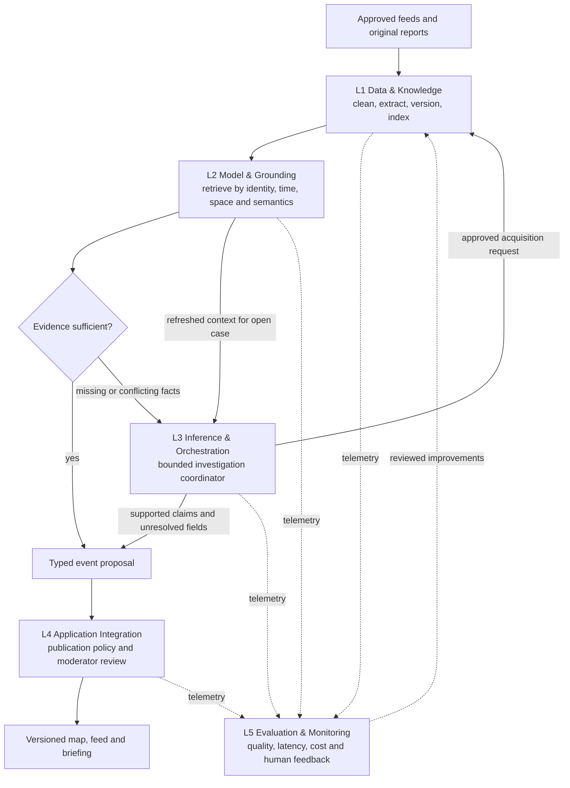

# Waspada Jakarta — five-layer architecture

Delivery scope, requirements and work sequencing are maintained in [SOFTWARE_DEVELOPMENT_PLAN.md](SOFTWARE_DEVELOPMENT_PLAN.md). This file owns the detailed logical architecture; proposed deployment, missing domain contracts and open decisions are tracked in that plan.

Status: target architecture with partial local implementation. The local code includes L1 synthetic GeoJSON parsing, deterministic text preparation/chunk persistence, source-supported geometry, immutable revision/evidence writers and a fixture-only queue pipeline; L2 typed model contracts, hybrid retrieval, a least-privilege reader, canonical refs-only context persistence and the injected reasoning-context bridge; L3 durable gap-investigation ledger; and L4 fail-closed publication policy, public EventView/EventDetail/GeoJSON projection, a manual transaction writer, and synthetic-only context/list/detail/history HTTP routes. The detail/history routes read only fictional fixtures; no database-backed public reader or GeoJSON route is wired. UI-00, the fixture pipeline and casebook tooling use synthetic/demo data. These tests establish local component behavior, not live-data safety.

## 1. Architecture and boundaries

| Layer | Owns | Produces | Must not own |
| --- | --- | --- | --- |
| 1 — Data & Knowledge | Source registry, scheduled ingestion, parsing/OCR, cleaning, extraction pipeline, revision storage, spatial data, evidence chunks and embeddings | Versioned reports, extracted candidates, indexed evidence | Autonomous investigation or public publication |
| 2 — Model & Grounding | Task-specific model adapters, initial hybrid retrieval, claim support assessment, structured proposal generation | Grounding context, evidence assessments, typed proposals, explicit missing facts | Source approval, budget changes, direct database publication |
| 3 — Inference & Orchestration | Investigation of gaps remaining after initial retrieval, approved tools, checkpoints, budgets, stopping and escalation | Additional acquisition requests, revised proposals, review reasons | Routine ingestion, raw-content cleaning, source-of-truth ownership, publication |
| 4 — Application Integration | Typed APIs, deterministic policy checks, moderator authorization, event versions, maps/feed/briefings, freshness and corrections | Publication decisions and public event views | Trusting a model's proposed publication status |
| 5 — Evaluation & Monitoring | Offline evaluation, pipeline health, model/retrieval quality, cost and latency, review feedback, release regression checks | Metrics, alerts and reviewed improvement candidates | Silently changing policies or training on moderator actions |

Responsible AI applies across all five layers: provenance, least-privilege access, privacy, hostile-input isolation, audit trails and human review. Layer 5 observes the entire stack; it is not only a final post-publication stage.

The initial Layer 2 sufficiency check runs before creating an investigation. An open case returns to Layer 3 after each acquisition and grounding pass, retaining its original budget. The arrows express data dependencies, not permission for a model to call arbitrary services.

## 2. Layer 1 — data pipelines and storage

The ingestion scheduler polls approved APIs/RSS and permitted original pages. Adapters preserve canonical URL/provider ID, source identity, publication time, observation/event time, retrieval time, content hash and revision links. New or changed content enters the preprocessing queue; unchanged polls update connector health only.

The pipeline parses structured alerts and cleans HTML, separates multi-event articles, normalizes encoding and Indonesian date expressions, and retains source-span offsets. A gazetteer provides place candidates with administrative hierarchy and distinct roles such as incident scene versus arrest location. OCR-only dates or geometry require moderator comparison with the original. Failed parsers enter quarantine with reasons.

Entity extraction belongs to this predefined pipeline. Deterministic parsers handle known formats; ambiguous prose calls the fast extraction adapter defined in Layer 2. This shared model adapter does not make preprocessing an agent activity. Extraction has a fixed schema, no tools, and at most one schema-repair retry before review.

Proposed persistence is PostgreSQL with PostGIS and pgvector. Relational records retain sources, immutable report revisions, source spans, origins, extracted entities, claims, effects and decisions. PostGIS stores validated points, lines or supplied polygons with SRID 4326, precision and provenance. Geographic overlap narrows candidates; it never proves an incident occurred or establishes a warning radius.

Evidence chunks reference a report revision and stable offsets in its normalized text. Embeddings retain chunk ID, embedding model/version, dimension and text hash. Strip unnecessary personal data before embedding or sending data to a hosted model. Store full raw documents only where access/reuse conditions permit; otherwise retain allowed excerpts and hashes. Embeddings assist candidate deduplication and context lookup; they do not establish evidence independence or truth.

The local implementation now covers synthetic GeoJSON parsing, deterministic text preparation and chunk metadata persistence, plus transactional L1 writers for source-backed geometry, report revisions, and evidence references. Revision retries compare every immutable typed column and JSONB record; evidence retries return the same database-enforced identity while preserving the first trace. Migration 007 stops without data changes if legacy evidence references already share a natural identity. These local changes add no source polling, live-content persistence, inferred geometry roles, hazard areas, or Worker-to-hosted-database wiring. Source-field mapping, rights, and per-source approval remain activation gates.

The canonical schema 2.0 `EvidenceRef` and L2 contracts include `supports`, `contradicts`, `updates`, and `context`. Accepted migration 009 and the database `EvidenceRelation` type preserve all four values through local evidence persistence and retrieval. `updates` remains distinct from claim support, and the L4 publication policy stays fail-closed. Accepted [ADR-015](docs/decisions/ADR-015-l2-grounding-context-persistence.md) implements an immutable, transactional writer for the canonical refs-only `GroundingContext` and its normalized links. The expanded retrieval/reasoning payload and excerpt text are not part of that stored record, and the caller-supplied `sufficient` value is preserved without assessment. Accepted [L2-CONTEXT-BRIDGE-CORE](docs/assignments/L2-CONTEXT-BRIDGE-CORE.md) adds a pure injected Layer 2 adapter that validates the existing reasoning request, persists only canonical references, and returns the excerpt-bearing request separately in memory. The local repository and adapter are not wired to a Worker route, database session, or hosted Neon; the adapter does not invoke retrieval, a model, L3 or publication.

Keep unreviewed reports, eligible claims and public event versions logically separate with database roles/views. A correction, withdrawal or privacy deletion invalidates derived chunks, embeddings and retrieval caches. Every retrieval also checks source revision status at read time, so a lagging vector index cannot reinstate withdrawn evidence. Re-embedding after a model change uses a new index version; do not compare vectors from incompatible models.

## 3. Layer 2 — models and grounding

| Capability | Proposed route | Contract and limit |
| --- | --- | --- |
| Known structured fields | Parser/rules | Preserve issuer identifiers, timestamps and geometry; no model needed |
| Category and entity extraction | Small low-latency model or classifier | Fixed ExtractionResult schema, evidence offsets, explicit unknowns; no browsing/tools |
| Semantic lookup | Dedicated embedding model | Versioned vectors for permitted evidence chunks; evaluate Indonesian place names and aliases |
| Synthesis and conflicting accounts | Reasoning-capable model | GroundingContext in, EventProposal or missing-fact assessment out; source-linked claims only |

Choose provider/model versions after benchmarking the labelled Jakarta cases. Extraction, embedding and reasoning are separate capability configurations even if one provider supplies them. Fine-tuning is deferred until there is enough labelled data and a measured need. Record model version, prompt version, schema version, latency and token usage per call.

Initial grounding runs for every new candidate before autonomy:

1. Retrieve exact provider IDs, explicit updates, event IDs and previously reviewed decisions first.
2. Build compatible candidate sets using event time and PostGIS intersection/proximity. Search explicit service, institution and audience fields independently for notices without geography. Unknown locations use lexical/entity and semantic candidates without inventing coordinates.
3. Rank permitted evidence using lexical terms and vector similarity, then recheck time, event identity, provenance, revision status and access constraints. Start with exact vector search on the small prototype corpus; evaluate recall before introducing approximate indexes. Retrieval size is bounded and configurable, initially 20 candidate chunks and 8 evidence chunks supplied to synthesis, with relevant contradictions retained.
4. Return a GroundingContext with evidence spans, candidate event versions, prior decisions, conflicts, retrieval/index version and missing fields. Retrieved content is evidence with a review state, not automatically ground truth. Test recall against human-labelled supporting and contradicting evidence.
5. Assess support claim by claim. If required evidence is sufficient, produce a proposal for Layer 4 directly. Otherwise create an InvestigationRequest containing the specific gap and the context already searched.

Use strict schema validation at every boundary. Source-span existence and hash checks are deterministic; whether prose actually supports a claim requires an evidence assessment and sometimes human judgement. Schema conformance alone does not prove factual correctness. A novel inference, contradictory source, unknown independence or uncertain semantic support stays unresolved.

The accepted RAG-CORE repository implements bounded exact-identifier/term, report/event-time, source-linked geometry-intersection, and optional exact-embedding-identity distance facets over stored evidence. It returns source/revision state, source and origin lineage, time distinctions, exact offsets, match facets and truncation metadata. Its row-evaluation limit is not a physical database scan or latency bound. RAG-ACCESS-01 adds a dedicated `waspada_l2_grounding_reader` role with column-scoped grants and verifies the actual query under `SET ROLE` in synthetic PGlite fixtures. The modules remain outside an application retrieval path until Worker/database service-role wiring is integrated and checked against Neon. They never set `GroundingContext.sufficient`, make a safety/factuality claim, or invoke L3.

## 4. Layer 3 — bounded investigation

Layer 3 owns a case state machine, not the whole data platform. Its initial state contains candidate ID, GroundingContext ID, unresolved questions, checked sources, counters, elapsed time, model usage and checkpoint version. Use a bounded TypeScript workflow on Cloudflare Workflows for persisted asynchronous transitions. Neon case/job rows remain authoritative for investigation identity, counters and outcomes; every step checks its saved budget before acting. The workflow does not own ingestion, normalization or publication. Free step/CPU quotas may require smaller investigations or a held-for-review outcome.

```mermaid
stateDiagram-v2
  [*] --> ContextReady
  ContextReady --> Propose: sufficient evidence
  ContextReady --> Investigate: eligible evidence gap
  Investigate --> Acquire: approved tool and remaining budget
  Acquire --> Reground: L1 processes result; L2 retrieves again
  Reground --> Investigate: unresolved and measurable progress
  Reground --> Propose: sufficient evidence
  Investigate --> Review: limit, conflict, failure or no progress
  Propose --> PolicyCheck: L4 only
  Review --> PolicyCheck: supported moderator correction
  PolicyCheck --> [*]
```

Initial prototype limits per event-revision investigation are **5 tool attempts, 4 reasoning turns, 60 seconds of active investigation time, and 12,000 total model input/output tokens**. Stop at whichever limit is reached first. These are proposed configuration values, not measured performance guarantees. Count retries and failed tool attempts; each fetch request covers one original document, and bulk fan-out is disallowed. Include model calls caused by the investigation in its token ledger. Preflight requested token limits against the remaining allowance. Queue wait time is monitored separately; restart/resume does not reset counters or extend the active-time allowance.

Allowed tools request one approved source search, one original-document acquisition, a gazetteer lookup, or a refreshed event/evidence lookup. The execution service validates typed arguments, allowed hosts, redirect destinations, timeouts and response size. New material always returns through Layer 1 processing and Layer 2 grounding. Search snippets are discovery leads, not evidence.

Stop when required claims are supported; the next action would repeat an unchanged lookup; two successive results add no usable evidence; a hard limit is exhausted; a tool is unavailable without an approved alternative; or a material dispute remains. Preserve eligible claims for policy review and queue unresolved claims with a reason. No evidence is a valid result. A moderator can submit supported corrections or explicitly authorize a new investigation with a new ID; neither action can bypass the publication gate. Models cannot grant tool permissions, approve sources or reset budgets.

## 5. Contracts and module interfaces

The machine-readable boundary specification is [docs/contracts.schema.json](docs/contracts.schema.json), with [synthetic examples](docs/contracts.examples.json) for each record type. It is a design artifact, not evidence that runtime validation is implemented. All records carry schema_version and trace_id. Closed object schemas reject extra fields, and required fields distinguish explicit unknowns from omitted values.

| Record | Producer → consumer | Essential content |
| --- | --- | --- |
| ReportRevision | L1 → storage/extraction | Source and revision IDs, canonical URL, hash, permitted text, publication/fetch times, source status |
| ExtractionResult | L1 pipeline using L2 adapter → L2 | Candidate ID, report ID, category, time, place/audience candidates, evidence spans, unknown fields |
| GroundingContext | L2 → proposal builder or L3 | Evidence references, candidate event/version pairs, conflicts, missing fields, retrieval version |
| InvestigationRequest | L2 → L3 | Context ID, unresolved questions, fixed budget, case ID and revision |
| EventProposal | L2/L3 → L4 | Supported claims with evidence references, separately unresolved fields, affected scope, base event version; no authoritative publish flag |
| PublicationDecision | L4 → API/event store/L5 | Per-claim disposition, rule version, reasons, reviewer where applicable, event version and evidence lineage |

Required service checks go beyond JSON shape: references must resolve to accessible immutable report revisions; offsets must match normalized text; hashes and event versions must still match; geometry must be valid and source-supported; event time must be compatible; claim evidence and origin relationships must be checked. For a new candidate, event ID and base revision are both null; for an existing event, both must resolve together. Grounding contexts retain source review states and prior decision IDs from the retrieval service, with status rechecked before publication. Do not accept model-provided source approval or independence claims without recorded evidence. Proposal fields never overwrite policy-owned decision fields.

Suggested module boundaries are ingestion, preprocessing and knowledge_store (L1); model_adapters, retrieval, grounding and the injected context-persistence bridge (L2); investigation and tool_executor (L3); publication_policy, moderation, public_api and frontend (L4); and evaluation and telemetry (L5). The repository contains these local modules plus a separate apps/db foundation, but the Worker is not wired to a database session; no public event API or moderator HTTP route is connected to persistence. Most L3 tool execution, moderator authorization, freshness/correction services and public endpoints remain planned. Keep acquisition, extraction and investigation as separate bounded workflows, and enforce database roles so model/ingestion code cannot write public event versions. The physical deployment target is a modular TypeScript Worker with static frontend assets, not five services. WSL hosts local development and tests.

## 6. Layer 4 — publication and application integration

Both the direct grounded path and investigated path submit the same EventProposal. The backend rejects schema errors, dangling evidence references, stale base versions, unapproved sources, expired validity, unsupported geometry and unresolved material contradictions. Evidence labels are assigned per claim: issuer notice, attributed report or demonstrably independent corroboration. Several publishers repeating one origin count once. The policy gate consumes recorded support assessments; uncertain semantic assessments require review instead of automatic publication.

The accepted `apps/worker/src/layers/l4-application-integration/publication-policy.ts` is a pure pre-persistence assessment: it requires an explicit moderator approval, exact same-dataset support citations in both the grounding context and current retrieval, an eligible revision, approved source, current in-scope evidence state, source-linked geometry, and a matching event version. It refuses publication-eligible dispositions for historical and synthetic datasets. It does not authenticate the actor, establish factual support or retrieval sufficiency, make database writes, resolve new-event duplicates, or replace transaction-time version checks; those remain work for MOD-01, PUB-01 and evaluated RAG integration.

`apps/worker/src/layers/l4-application-integration/public-projection.ts` adds a pure runtime-validated whitelist from internal schema 2.0 Event/Impact records to the existing public `EventView`. It resolves scope IDs to display names, resolves each support span to an explicitly public-approved attribution, matches exact event/impact versions, and constructs each public field directly. Internal JSON is never spread into the response. The synthetic-only module has no database reader or HTTP route; those remain API-01 work. Source/data rights remain pending.

Publication is an idempotent transaction keyed by proposal ID and policy version. A changed event version triggers re-grounding and revalidation, not a blind overwrite. Commit eligible claim versions and an outbox event together so map/feed/briefing updates remain consistent. Moderation supplies evidence and reasons, then re-enters the same gate; rejecting a claim can occur without publishing anything.

Public map/feed reads use published views only. Briefings summarize eligible claims with links and cannot add unsupported effects. Background jobs remove expired warnings, mark unsupported recency as stale, invalidate dependent summaries on corrections, and suppress duplicate alerts. Map geometry and audience relevance follow source scope. Browsing should remain usable when model services are unavailable, showing current stored status and source-health limitations.

## 7. Layer 5 — evaluation, monitoring and safeguards

Use at least 40 reports spanning at least 12 cases, including all ten categories and the four demonstration scenarios. Keep articles, copied origins and revisions from the same incident in the same evaluation split. Two reviewers reconcile labels; reserve held-out event cases before tuning retrieval, prompts or thresholds. Report counts as well as rates; this sample is not a production-safety claim.

| Layer | Evaluate and monitor | Required failure handling |
| --- | --- | --- |
| L1 | Connector health, parser/schema failures, missing provenance, duplicate hashes, extraction accuracy, index lag | Quarantine malformed records, retain source status, backoff, no false resolution |
| L2 | Retrieval recall@k including contrary evidence, merge precision/recall, claim support, schema violations, per-model latency/cost | Abstain or review; rerun held-out cases before model/prompt/index changes |
| L3 | Tool calls, retries, progress, stop reasons, elapsed time, token totals, review rate | Cancel on hard limits; checkpoint; prevent silent budget reset |
| L4 | Unsupported publication, stale warnings, authorization failures, correction propagation, duplicate alerts, user task success | Hold/retract affected claims, enforce access checks, repair derived views |
| L5 | Missing traces, feedback backlog, metric coverage by source/category, release regressions | Alert a maintainer; block release on known unsupported claims or privacy failures |

The synthetic Worker read API records an operational `api_request` event through an injected Layer 5 sink. It contains only a fixed route category, HTTP status and non-negative duration; the structured console sink uses an explicit field allowlist. Wrangler samples at 1% and disables invocation logs, which can include request URLs. The Layer 2 evidence-retrieval adapter also emits a bounded `l2_retrieval` success/error summary through the injected sink: duration, candidate and row counts, truncation flags, and a closed semantic-status value on success; error records omit exception details. The Layer 3 ledger decorator reports only bounded write-transition names, lifecycle outcomes, duration and consumed-budget counters; it omits case, action, source and model identifiers, and does not instrument reads. Both L2 and L3 sinks default to no-op, and no Worker/database composition path enables them yet. These are local operational telemetry slices, not full-stack monitoring: no Cloudflare deployment, remote log collection, quality/cost/source-health dashboard, or human-feedback metric has been verified.

An audit trace links report revision, evidence span, retrieval snapshot, model configuration, tool invocation, proposal, policy decision and public version. Store concise operational reasons, not private model chain-of-thought. Restrict audit access and retention. Source text cannot modify system prompts, tools or policies; retrieved quotations use data-only boundaries. Review malicious instructions in reports, redirect-based internal-network access, sensitive details in embeddings, copied origins, wrong geocodes, stale retrieval and moderator override attempts.

Moderation corrections become reviewed evaluation examples. They do not automatically change labels, prompts, embeddings or production policies. Compare proposed changes on held-out cases and require a team review before release. A/B experiments are deferred until a responsible public pilot; prototype usability tasks and offline evaluation are the initial methods.

## 8. Ownership and delivery

| Owner | Primary responsibility | Concrete handoff |
| --- | --- | --- |
| Jesaya Hamonangan Gaudensius Malau | L1 storage/spatial schemas and L4 backend policy/API | Versioned data contracts, spatial candidate query, publication decision service and correction propagation |
| Perry Tjahya | L1 connectors/preprocessing, L2 model/grounding and L3 coordinator | Ingestion without an agent, retrieval benchmark, distinct model adapters and bounded recorded investigations |
| M. Rasya Syahputra | L4 frontend/moderation screens and L5 evaluation/monitoring integration | Published-event UI, review actions, user tests and evaluation/health dashboard |

Each owner writes component checks and reviews another member's boundary. Evaluation and Responsible AI remain shared duties across every layer.

Proposed 12-week sequence: weeks 1–2 establish user needs, sources and contracts; weeks 3–4 deliver L1 plus a basic published-data API; weeks 5–6 benchmark L2 and the direct grounded path; weeks 7–8 add L3 only for unresolved cases; weeks 9–10 integrate L4 moderation, updates and L5 monitoring; weeks 11–12 run held-out cases, usability work and final documentation. Add telemetry and regression fixtures from week 1, not only in the last phase. These are relative milestones to fit the course calendar, not committed dates.

Release checks: supported direct-path cases bypass investigation; a missing fact invokes L3; copied reports do not inflate independent origins; similar nearby events do not merge without identity evidence; non-geographic notices survive retrieval; exhausted budgets stop; stale vectors cannot restore withdrawn claims; corrections reach every public view; source instructions cannot publish or grant tools. The database schema and core persistence ports are implemented locally; Worker database runtime, model services and remaining pipelines are future work.
