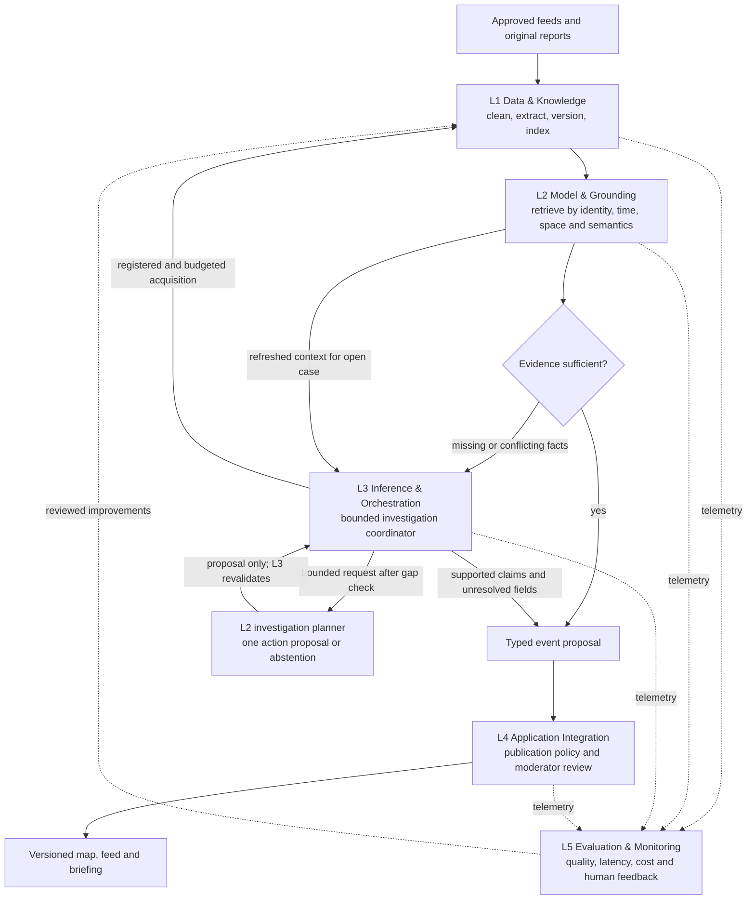
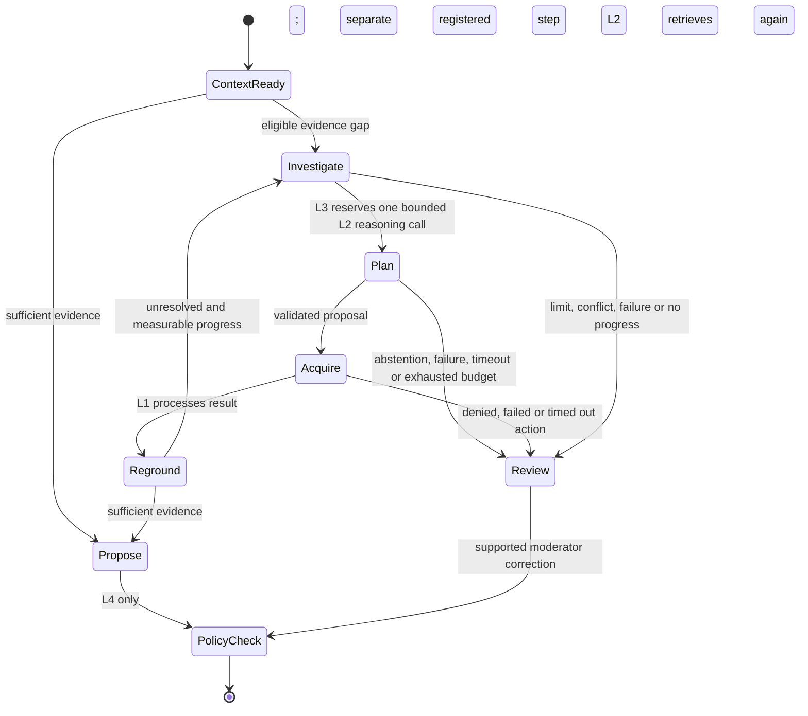

# Waspada Jakarta — five-layer architecture

Delivery scope, requirements and work sequencing are maintained in [SOFTWARE_DEVELOPMENT_PLAN.md](SOFTWARE_DEVELOPMENT_PLAN.md). This file owns the detailed logical architecture; proposed deployment, missing domain contracts and open decisions are tracked in that plan.

Status: target architecture with partial local implementation. The local code includes L1 synthetic GeoJSON parsing, deterministic text preparation/chunk persistence, source-supported geometry, immutable revision/evidence writers, a synthetic queue pipeline that stores schema 2.0 extraction candidates through an injected L2 capability, and a separate scheduled Worker processor for at most one synthetic source-poll job. The processor requires an exact demo opt-in, a dedicated L1 connection, and injected fixture-catalog/extraction capabilities; the checked-in Worker supplies neither capability and therefore cannot claim work. L2 includes typed model contracts, hybrid retrieval, a least-privilege reader, canonical refs-only context persistence, injected reasoning-context assembly, and an accepted proposal-only investigation planner; L3 includes a durable gap-investigation ledger, insufficient-context case entry, single-step action executor, one-call L2 planner wrapper with durable reservation/reconciliation, case-scoped HMAC progress fingerprints, and an accepted stateless bounded coordinator that composes one planner/action/refresh advance through injected ports; L4 includes fail-closed publication policy, a manual transaction writer, strict public projections, and database-backed exact-live list/detail/history/GeoJSON, transient-briefing and update-feed readers/runtimes, plus the injected context source-status provider. The checked-in Worker remains in demo mode, and no hosted live database binding or source/provider has been enabled. Demo APIs and the UI use synthetic fixtures; GeoJSON returns an empty collection because fixtures do not supply source-supported geometry. There is no production L3 investigation runtime, production source-to-L1/L2 dispatch, or authenticated moderator session route; the accepted L2 planner and bounded coordinator have no production provider or runtime composition. The synthetic L1 pipeline reuses an exact validated persisted extraction candidate and its evidence links after uncertain acknowledgement, without a second L2 call. These are local synthetic proofs only; they do not activate providers or establish hosted Neon behavior or live-data safety.

L3-PROGRESS-FINGERPRINT-CORE adds a case-pinned key identifier, purpose-separated action and grounding HMACs, and append-only progress snapshots. Grounding projection version 2 excludes free-form missing-field/conflict text and includes bounded counts only, so wording changes with the same counts do not register as progress. The no-progress stop is conservative and escalates to review. The stateless bounded coordinator composition is accepted; production key configuration, source-to-L1/L2 dispatch, and Worker/Workflow runtime composition remain unimplemented.

L1 also contains an accepted, pure CAP 1.2 XML parser over caller-buffered synthetic input. It enforces the CAP namespace and parser bounds, rejects DTDs, preserves source-declared fields and separate timestamps, and validates only source-described polygons. This does not provide BMKG source approval, field mapping, source acquisition, signature verification, evidence validation, or event publication; the connector remains disabled.

## 1. Architecture and boundaries

| Layer | Owns | Produces | Must not own |
| --- | --- | --- | --- |
| 1 — Data & Knowledge | Source registry, scheduled ingestion, parsing/OCR, cleaning, extraction pipeline, revision storage, spatial data, evidence chunks and embeddings | Versioned reports, extracted candidates, indexed evidence | Autonomous investigation or public publication |
| 2 — Model & Grounding | Task-specific model adapters, initial hybrid retrieval, claim support assessment, structured proposal generation | Grounding context, evidence assessments, typed proposals, explicit missing facts | Source approval, budget changes, direct database publication |
| 3 — Inference & Orchestration | Investigation of gaps remaining after initial retrieval, approved tools, checkpoints, budgets, stopping and escalation | Additional acquisition requests, revised proposals, review reasons | Routine ingestion, raw-content cleaning, source-of-truth ownership, publication |
| 4 — Application Integration | Typed APIs, deterministic policy checks, moderator authorization, event versions, maps/feed/briefings, freshness and corrections | Publication decisions and public event views | Trusting a model's proposed publication status |
| 5 — Evaluation & Monitoring | Offline evaluation, pipeline health, model/retrieval quality, cost and latency, review feedback, release regression checks | Metrics, alerts and reviewed improvement candidates | Silently changing policies or training on moderator actions |

The database adapter exposes both plain and explicit transaction-capable SQL operations over one request-scoped PostgreSQL client. The generic due-freshness Worker runtime is implemented behind exact-live, explicit-flag, and dedicated-connection gates but remains dormant without hosting configuration. The separate source-revision transition now has private run state and one-page coordination; its scheduled Worker integration is still pending.

Responsible AI applies across all five layers: provenance, least-privilege access, privacy, hostile-input isolation, audit trails and human review. Layer 5 observes the entire stack; it is not only a final post-publication stage.

Layer 4 keeps freshness separate from lifecycle and user relevance. A missed evidence review deadline yields `needs_update`; only issuer validity yields `expired`. The event badge conservatively summarizes its grouped public claim set and its impacts: any `needs_update` or a mixture of current and expired yields event `needs_update`; `expired` requires every included value to be issuer-expired; `current` requires every value to be current. Public claims remain grouped under event freshness and impacts retain their own freshness in the existing contract. The single-record transition policy, append-only transition ledger, current-public status overlay, bounded due-target reader, and one-page explicit-time evaluator are implemented. A synthetic PGlite test composes that path with the current-public views and verifies persisted exact-version transitions, aggregate status, and unchanged publication rows. List and GeoJSON SQL filters consume the same derived status. The generic due evaluator is wired to a disabled-by-default Worker scheduled handler; source-revision freshness uses separate resumable run state and a one-page coordinator, with its scheduled runtime still pending. See [ADR-032](docs/decisions/ADR-032-review-deadline-freshness.md), [ADR-038](docs/decisions/ADR-038-append-only-freshness-transitions.md), and the [due-evaluation handoff](docs/assignments/LIFE-01-FRESHNESS-DUE-COMPOSITION-PGLITE-CORE-HANDOFF.md).
Layer 4 keeps freshness separate from lifecycle and user relevance. A missed evidence review deadline yields `needs_update`; only issuer validity yields `expired`. The event badge conservatively summarizes its grouped public claim set and its impacts: any `needs_update` or a mixture of current and expired yields event `needs_update`; `expired` requires every included value to be issuer-expired; `current` requires every value to be current. Public claims remain grouped under event freshness and impacts retain their own freshness in the existing contract. Freshness-only transitions appear on current event/impact views and do not create `/updates` entries; that feed remains reserved for moderator-reviewed published-version changes under [ADR-026](docs/decisions/ADR-026-public-update-feed-cursor.md). The single-record transition policy, append-only transition ledger, current-public status overlay, bounded due-target reader, and one-page explicit-time evaluator are implemented. A synthetic PGlite test composes that path with the current-public views and verifies persisted exact-version transitions, aggregate status, and unchanged publication rows. List and GeoJSON SQL filters consume the same derived status. The generic due evaluator is wired to a disabled-by-default Worker scheduled handler; source-revision freshness uses separate resumable run state and a one-page coordinator, with its scheduled runtime still pending. See [ADR-032](docs/decisions/ADR-032-review-deadline-freshness.md), [ADR-038](docs/decisions/ADR-038-append-only-freshness-transitions.md), and the [due-evaluation handoff](docs/assignments/LIFE-01-FRESHNESS-DUE-COMPOSITION-PGLITE-CORE-HANDOFF.md).

`LIFE-01-FRESHNESS-AGGREGATE-CORE` is accepted: current-public Layer 4 projections and database list/GeoJSON filters use the conservative event status derived from the grouped claim set and exact referenced impact versions. It preserves event-level evaluation metadata and the existing API shape; impact freshness remains separate. PGlite verifies the SQL views and filters under the existing public-reader role; hosted Neon behavior remains unverified.

```mermaid
flowchart TD
  S[Approved feeds and original reports] --> D["L1 Data & Knowledge\nclean, extract, version, index"]
  D --> G["L2 Model & Grounding\nretrieve by identity, time, space and semantics"]
  G --> C{Evidence sufficient?}
  C -->|yes| P[Typed event proposal]
  C -->|missing or conflicting facts| A["L3 Inference & Orchestration\nbounded investigation coordinator"]
  A -->|bounded request after gap check| M["L2 investigation planner\none action proposal or abstention"]
  M -->|proposal only; L3 revalidates| A
  A -->|registered and budgeted acquisition| D
  G -->|refreshed context for open case| A
  A -->|supported claims and unresolved fields| P
  P --> B["L4 Application Integration\npublication policy and moderator review"]
  B --> U[Versioned map, feed and briefing]
  D -. telemetry .-> E["L5 Evaluation & Monitoring\nquality, latency, cost and human feedback"]
  G -. telemetry .-> E
  A -. telemetry .-> E
  B -. telemetry .-> E
  E -. reviewed improvements .-> D
```

The initial Layer 2 sufficiency check runs before creating an investigation. An open case returns to Layer 3 after each acquisition and grounding pass, retaining its original budget. The arrows express data dependencies, not permission for a model to call arbitrary services.

## 2. Layer 1 — data pipelines and storage

The ingestion scheduler polls approved APIs/RSS and permitted original pages. Adapters preserve canonical URL/provider ID, source identity, publication time, observation/event time, retrieval time, content hash and revision links. New or changed content enters the preprocessing queue; unchanged polls update connector health only.

The pipeline parses structured alerts and cleans HTML, separates multi-event articles, normalizes encoding and Indonesian date expressions, and retains source-span offsets. A gazetteer provides place candidates with administrative hierarchy and distinct roles such as incident scene versus arrest location. OCR-only dates or geometry require moderator comparison with the original. Failed parsers enter quarantine with reasons.

Entity extraction belongs to this predefined pipeline. Deterministic parsers handle known formats; ambiguous prose calls the fast extraction adapter defined in Layer 2. This shared model adapter does not make preprocessing an agent activity. Extraction has a fixed schema, no tools, and at most one schema-repair retry before review.

Proposed persistence is PostgreSQL with PostGIS and pgvector. Relational records retain sources, immutable report revisions, source spans, origins, extracted entities, claims, effects and decisions. PostGIS stores validated points, lines or supplied polygons with SRID 4326, precision and provenance. Geographic overlap narrows candidates; it never proves an incident occurred or establishes a warning radius.

Evidence chunks reference a report revision and stable offsets in its normalized text. Embeddings retain chunk ID, embedding model/version, dimension and text hash. Strip unnecessary personal data before embedding or sending data to a hosted model. Store full raw documents only where access/reuse conditions permit; otherwise retain allowed excerpts and hashes. Embeddings assist candidate deduplication and context lookup; they do not establish evidence independence or truth.

The accepted L1 embedding repository stores one closed schema 2.0 run plus its numeric vector in one transaction. It validates exact chunk/revision hash and Unicode span, same-dataset trace, active chunk and eligible/unreviewed revision; a run-identity advisory lock and chunk row lock bound the local write sequence. Replay uses storage-equivalent vectors and microsecond instants, while invalidated/failed records remain unavailable. Inputs are copied before asynchronous SQL. Migration 022 grants only verification-column reads to L1; existing L2 retrieval grants are unchanged. This local storage composition invokes no embedding provider, L3 action or publication service, and does not establish independent-session concurrency or semantic quality. See [ADR-034](docs/decisions/ADR-034-embedding-persistence.md).

The local implementation covers synthetic GeoJSON parsing, deterministic text preparation and chunk metadata persistence, plus transactional L1 writers for source-backed geometry, report revisions, evidence references, and validated schema 2.0 extraction candidates. The synthetic moderator-submission pipeline calls only the injected L2 extraction method, persists exact evidence links for all four relations and the candidate through the repository port, and acknowledges the queue job only after those writes. PGlite under `waspada_l1_pipeline` verifies the candidate and its four links survive an uncertain completion acknowledgement and lease recovery. Extraction-result persistence validates the closed record, resolves exact same-dataset report/hash/span/relation identities, requires supporting evidence for proposed fields, and uses create-or-verify retries. The accepted replay lookup reads by exact dataset/candidate identity, validates the stored schema, row identity, and evidence-link set, then reuses the result before another L2 call. Read outages remain retryable; malformed records and identity conflicts fail permanently with fixed codes. Migration 018 grants only the extraction columns the L1 role needs for retry verification. The existing moderator-submission path is synthetic-only: it does not assess factual support, create Events, authorize publication, fetch sources, or use a live model/runtime. The accepted due-source scheduler enqueues bounded current-slot jobs, the synthetic source-poll claim leases only due synthetic `source_poll` rows, and the accepted source-ID keyed fixture processor carries one claimed synthetic job through the existing parse/extraction/persistence/replay path under the L1 role. The accepted test-only PGlite composition verifies scheduling through persistence and acknowledgement on `main` at `459f68a`; the focused case passes 1/1, with DB and full workspace checks also passing. Network fetch, external collection, configured Cron scheduling, source-processing runtime, inferred geometry roles, hazard areas and hosted database operation remain unimplemented or unverified. Source-field mapping, rights and per-source approval remain activation gates.

The accepted opt-in Worker `scheduled` entrypoint stays in L1 and enqueues only. Exact demo mode, an explicit enable flag, a separate L1 connection, validated platform time and a synthetic database namespace gate one transaction under `waspada_l1_pipeline`. It creates a count-only trace and uses the existing scheduler/queue on the same SQL client; errors roll back with redacted diagnostics. Migration 021 adds only the L1 namespace dataset-column read. Trace start/end use the scheduling instant and do not measure runtime duration or prove intake/model/publication completion. No flag, L1 binding or Cron expression is configured, and this entrypoint never invokes the fixture processor or L3. See [ADR-033](docs/decisions/ADR-033-synthetic-scheduled-poll-runtime.md).

The canonical schema 2.0 `EvidenceRef` and L2 contracts include `supports`, `contradicts`, `updates`, and `context`. Accepted migration 009 and the database `EvidenceRelation` type preserve all four values through local evidence persistence and retrieval. `updates` remains distinct from claim support, and the L4 publication policy stays fail-closed. Accepted [ADR-015](docs/decisions/ADR-015-l2-grounding-context-persistence.md) implements an immutable, transactional writer for the canonical refs-only `GroundingContext` and its normalized links. The expanded retrieval/reasoning payload and excerpt text are not part of that stored record, and the caller-supplied `sufficient` value is preserved without assessment. Accepted [L2-CONTEXT-BRIDGE-CORE](docs/assignments/L2-CONTEXT-BRIDGE-CORE.md) adds a pure injected Layer 2 adapter that validates the existing reasoning request, persists only canonical references, and returns the excerpt-bearing request separately in memory. The local repository and adapter are not wired to a Worker route, database session, or hosted Neon; the adapter does not invoke retrieval, a model, L3 or publication.

Keep unreviewed reports, eligible claims and public event versions logically separate with database roles/views. A correction, withdrawal or privacy deletion invalidates derived chunks, embeddings and retrieval caches. Every retrieval also checks source revision status at read time, so a lagging vector index cannot reinstate withdrawn evidence. Re-embedding after a model change uses a new index version; do not compare vectors from incompatible models.

## 3. Layer 2 — models and grounding

| Capability | Proposed route | Contract and limit |
| --- | --- | --- |
| Known structured fields | Parser/rules | Preserve issuer identifiers, timestamps and geometry; no model needed |
| Category and entity extraction | Small low-latency model or classifier | Fixed ExtractionResult schema, evidence offsets, explicit unknowns; no browsing/tools |
| Semantic lookup | Dedicated embedding model | Versioned vectors for permitted evidence chunks; evaluate Indonesian place names and aliases |
| Synthesis and conflicting accounts | Reasoning-capable model | GroundingContext in, EventProposal or missing-fact assessment out; source-linked claims only |
| Next investigation step | Typed L2 planner adapter (ADR-027), called through the L3 budget boundary (ADR-029) | Retrieved insufficient context plus a bounded trusted action menu in; one validated proposal or fixed abstention with bounded usage out; no execution authority or live provider |

The Layer 2 investigation planner is separate from event-claim synthesis. It validates the retrieved insufficient context and trusted action menu, invokes one model capability, and returns only a typed proposal or abstention with bounded usage. Under [ADR-029](docs/decisions/ADR-029-l3-budgeted-planner-call.md), Layer 3 preflights the current case/context identity, reserves one reasoning turn plus worst-case time and tokens in the durable ledger, then starts the call. A replay never invokes the provider; failure, timeout or uncertain usage consumes the reservation and is not retried. A successful proposal is data, not authority: a later single-step executor call must independently validate and reserve its registered action. Abstention escalates to moderator review. Neither output establishes evidence sufficiency, stops an investigation by model authority, nor permits publication. The adapter and one-call wrapper are accepted for local synthetic implementation; no real provider, production action registry or L3 runtime composition is enabled.

Choose provider/model versions after benchmarking the labelled Jakarta cases. Extraction, embedding and reasoning are separate capability configurations even if one provider supplies them. Fine-tuning is deferred until there is enough labelled data and a measured need. Record model version, prompt version, schema version, latency and token usage per call.

Initial grounding runs for every new candidate before autonomy:

1. Retrieve exact provider IDs, explicit updates, event IDs and previously reviewed decisions first.
2. Build compatible candidate sets using event time and PostGIS intersection/proximity. Search explicit service, institution and audience fields independently for notices without geography. Unknown locations use lexical/entity and semantic candidates without inventing coordinates.
3. Rank permitted evidence using lexical terms and vector similarity, then recheck time, event identity, provenance, revision status and access constraints. Start with exact vector search on the small prototype corpus; evaluate recall before introducing approximate indexes. Retrieval size is bounded and configurable, initially 20 candidate chunks and 8 evidence chunks supplied to synthesis, with relevant contradictions retained.
4. Return a GroundingContext with evidence spans, candidate event versions, prior decisions, conflicts, retrieval/index version and missing fields. Retrieved content is evidence with a review state, not automatically ground truth. Test recall against human-labelled supporting and contradicting evidence.
5. Assess support claim by claim. If required evidence is sufficient, produce a proposal for Layer 4 directly. Otherwise create an InvestigationRequest containing the specific gap and the context already searched.

Use strict schema validation at every boundary. Source-span existence and hash checks are deterministic; whether prose actually supports a claim requires an evidence assessment and sometimes human judgement. Schema conformance alone does not prove factual correctness. A novel inference, contradictory source, unknown independence or uncertain semantic support stays unresolved.

The accepted RAG-CORE repository implements bounded exact-identifier/term, report/event-time, source-linked geometry-intersection, and optional exact-embedding-identity distance facets over stored evidence. It returns source/revision state, source and origin lineage, time distinctions, exact offsets, match facets and truncation metadata. Its row-evaluation limit is not a physical database scan or latency bound. RAG-ACCESS-01 adds a dedicated `waspada_l2_grounding_reader` role with column-scoped grants and verifies the actual query under `SET ROLE` in synthetic PGlite fixtures. The modules remain outside an application retrieval path until Worker/database service-role wiring is integrated and checked against Neon. They never set `GroundingContext.sufficient`, make a safety/factuality claim, or invoke L3.

The durable EventProposal boundary is assigned separately under [ADR-036](docs/decisions/ADR-036-event-proposal-persistence.md), with implementation pending. Its writer stores canonical private drafts and exact context/evidence/support-origin/case links; it does not call models, decide sufficiency, spend investigation budgets or publish. A later bridge must map the typed reasoning result into this shared draft contract. Draft labels remain assessments; Layer 4 owns public labels and publication.

## 4. Layer 3 — bounded investigation

Layer 3 owns a case state machine, not the whole data platform. Its initial state contains candidate ID, GroundingContext ID, unresolved questions, checked sources, counters, elapsed time, model usage and checkpoint version. Use a bounded TypeScript workflow on Cloudflare Workflows for persisted asynchronous transitions. Neon case/job rows remain authoritative for investigation identity, counters and outcomes; every step checks its saved budget before acting. The workflow does not own ingestion, normalization or publication. Free step/CPU quotas may require smaller investigations or a held-for-review outcome.

```mermaid
stateDiagram-v2
  [*] --> ContextReady
  ContextReady --> Propose: sufficient evidence
  ContextReady --> Investigate: eligible evidence gap
  Investigate --> Plan: L3 reserves one bounded L2 reasoning call
  Plan --> Acquire: validated proposal; separate registered step
  Plan --> Review: abstention, failure, timeout or exhausted budget
  Acquire --> Review: denied, failed or timed out action
  Acquire --> Reground: L1 processes result; L2 retrieves again
  Reground --> Investigate: unresolved and measurable progress
  Reground --> Propose: sufficient evidence
  Investigate --> Review: limit, conflict, failure or no progress
  Propose --> PolicyCheck: L4 only
  Review --> PolicyCheck: supported moderator correction
  PolicyCheck --> [*]
```

Initial prototype limits per event-revision investigation are **5 tool attempts, 4 reasoning turns, 60 seconds of active investigation time, and 12,000 total model input/output tokens**. Stop at whichever limit is reached first. These are proposed configuration values, not measured performance guarantees. Count retries and failed tool attempts; each fetch request covers one original document, and bulk fan-out is disallowed. Include every model call caused by the investigation—including the L2 planner—in the durable token ledger. Reserve a trusted worst-case time/token cap before invoking; L2 validates provider usage and L3 reconciles it, charging the full reservation when usage is unknown. Queue wait time is monitored separately; restart/resume does not reset counters or extend the active-time allowance.

Allowed tools request one approved source search, one original-document acquisition, a gazetteer lookup, or a refreshed event/evidence lookup. The execution service validates typed arguments, allowed hosts, redirect destinations, timeouts and response size. New material always returns through Layer 1 processing and Layer 2 grounding. Search snippets are discovery leads, not evidence.

Stop when required claims are supported; the next action would repeat an unchanged lookup; two successive results add no usable evidence; a hard limit is exhausted; a tool is unavailable without an approved alternative; or a material dispute remains. Preserve eligible claims for policy review and queue unresolved claims with a reason. No evidence is a valid result. A moderator can submit supported corrections or explicitly authorize a new investigation with a new ID; neither action can bypass the publication gate. Models cannot grant tool permissions, approve sources or reset budgets.

Restart-safe repeat/no-progress detection follows [ADR-030](docs/decisions/ADR-030-l3-progress-fingerprints.md). Trusted code computes purpose-separated HMAC-SHA-256 digests over validated action inputs and a closed, text-free grounding projection. The ledger stores only digests, a key identifier, and bounded progress counts; exact repeated action digests are rejected, and two successive unchanged grounding refreshes stop for review. The fingerprint persistence and bounded coordinator composition are accepted with local synthetic tests. The key remains outside the database; there is no production key, Workflow binding, or Worker/database coordinator runtime configured, and source-to-L1/L2 dispatch remains open.

## 5. Contracts and module interfaces

The machine-readable boundary specification is [docs/contracts.schema.json](docs/contracts.schema.json), with [synthetic examples](docs/contracts.examples.json) for each record type. It is a design artifact, not evidence that runtime validation is implemented. All records carry schema_version and trace_id. Closed object schemas reject extra fields, and required fields distinguish explicit unknowns from omitted values.

ADR-040 defines a separate future synthetic poll-processing runtime after enqueueing. It reuses the bounded L1 runner and requires both an in-memory source-ID fixture catalog and an injected L2 extraction adapter; absent either, it must not open SQL or claim a job. The current Worker still has no such provider/catalog composition. This remains a synthetic local pipeline and does not enable a live source or move ingestion into L3.

| Record | Producer → consumer | Essential content |
| --- | --- | --- |
| ReportRevision | L1 → storage/extraction | Source and revision IDs, canonical URL, hash, permitted text, publication/fetch times, source status |
| ExtractionResult | L1 pipeline using L2 adapter → L2 | Candidate ID, report ID, category, time, place/audience candidates, evidence spans, unknown fields |
| GroundingContext | L2 → proposal builder or L3 | Evidence references, candidate event/version pairs, conflicts, missing fields, retrieval version |
| InvestigationRequest | L2 → L3 | Context ID, unresolved questions, fixed budget, case ID and revision |
| EventProposal | L2/L3 → L4 | Supported claims with evidence references, separately unresolved fields, affected scope, base event version; no authoritative publish flag |
| PublicationDecision | L4 → API/event store/L5 | Per-claim disposition, rule version, reasons, reviewer where applicable, event version and evidence lineage |

Required service checks go beyond JSON shape: references must resolve to accessible immutable report revisions; offsets must match normalized text; hashes and event versions must still match; geometry must be valid and source-supported; event time must be compatible; claim evidence and origin relationships must be checked. For a new candidate, event ID and base revision are both null; for an existing event, both must resolve together. Grounding contexts retain source review states and prior decision IDs from the retrieval service, with status rechecked before publication. Do not accept model-provided source approval or independence claims without recorded evidence. Proposal fields never overwrite policy-owned decision fields.

Suggested module boundaries are ingestion, preprocessing and knowledge_store (L1); model_adapters, retrieval, grounding, the injected context-persistence bridge and investigation proposal adapter (L2); investigation and tool_executor (L3); publication_policy, moderation, public_api and frontend (L4); and evaluation and telemetry (L5). The repository contains these local modules plus a separate apps/db foundation. Exact-live list, detail, reviewed-history, GeoJSON, transient-briefing and update-feed runtimes use request-scoped database reads behind validated Worker bindings; the context route reads the injected source-status provider. The checked-in configuration remains demo-only and hosted Neon behavior is unverified. L1 collection and L2 retrieval are not composed into a live scheduled pipeline; the L3 coordinator is locally composed through injected ports but has no Worker/database or Cloudflare Workflow runtime and no registered production tools; the accepted L2 proposal adapter has no provider/runtime composition; moderator identity, session/CSRF handling and protected review routes remain unimplemented. Keep acquisition, extraction and investigation as separate bounded workflows, and enforce database roles so model/ingestion code cannot write public event versions. The physical deployment target is a modular TypeScript Worker with static frontend assets, not five services. WSL hosts local development and tests.

## 6. Layer 4 — publication and application integration

Both the direct grounded path and investigated path submit the same EventProposal. The backend rejects schema errors, dangling evidence references, stale base versions, unapproved sources, expired validity, unsupported geometry and unresolved material contradictions. Evidence labels are assigned per claim: issuer notice, attributed report or demonstrably independent corroboration. Several publishers repeating one origin count once. The policy gate consumes recorded support assessments; uncertain semantic assessments require review instead of automatic publication.

The accepted `apps/worker/src/layers/l4-application-integration/publication-policy.ts` is a pure pre-persistence assessment: it requires an explicit moderator approval, exact same-dataset support citations in both the grounding context and current retrieval, an eligible revision, approved source, current in-scope evidence state, source-linked geometry, and a matching event version. It refuses publication-eligible dispositions for historical and synthetic datasets. It does not authenticate the actor, establish factual support or retrieval sufficiency, make database writes, resolve new-event duplicates, or replace transaction-time version checks; those remain work for MOD-01, PUB-01 and evaluated RAG integration.

The accepted [manual-publication-service.ts](apps/worker/src/layers/l4-application-integration/manual-publication-service.ts) adds an internal policy-to-command boundary. It loads the canonical live proposal by ID through a strict reader using existing L4 column grants, verifies proposal, context, retrieval and claim lineage against current L4 inputs, recomputes the deterministic assessment, and constructs a typed writer command only after explicit approval and trusted-caller authorization. Direct and investigated proposals share this gate for new events and updates. The unit tests inject a writer port; they do not establish SQL-writer compatibility. The L2 bridge correctly persists `under_review` on draft claims, while the SQL writer accepts only the four public evidence labels and projects that label into the published claim. The current command carries no explicit moderator-reviewed public label, so the SQL writer fails closed for these canonical drafts. `PUB-01-MANUAL-GATE-PGLITE-CORE` is paused pending Team 12's label rule. The service is not registered in an HTTP route or scheduled handler, does not authenticate reviewers, and does not change the read-only demo. It adds no migration or grant. The current writer contract also cannot preserve an `updates` relation in claim-decision evidence, so the service rejects that case. Grounding sufficiency remains non-authoritative; the L4 writer role has no read grant on `grounding_contexts`.

`apps/worker/src/layers/l4-application-integration/public-projection.ts` adds a pure runtime-validated whitelist from internal schema 2.0 Event/Impact records to the existing public `EventView`. It resolves scope IDs to display names, resolves each support span to an explicitly public-approved attribution, matches exact event/impact versions, and constructs each public field directly. Internal JSON is never spread into the response. Separate API-01 readers and runtimes now compose database-backed list, detail, reviewed-history and GeoJSON reads for exact-live configuration; the checked-in demo configuration continues to use synthetic fixtures, and hosted database behavior and source/data rights remain unverified or pending.

Publication is an idempotent transaction keyed by proposal ID and policy version. A changed event version triggers re-grounding and revalidation, not a blind overwrite. Commit eligible claim versions and an outbox event together so map/feed/briefing updates remain consistent. Moderation supplies evidence and reasons, then re-enters the same gate; rejecting a claim can occur without publishing anything.

The publication outbox remains append-only. The accepted local [ADR-041](docs/decisions/ADR-041-publication-outbox-delivery.md) relay reserves at most 20 notices per pass and records attempts/results in a separate append-only ledger. It delivers through an injected sink using the stable outbox ID for deduplication, with bounded retries and count-only telemetry. This is local relay infrastructure only: it does not select a cache/notification provider, configure a trigger, alter event publication, or deliver source-retraction/freshness updates. Hosted role binding and remote sink behavior remain unverified.

Public map/feed reads use published views only. Briefings summarize eligible claims with links and cannot add unsupported effects. Background jobs remove expired warnings, mark unsupported recency as stale, invalidate dependent summaries on corrections, and suppress duplicate alerts. Map geometry and audience relevance follow source scope. Browsing should remain usable when model services are unavailable, showing current stored status and source-health limitations.

## 7. Layer 5 — evaluation, monitoring and safeguards

Use at least 40 reports spanning at least 12 cases, including all ten categories and the four demonstration scenarios. Keep articles, copied origins and revisions from the same incident in the same evaluation split. Two reviewers reconcile labels; reserve held-out event cases before tuning retrieval, prompts or thresholds. Report counts as well as rates; this sample is not a production-safety claim.

| Layer | Evaluate and monitor | Required failure handling |
| --- | --- | --- |
| L1 | Connector health, parser/schema failures, missing provenance, duplicate hashes, extraction accuracy, index lag | Quarantine malformed records, retain source status, backoff, no false resolution |
| L2 | Retrieval recall@k including contrary evidence, merge precision/recall, claim support, schema violations, per-model latency/cost | Abstain or review; rerun held-out cases before model/prompt/index changes |
| L3 | Tool calls, retries, progress, stop reasons, elapsed time, token totals, review rate | Cancel on hard limits; checkpoint; prevent silent budget reset |
| L4 | Unsupported publication, stale warnings, authorization failures, correction propagation, duplicate alerts, user task success | Hold/retract affected claims, enforce access checks, repair derived views |
| L5 | Missing traces, feedback backlog, metric coverage by source/category, release regressions | Alert a maintainer; block release on known unsupported claims or privacy failures |

The synthetic Worker read API records an operational `api_request` event through an injected Layer 5 sink. It contains only a fixed route category, HTTP status and non-negative duration; the structured console sink uses an explicit field allowlist. Wrangler samples at 1% and disables invocation logs, which can include request URLs. The Layer 2 evidence-retrieval adapter also emits a bounded `l2_retrieval` success/error summary through the injected sink: duration, candidate and row counts, truncation flags, and a closed semantic-status value on success; error records omit exception details. The Layer 3 ledger decorator reports only bounded write-transition names, lifecycle outcomes, duration and consumed-budget counters; it omits case, action, source and model identifiers, and does not instrument reads. The synthetic L1 fixture runner also has an optional no-op-default summary for fixed outcomes, duration and completion counts, with fixture content and identifiers excluded. These sinks default to no-op, and no Worker/database composition path enables them yet. These are local operational telemetry slices, not full-stack monitoring: no Cloudflare deployment, remote log collection, quality/cost/source-health dashboard, or human-feedback metric has been verified.

An audit trace links report revision, evidence span, retrieval snapshot, model configuration, tool invocation, proposal, policy decision and public version. Store concise operational reasons, not private model chain-of-thought. Restrict audit access and retention. Source text cannot modify system prompts, tools or policies; retrieved quotations use data-only boundaries. Review malicious instructions in reports, redirect-based internal-network access, sensitive details in embeddings, copied origins, wrong geocodes, stale retrieval and moderator override attempts.

Moderation corrections become reviewed evaluation examples. They do not automatically change labels, prompts, embeddings or production policies. Compare proposed changes on held-out cases and require a team review before release. A/B experiments are deferred until a responsible public pilot; prototype usability tasks and offline evaluation are the initial methods.

## 8. Ownership and delivery

| Owner | Primary responsibility | Concrete handoff |
| --- | --- | --- |
| Jesaya Hamonangan Gaudensius Malau | L1 storage/spatial schemas and L4 backend policy/API | Versioned data contracts, spatial candidate query, publication decision service and correction propagation |
| Perry Tjahya | L1 connectors/preprocessing, L2 model/grounding and L3 coordinator | Ingestion without an agent, retrieval benchmark, distinct model adapters and bounded recorded investigations |
| M. Rasya Syahputra | L4 frontend/moderation screens and L5 evaluation/monitoring integration | Published-event UI, review actions, user tests and evaluation/health dashboard |

Each owner writes component checks and reviews another member's boundary. Evaluation and Responsible AI remain shared duties across every layer.

Proposed 12-week sequence: weeks 1–2 establish user needs, sources and contracts; weeks 3–4 deliver L1 plus a basic published-data API; weeks 5–6 benchmark L2 and the direct grounded path; weeks 7–8 add L3 only for unresolved cases; weeks 9–10 integrate L4 moderation, updates and L5 monitoring; weeks 11–12 run held-out cases, usability work and final documentation. Add telemetry and regression fixtures from week 1, not only in the last phase. These are relative milestones to fit the course calendar, not committed dates.

Release checks: supported direct-path cases bypass investigation; a missing fact invokes L3; copied reports do not inflate independent origins; similar nearby events do not merge without identity evidence; non-geographic notices survive retrieval; exhausted budgets stop; stale vectors cannot restore withdrawn claims; corrections reach every public view; source instructions cannot publish or grant tools. The database schema and core persistence ports are implemented locally; exact-live list, detail, history, GeoJSON, briefing and update-feed read paths have Worker runtimes behind validated bindings, while the context route uses the injected source-status provider. Hosted Neon behavior, live collection, model-provider calls, the full L2-to-L3 investigation runtime, authenticated moderator routes, freshness/correction propagation and the remaining end-to-end scenarios are future work.
