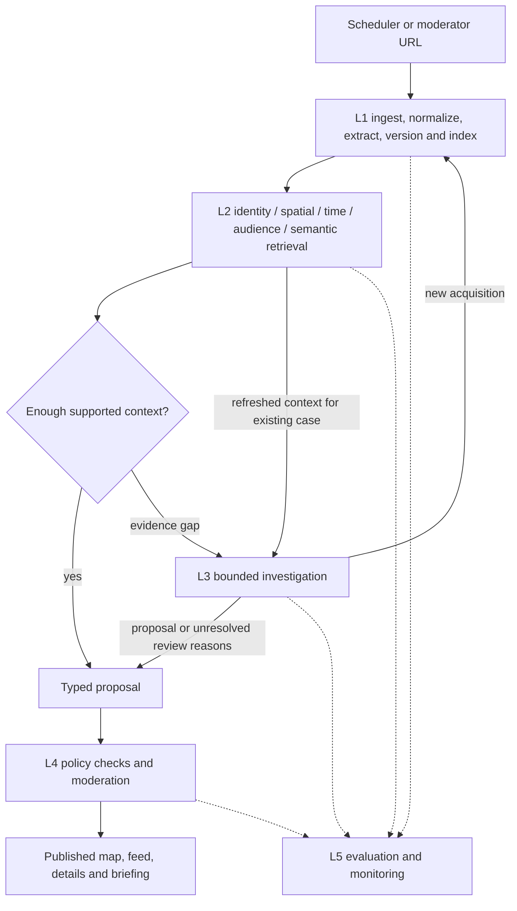

# Waspada Jakarta — Software Development Plan

**Team:** 12

**Baseline:** 0.1 — 24 September 2026

**Status:** Initial planning baseline; implementation not started

**Purpose:** Direct development of the complete prototype from requirements through implementation, review, evaluation and deployment.

This Software Development Plan (SDP) is the project's main engineering document. It combines the release scope, a requirements baseline, work breakdown, delivery process and acceptance gates. The detailed architecture and source-verification specifications remain linked supporting documents. A separate Software Requirements Specification (SRS) can later be extracted from the requirements here if the course requires it; duplicating the same requirements now would create competing versions.

## 1. Document ownership and change control

| Document | Owns |
| --- | --- |
| This SDP | Current delivery scope, requirements, milestones, responsibilities and release acceptance |
| [PROJECT_PLAN.md](PROJECT_PLAN.md) | Product context, ten-category taxonomy and user-facing concept |
| [ARCHITECTURE.md](ARCHITECTURE.md) | Five-layer boundaries, retrieval, investigation and publication design |
| [SOURCE_VERIFICATION_PLAN.md](SOURCE_VERIFICATION_PLAN.md) | Acquisition, evidence independence, source-specific freshness and publication rules |
| [docs/contracts.schema.json](docs/contracts.schema.json) | Proposed versioned message shapes; not the complete database or public API schema |
| [docs/IMPLEMENTATION_BACKLOG.md](docs/IMPLEMENTATION_BACKLOG.md) | Ordered work packages, dependencies and review status |
| [docs/decisions/README.md](docs/decisions/README.md) | Architecture decision record (ADR) process and open decisions |
| [AGENTS.md](AGENTS.md) | Planner, implementer and reviewer operating rules |
| [REFERENCES.md](REFERENCES.md) | Source register for the eventual report bibliography |

The latest user instruction is authoritative. Within the repository, the SDP owns scope and delivery; supporting specifications own their detailed subject. Resolve a conflict explicitly rather than letting an agent select the easier rule. The root planner records the decision and updates all affected documents together. Numerical budgets, model settings and thresholds are versioned configuration, not measured guarantees.

Google Docs remains the maintained university report. Markdown is the engineering planning format. The root reports accepted engineering changes; update the presented report when requested or when a report-update task is scheduled. No LaTeX work is required.

## 2. Product objective and success

Build a Bahasa Indonesia website that connects reported safety incidents and disruptions in Jakarta to affected places, services and groups. Users can determine what happened, whether it applies to them, what is still current, and which evidence supports it. The system collects sources automatically, investigates unresolved evidence gaps within limits, and gives moderators control over disputed claims and corrections.

The prototype provides situational awareness. It does not dispatch responders, guarantee route safety, score neighbourhood criminality, identify individuals, or infer active danger from historical news volume.

| Story | User outcome | Primary acceptance scenario |
| --- | --- | --- |
| US-01 Discovery | As a Jakarta resident or visitor, I want to explore incidents relevant to my location or situation so I can make informed activity decisions. | Find an applicable event, read its event time and evidence, and distinguish a point from a warning boundary. |
| US-02 Following updates | As someone potentially affected, I want updates about places, services and interests I follow so I can respond when conditions change. | Save an interest; see a relevant update and its reason; see a correction without duplicate alerts. |
| US-03 Trustworthy maintenance | As a moderator, I want evidence comparison, bounded investigations and disputed-claim review so published information remains current and traceable. | Inspect origins, resolve a disputed detail, and verify a correction reaches every public view. |

Validate needs with 6–8 interviews. The initial usability target is at least 80% of participants completing the discovery task within one minute. Record sample size and failures; a small class study does not establish population-wide performance.

## 3. Release scope

### 3.1 First complete prototype

- Responsive map and linked feed, category/time/status filters, place search, event details, evidence links and change history.
- Locally stored place/service/group preferences, a personal briefing and in-site update centre. Reading public information requires no account.
- Authenticated moderator workspace for source registration, submitted URLs, review, correction, candidate merging and retraction.
- Scheduled BMKG, PetaBencana and ANTARA acquisition as initial connector candidates; add a permitted traffic/operator source for the demonstration. Each connector needs a fresh feasibility check before activation.
- Ten supported category labels; four complete scenarios: historical crime, gathering plus transport impact, weather warning plus flood observation, and a non-geographic group notice.
- Versioned evidence storage, extraction, hybrid retrieval, a direct grounded proposal path, bounded investigation, deterministic publication, freshness jobs and monitoring.
- Reproducible labelled fixtures, automated checks, a single-server deployment specification, backup/restore procedure and operator handover.

Historical or synthetic fixtures can fill source gaps in the demonstration, with explicit labels and a separate demo environment/data namespace. A fixture-backed scenario must never be reported as a live integration.

| Scenario/source | Intended delivery mode | Activation and fallback |
| --- | --- | --- |
| BMKG weather warnings | Live connector candidate | Fresh access/validity checks required; labelled historical CAP fixtures if unavailable. |
| PetaBencana observations | Live connector candidate | Preserve crowdsourced labels; an empty current feed is valid; historical fixtures demonstrate populated cases. |
| ANTARA Metro/crime | Live discovery candidate | RSS discovery plus permitted article extraction; moderator-reviewed original URL/excerpt if full retrieval is unavailable. |
| Gathering with traffic/operator impact | At least one approved automated traffic source plus moderator-submitted complementary material | SPEC-01 selects the viable source; do not promise a live operator feed before access is established. |
| Group-specific notice | Moderator-submitted official original | Live automation optional; a labelled historical/synthetic notice demonstrates audience-only retrieval. |
| Remaining category labels | Schema support and evaluation fixtures | Additional live connectors are subsequent scope; category support alone does not imply current coverage. |

No source above is currently enabled in an implemented application. SPEC-01 records the final live/manual/demo mode and evidence for each connector before implementation acceptance.

### 3.2 Later releases

Citizen report submissions, browser push, route analysis, chat-based question answering, local LLM hosting, fine-tuning, native mobile applications, broad social-media scraping, high availability and integrations for every category are deferred. Source acquisition and moderation support broad categories without promising live coverage of them all.

## 4. Requirements baseline

Requirement IDs remain stable across task and design changes. “Must” identifies the initial release gate; “target” identifies a hypothesis to measure.

| ID | Requirement and observable acceptance | Priority |
| --- | --- | --- |
| FR-01 | A source registry records source identity, remit, access method, approval, restrictions and health; unapproved sources cannot auto-publish. | Must |
| FR-02 | Scheduled and moderator-submitted acquisitions enter the same pipeline. IDs/URLs/content hashes prevent unchanged content from creating duplicate processing work. | Must |
| FR-03 | Store immutable permitted source text/revisions and evidence offsets, keeping event, observation, publication, retrieval and validity times distinct. | Must |
| FR-04 | Extract category, place/audience, time, qualifiers and source spans; preserve unknowns and quarantine malformed or ambiguous results. | Must |
| FR-05 | Retrieve exact references and compatible spatial/time/audience/semantic evidence, including contradictions, before invoking L3. | Must |
| FR-06 | Match reports to candidate events and track independent origins per claim. Copied reports do not inflate corroboration; uncertain matches are reviewed. | Must |
| FR-07 | Sufficient evidence bypasses investigation. Missing evidence creates a persisted bounded case with tools, counters, stop reasons and escalation. | Must |
| FR-08 | Both paths and moderator corrections use one publication gate with evidence, scope, source, freshness and concurrency checks; models cannot publish. | Must |
| FR-09 | Display only supported geometry: points, source-defined polygons or road/service segments. Non-geographic notices remain accessible. | Must |
| FR-10 | Map/feed/details expose source links, evidence labels, event time, freshness and supported effects; public queries exclude private drafts. | Must |
| FR-11 | Preferences produce explainable relevant briefings and material updates; removing an interest removes its personalization. Repeated coverage does not repeat alerts. | Must |
| FR-12 | Moderator authentication and authorization protect review, source approval, corrections, merges and withdrawals; all actions have an audit record. | Must |
| FR-13 | Expiry, retraction and stale-observation jobs update dependent public views. Missing updates cannot mark an incident resolved. | Must |
| FR-14 | Every pipeline run links reports, context, model configuration, investigation and publication decision through a trace ID. | Must |
| FR-15 | Demo/historical records are clearly separated from live active warnings; empty coverage is not displayed as an all-clear. | Must |

| ID | Quality requirement | Initial acceptance evidence |
| --- | --- | --- |
| NFR-01 Evidence integrity | No known unsupported factual claim or geometry is published in release scenarios. | Adjudicated claim/span and geometry checks; disputed cases held. |
| NFR-02 Resource bounds | L3 stops at 5 tool attempts, 4 reasoning turns, 60 active seconds or 12,000 model input/output tokens, whichever comes first. | Failure/retry/resume cases; preflight reservations and persisted counters; no budget reset. |
| NFR-03 Usability | Mobile and desktop discovery remain usable with a list fallback; keyboard access and understandable labels. | US-01/02 tasks on a real phone and desktop, 80% target, documented issues. |
| NFR-04 Responsiveness | Public API reads never wait for scraping or model inference. Provisional target: p95 <=1 second at 20 concurrent browsing sessions on the declared reference host. | A repeatable workload with stated event/vector volume, connection settings and background load; target revisited after baseline measurement. |
| NFR-05 Reliability | Duplicate delivery/retries do not duplicate public versions or notifications; stale proposals cannot overwrite a newer event. | Transaction, retry and optimistic concurrency cases. |
| NFR-06 Recoverability | Nightly external backup; proposed prototype RPO 24 hours and RTO 4 hours. | Timed restoration into an isolated database and reconciliation of pending jobs; no guarantee until rehearsed. |
| NFR-07 Privacy/security | Least-privilege roles, approved outbound hosts, input isolation, minimal personal data and protected moderator access. | Access-control, malicious-source, redirect, secret-handling and retention checks. |
| NFR-08 Maintainability | Layer responsibilities, versioned interfaces and reproducible builds remain explicit. | Dependency locks, migrations, clear run instructions, reviewed contract changes. |

## 5. Architecture and deployment baseline

Five logical layers: L1 owns collection, cleaning, pipeline extraction and storage; L2 owns model adapters and grounding; L3 coordinates unresolved investigations; L4 owns policy and application interfaces; L5 measures and monitors the entire system. Responsible AI applies throughout. A fixed L2 model adapter inside preprocessing does not make L1 an autonomous agent.

The refreshed-context edge applies only to an already open investigation and preserves its case ID/budget. The initial sufficient-context path never opens L3. A moderator's evidence-backed correction re-enters L4 checks.

The proposed deployment baseline, based on the latest hosting discussion, is one Linux VPS with a reverse proxy, static React/TypeScript frontend, FastAPI API, scheduler, bounded workers, and PostgreSQL with PostGIS and pgvector. Use separate processes/containers, database roles and resource limits on that host. A PostgreSQL-backed job queue keeps initial infrastructure small; leases, unique job keys, retries and crash recovery must be implemented explicitly. LangGraph manages L3 state transitions and checkpoints, not all application scheduling.

Budget initially for **4 vCPU, 16 GB RAM and 100 GB expandable SSD**, with hosted extraction, embedding and reasoning APIs. This is a sizing assumption requiring measurement, not a promised capacity. Start with one concurrent investigation and one or two ingestion jobs. A local model/GPU server is outside the baseline. Provider, hosting region, model versions, paid service budget and exact dependency versions remain open implementation decisions.

Backups are stored outside the VPS. Put large permitted source files in object/file storage and retain references in the database. On a single host, failure affects all services; the MVP accepts this limitation subject to the restore rehearsal. Public browsing uses stored published versions during model outages and shows source freshness limitations.

## 6. Data lifecycle and status model

Store source registry, report revisions, extracted candidates, chunks/vectors, origin relationships, events/impacts, claim versions, contexts, investigations, decisions, jobs/outbox, moderator accounts and audit records. Existing JSON contracts define message boundaries; M1 must add database relations, public/review API shapes and migration rules.

Known contract work for SPEC-02: define source/origin/geometry/event/impact/checkpoint records; replace free-text category with the agreed taxonomy plus tags; record embedding capability/version/dimensions separately from extraction/reasoning runs; distinguish investigation limits from consumed/reserved counters; formalize ID/version pairing, time ordering and status transitions. Do not treat the existing six illustrative contracts as a complete implementation model.

Keep four independent dimensions:

| Dimension | Proposed representation | Owner |
| --- | --- | --- |
| Incident or impact lifecycle | planned, ongoing, resolved, cancelled, unknown | Evidence-backed proposal and L4 decision; each impact has its own lifecycle. |
| Freshness | current, needs_update, expired | L4 time rules and scheduled checks; not a finding that physical conditions are safe. |
| Evidence | issuer notice / attributed / independently corroborated; support may be disputed or withdrawn | Recorded provenance, assessments and moderation. |
| User relevance | Match by place, service, institution or user-selected group | Deterministic relevance rules; not a global event truth label. |

These conceptual states must become an explicit transition table and versioned enums in M1. Distinguish source eligibility, source revision status and claim evidence labels; they are not interchangeable.

Maintain histories for collected events, not every event that ever happened. Active-condition retrieval filters validity and eligibility; historical matching can access older records; audit views can inspect retracted evidence without treating it as current support. Invalidations affect chunks, vectors, caches, dependent summaries and public versions. Retrieval checks source state even when indexing is delayed.

Baseline freshness rules remain those in SOURCE_VERIFICATION_PLAN.md: explicit issuer validity first; 60-minute review deadline for fast-changing observations; 24-hour review for an undated-end advisory. Fetching again never refreshes observation time. Proposed polling intervals are BMKG 2 minutes, PetaBencana 5 minutes and news/traffic 10 minutes, always subject to source limits.

Retention durations and permitted archival formats require a source/data retention matrix before live enablement. Do not promise indefinite raw-document retention. Minimize unnecessary personal details before embedding; a deletion workflow must reach derived data and define backup expiry. Public user location remains optional; prototype preferences stay on the user's device.

## 7. AI strategy and verification

Use deterministic parsing for known fields, a low-latency classification/extraction adapter for prose, a dedicated embedding capability, and a reasoning adapter for synthesis/conflict assessment. The grounding and investigation roles may share a reasoning model while having different instructions and permissions. OCR is optional for selected image/scanned-document cases and requires review of uncertain dates and geography. No fine-tuning is planned initially.

Start with exact vector retrieval on the small corpus, combined with source identity, event time, PostGIS and audience/service lookup. The initial limit is 20 candidate chunks and at most 8 evidence chunks to synthesis; preserve relevant contradictions and record truncation/coverage gaps. Any later approximate index must justify its recall trade-off.

Proposals contain traceable support and explicit unknowns. Deterministic checks establish shape, resolvable references, scope, versions and eligibility; semantic support and source independence still need assessed evidence. Novel inference, uncertain independence or material contradictions go to review. Auto-publication remains disabled during early integration and is enabled per approved source/rule only after reviewer acceptance of held-out cases.

L3 tools are typed, allowlisted source search/acquisition, gazetteer lookup and refreshed evidence lookup. Count failed attempts and retries, disallow hidden bulk fan-out, persist usage before execution, and reconcile interrupted calls. Stop on sufficient evidence, repeated unchanged lookup, two non-progress results, exhausted limits or unresolved material dispute. Newly acquired material always passes through L1/L2. Preprocessing before an investigation has its own bounded retry/timeout policy; the L3 ledger covers model calls caused by that investigation.

## 8. Milestones and dependency order

Weeks are relative estimates inherited from the semester plan, not committed calendar dates. Agents may work concurrently on independent tasks after shared interfaces are stable.

| Milestone | Window | Deliverable and exit gate |
| --- | --- | --- |
| M0 Planning baseline | Now | Versioned SDP, linked architecture, backlog and agent/review rules in local Git; origin connected to the team's GitHub repository. No application completion claim. |
| M1 Requirements and contracts | Weeks 1–2 | User/source findings, wireframes, entity/state/API specifications, labelled fixture plan and key ADRs reviewed. |
| M2 Data foundation | Weeks 3–4 | Local runtime, migrations, source registry, permitted connectors and idempotent preprocessing; traces, basic API, early feed/detail/map shell and read-only moderator views using reviewed fixtures. Real moderation mutations wait for MOD-01 authorization. |
| M3 Grounded direct path | Weeks 5–6 | Model adapter comparison, hybrid retrieval and typed proposals with fixtures; supported cases bypass L3. |
| M4 Bounded investigation | Weeks 7–8 | Tool service, durable counters/checkpoints and escalation; exhaustion, malicious input and restart cases pass. |
| M5 Complete application | Weeks 9–10 | One publication gate, moderation, responsive map/feed/details/preferences/briefing and consistent correction updates. |
| M6 Evaluation and operation | Weeks 11–12 | Held-out evaluation, usability, deployment/restore rehearsal, operating guide and final report evidence. |

Build L4 policy foundations and UI using reviewed fixtures before M5; M5 is the integration gate, not the start of that work. Instrumentation and evaluation cases begin in M1/M2. Finish a narrow end-to-end path before expanding connector breadth.

Use separate local development, isolated demo/staging and eventual live deployment configurations with distinct databases, secrets and source-enable flags. The first integrated slice is moderator-approved. Source-specific automatic publication is a later reviewed gate within the prototype, never the default for unassessed model output. Release changes through a versioned build, database migration plan, health check and rollback procedure; recovery must account for migrations that cannot simply be reversed.

## 9. Team and agent responsibilities

| Role | Responsibility |
| --- | --- |
| Root assistant | Planner and reviewer: write bounded assignments, maintain requirements, resolve interface decisions, inspect changes, evaluate verification evidence and integrate accepted work. |
| Implementation subagents | **GPT-6 Luna, max reasoning**: implement assigned work and relevant checks; return evidence and limitations; address review findings. |
| Jesaya Hamonangan Gaudensius Malau — 2406409845 | Proposed human ownership of storage/spatial contracts, backend API and publication policy. |
| Perry Tjahya — 2406409965 | Proposed human ownership of connectors/preprocessing, model/grounding capabilities and investigation. |
| M. Rasya Syahputra — 2406357803 | Proposed human ownership of frontend/moderation experience and evaluation/monitoring integration. |

Human owners validate requirements, adjudicate labelled evidence and accept product decisions. Subagents are engineering implementers, separate from the product's runtime investigation agents. Do not encode the implementation-agent model preference as the production model choice.

Workflow: root selects a ready task → specifies allowed paths/interfaces and acceptance checks → dispatches a Luna/max agent → implementer returns changes and actual results → root reviews against requirement IDs → fixes are requested if needed → root integrates and records an accepted commit. Disjoint tasks may run concurrently in separate worktrees. Shared migrations, contracts and dependency locks have one integration owner.

Root review checks behavior, evidence correctness, layer boundaries, security, migration impact, failure handling, maintainability and actual acceptance results. An agent's “done” message alone is insufficient. Task states are planned, ready, in_progress, in_review, changes_requested, accepted or blocked. Record the blocker/dependency explicitly; accepted is set by the root.

## 10. Verification and release acceptance

Use at least 40 reports across at least 12 cases, at least three documents per case, with additional revisions where needed. Cover all ten labels and the four deeper scenarios. Two human reviewers reconcile expected event identity, time, geography, evidence origin, claim support and publication decisions. AI predictions are not their own ground truth. Keep an incident's copies and revisions together in the same split; freeze held-out cases before prompt/retrieval tuning.

| Area | Required evidence before acceptance |
| --- | --- |
| Data/model boundaries | Contract and parser checks; explicit unknowns; source offsets survive normalization; model failures enter review/quarantine. |
| Retrieval/matching | Supporting and contrary evidence recall@k, merge/split precision/recall, non-geographic notices, nearby distinct incidents and retracted vectors. |
| Orchestration | Sufficient-context bypass, typed tools, retries counted, durable budgets, no-progress stopping and escalation. |
| Publication | Unsupported/disputed claims held; approved-source scope; no invented geometry; idempotency, concurrency and correction propagation. |
| Application | US-01/02/03 browser flows, mobile/list fallback, filtering, empty/error states, moderator access and preferences. |
| Operations | Provider/source outage, worker crash, connection/disk limits, scheduled expiry, database migration and restore rehearsal. |

Report quality counts and rates separately by category/source/model role; track review workload, latency, tokens and cost. Set model accuracy thresholds during M1/M3 with the labelled cases and workload; do not invent benchmark results. Release-blocking defects include known unsupported publication, exposed personal data, wrong active warning geometry, budget bypass, unauthorized moderation, and stale/retracted evidence reinstated as current.

Definition of done for each implementation task: intended behavior complete, relevant checks executed and reported, interface/migration/docs updated, no unresolved blocking review finding, and root acceptance recorded. Release completion additionally requires all Must requirements, four integrated scenarios, actual held-out/usability evidence, a reproducible deployment and restored backup. A model or source outage may reduce coverage but must not silently fabricate freshness or safety.

## 11. Risks, cost and open decisions

| Risk | Response and owner |
| --- | --- |
| Source changes, limited access or incomplete coverage | Connector acceptance checklist, fixtures/manual URL fallback, health display; Perry. |
| Incorrect dates, event merging or claimed independence | Human-labelled adversarial cases, typed unknowns, claim-level lineage and review; Perry + Jesaya. |
| Scope exceeds three-person capacity | Four integrated scenarios, narrow connector set, stable IDs and dependency gates; root + team. |
| Model cost or investigation loops | Per-case limits, separate configurable daily spend ceiling, usage ledger, queue backpressure; Perry. |
| Single-server contention or failure | Worker concurrency/resource limits, API isolation, external backup/restore rehearsal; Jesaya. |
| Moderator backlog | Count queue age and review rate, prioritize current operational impact, reduce automatic intake if capacity is exceeded; Rasya + team. |
| Prompt injection or data exposure | Isolated source inputs, outbound restrictions, least privilege and privacy minimization; shared. |

No paid provider, hosting purchase, external deployment or public launch is part of this planning task. Implementation can begin with fixtures and mock adapters while cost-dependent decisions remain open. Record infrastructure, inference, embedding, OCR, map/geocoding and backup costs separately; actual spending limits must be selected before enabling paid jobs.

Open decisions with owners and timing are in the ADR register. The next work package is M1 contract/source/UX preparation, followed by the first data-to-public-view slice. Product implementation starts only when the user moves from this planning task to implementation.
