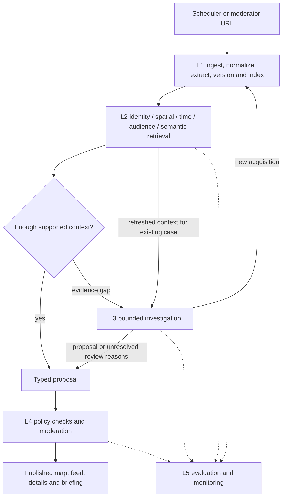

# Waspada Jakarta — Software Development Plan

**Team:** 12

**Baseline:** 0.1 — 24 September 2026

**L3 advance replay decision:** [ADR-051](docs/decisions/ADR-051-l3-advance-replay-and-stage-timing.md) requires action reservation time to be sampled after planner reconciliation and makes interrupted partial advances fail closed until a future runtime can prove the prior attempt terminal or fenced. `L3-ACTION-RESERVATION-TIMING-CORE` is accepted locally: the coordinator validates the planner checkpoint before sampling trusted wall time, compares bounded RFC3339 instants at full fractional precision, and denies action/refresh on malformed or regressing time. `L3-ADVANCE-REVIEW-PENDING-CORE` is now accepted locally with migration 035: a private append-only marker holds uncertain partial advances, serializes against reserve/start, and blocks new L3 progress while allowing only the exact already-started reservation to reconcile. It is not execution fencing, cancellation, terminal proof, or permission to retry. Checkpoint/public contracts and Workflow/runtime wiring are unchanged. Hosted PostgreSQL concurrency and Workflow recovery remain unverified.

**Accepted Layer 4 slice and label decision:** `PUB-01-MANUAL-GATE-CORE` reads a strictly validated persisted live proposal, rechecks it against current policy inputs, requires explicit authorized moderator approval, and constructs a typed write request. `PUB-01-REVIEWED-EVIDENCE-LABEL-CORE` is accepted locally: the service maps moderator choices by exact claim ID, and the SQL writer requires a selected label for each `publish` claim decision, rejects labels on non-published decisions, and stores the value consistently in the private decision, public Event claim, and normalized claim row. The command fingerprint includes labels. Team 12's rule is documented in [ADR-052](docs/decisions/ADR-052-moderator-selected-public-evidence-labels.md): labels use the existing four-value public enum; `under_review` remains private; choices do not replace policy eligibility or authorization. The schema-2.0 decision property is optional for legacy reads and required on new published claim decisions. No migration or grant changed. These internal services have no route/runtime registration and do not activate publication in the read-only demo. Synthetic tests do not establish source rights, factual quality, moderator identity integration, hosted Neon behavior, or deployed behavior; see the [implementation handoff](docs/assignments/PUB-01-REVIEWED-EVIDENCE-LABEL-CORE.md).

**Accepted publication composition proof:** `PUB-01-MANUAL-GATE-PGLITE-CORE` composes the strict persisted-proposal reader, manual gate, and real SQL writer under the existing moderator role in synthetic PGlite tests. The tests verify claim-ID label/evidence lineage, private proposal immutability, one coherent write, replay, changed-label conflict, and stale-policy denial, with exact fixture-scoped snapshots across all 14 publication tables. The DB runner auto-discovers the test; no package registration or production wiring changed. Root accepted the branch on `main`; see the [assignment and handoff](docs/assignments/PUB-01-MANUAL-GATE-PGLITE-CORE.md).

**Accepted Layer 2 audience retrieval:** `RAG-01-AUDIENCE-RETRIEVAL-CORE` adds a bounded list of exact audience IDs to internal evidence retrieval, matching only schema 2.0 `scope.audience_ids`. It can return a group notice without geographic or text matches and reports only exact matched IDs as candidate discovery hints. Retrieval behavior is versioned `hybrid-evidence-v2`; persisted context and public contracts are unchanged. The SQL query passes under the existing local L2 reader role. This does not establish audience extraction accuracy, evidence support, factuality, retrieval quality, or publication eligibility; hosted Neon remains unverified. See [ADR-053](docs/decisions/ADR-053-audience-evidence-retrieval.md) and the [assignment review](docs/assignments/RAG-01-AUDIENCE-RETRIEVAL-CORE.md).

**Accepted publication-to-public-read composition:** `PUB-01-PUBLIC-READ-CHAIN-PGLITE-CORE` exercises an initial publication and correction through the accepted Layer 4 manual gate and SQL writer, then verifies exact-version reviewed history and update-feed projections. Moderator-selected claim evidence labels remain separate from reviewed disclosure type and summary. Fixtures are fictional and stored only in disposable PGlite; the composition does not configure routes, reviewer authentication, or hosted services. See the [assignment review](docs/assignments/PUB-01-PUBLIC-READ-CHAIN-PGLITE-CORE.md).

`API-01-LIFE-01-PUBLIC-READ-PGLITE-CORE` is also accepted locally: its synthetic PGlite test follows source-withdrawal freshness through public list, detail and GeoJSON routes while preserving event-level freshness metadata, lifecycle, and published content. Three subsequent local seams are now accepted and recorded in [the implementation backlog](docs/IMPLEMENTATION_BACKLOG.md): a bounded RSS discovery parser, a persisted L3 review-hold coordinator composition, and publication-to-public-list/detail PGlite verification. These slices add no live-source behavior, hosted access, or moderator write routes. The 8 October 2026 first-party terms review is recorded in [SPEC-01](docs/SOURCE_FEASIBILITY.md) and [REFERENCES.md](REFERENCES.md), with the actionable source clearance sequence in [SOURCE_CLEARANCE_PLAN.md](docs/SOURCE_CLEARANCE_PLAN.md): BMKG's integration permission, PetaBencana's conflicting published license statements, ANTARA's written-permission conditions, and dataset-specific Satu Data rights remain unresolved. The BMKG permission-request draft retains sender, university, and supervisor placeholders at Team 12's direction; no source owner was contacted and no request was sent. Live-source ingestion and provider evaluation remain gated by documented reuse rights and the independent EVAL-01 casebook; protected moderator write routes remain deferred for the read-only course demo under [ADR-028](docs/decisions/ADR-028-read-only-moderator-demo.md), and the source-freshness Worker runtime remains explicitly paused.

**Status:** The exact live-mode Worker routes for event lists, current-public detail, reviewed history, GeoJSON, transient briefings, and the public update feed use request-scoped SQL reads and strict Layer 4 projections. The update runtime validates the query and signed cursor before SQL, then reads its watermark and candidates in one repeatable-read, read-only transaction; cursor restart errors use HTTP 410. History and all versions of an event stay hidden after its latest version is withdrawn. The GeoJSON runtime composes bounded spatial candidates, exact current snapshots, reviewed lookups, and the accepted feature projection; the checked-in Worker still defaults to demo and has no configured Hyperdrive binding or live connection. Migration 015 provides the least-privilege spatial candidate view. The accepted `UI-01-GEOJSON-MAP-CORE` browser client reads and renders only returned source-supported geometry; demo GeoJSON remains empty because fixtures contain no supported geometry, and empty results never imply safety. `GET /api/v1/context` supports an exact server-selected live-mode response through the existing source-status provider; no connectors are registered, so it returns `sources: []`, while the checked-in Worker remains demo-only. The exact-match Layer 4 briefing projector, bounded current-public candidate reader, exact-live `POST /api/v1/briefings` runtime, and explicit live-only browser briefing display are accepted. The browser update centre is also accepted: it uses local interests without transmitting them during polling, hydrates current public details with bounded concurrency, stores only an opaque cursor, and polls only while the view is visible and active; a 410 reset clears displayed updates and re-baselines before resuming. The L3 reasoning-step budget boundary and its PGlite/durable-ledger verification are accepted; `L3-PROGRESS-FINGERPRINT-CORE` and the bounded `L3-COORDINATOR-CORE` composition are accepted on `main`. The coordinator performs at most one planning call, registered action, and L1/L2 refresh per advance; production source-to-L1/L2 dispatch and the Cloudflare Workflow runtime remain open. A separate synthetic poll processor is now composed in the scheduled Worker, but stays dormant without its injected fixture catalog and L2 extractor. `OBS-01-SYNTHETIC-POLL-PROCESSOR-TELEMETRY-CORE` is accepted: active processor calls emit only a closed outcome, finite duration and bounded completion counts, with the existing console sink isolated behind the unchanged runtime gates. The checked-in Worker still lacks a catalog and extractor, and no remote log destination is configured. Hosted Neon collation/query-cost and migration behavior, production fingerprint-key management, Worker/database runtime composition, real review records, authenticated review writes, and source/data rights remain unverified or gated. The source permission review is now organized as a staged clearance plan in [docs/SOURCE_CLEARANCE_PLAN.md](docs/SOURCE_CLEARANCE_PLAN.md); its first recommended request is BMKG, but no request is sent and every live connector remains disabled.

`PUB-OUTBOX-DELIVERY-CORE` is accepted as a local Layer 4/5 delivery capability for immutable publication notices. It reserves one ordered page of at most 20 notices, writes append-only attempt/result records, uses bounded retry and an injected sink keyed by stable outbox ID, and emits only count-only telemetry. It does not configure an external sink, Cron, Worker binding, or cloud service. Hosted role activation and remote delivery remain unverified; see [ADR-041](docs/decisions/ADR-041-publication-outbox-delivery.md) and the [handoff](docs/assignments/PUB-OUTBOX-DELIVERY-CORE-HANDOFF.md).

The accepted `LIFE-01-FRESHNESS-TRANSITION-CORE` adds a deterministic Layer 4 policy for one event or impact record: issuer `valid_until` ends freshness at the inclusive boundary, missed `review_due_at` produces `needs_update`, and stale states recover only after newer applicable evidence is evaluated by Layer 4. ADR-032 records the user-selected conservative event aggregate: any public item needing update or a mix of current and expired items yields event `needs_update`; event `expired` requires every included public freshness value to be issuer-expired; event `current` requires all included values to be current. The event's claims remain grouped under event-level freshness, while each impact retains its own freshness. `LIFE-01-FRESHNESS-AGGREGATE-CORE` implements this derived status in current-public Layer 4 projections and database list/GeoJSON filters. It preserves event-level evaluation metadata and adds no claim-level schema or API field. Persistence is handled by the separate accepted append-only ledger. The bounded exact-version due-target reader, one-page explicit-time evaluator, PGlite composition, trace functions, and disabled-by-default scheduled Worker runtime are accepted. The runtime requires exact live mode, an explicit flag, and a dedicated freshness-writer connection; it processes one page of at most 100 targets per stable schedule slot and uses the fixed-purpose migration-026 trace functions. No Cron, Hyperdrive resource, hosted role membership, source access, or live processing is configured, so the checked-in demo remains dormant; hosted Neon and Cloudflare behavior are unverified. `OBS-01-FRESHNESS-DUE-TELEMETRY-CORE` is accepted. Layer 5 records only a closed outcome, finite duration, and validated evaluator counts for active runs; schedule/run, event/source/evidence, content, connection, and error details are excluded, and telemetry failures cannot affect the run.

The public `Freshness` contract stays unchanged: only `status` is aggregated, while `evaluated_at`, `review_due_at`, and `basis` remain those of the grouped event claim set. Each impact retains its own freshness. Migration 020 derives an internal event status from the grouped claim set and exact referenced impact versions; list and GeoJSON filters use that value before pagination or feature limits. Migration 025 projects the latest ledger status for the exact current event and referenced impact versions through the existing safe views, keeping list, GeoJSON, and detail reads aligned while the underlying published JSON and public DTO/OpenAPI remain unchanged. Historical version status stays as published, and latest-withdrawn events and their history remain hidden. See the [aggregate handoff](docs/assignments/LIFE-01-FRESHNESS-AGGREGATE-CORE-HANDOFF.md) and [current read-projection handoff](docs/assignments/LIFE-01-FRESHNESS-READ-PROJECTION-CORE-HANDOFF.md).

Local Layer 1 wires the typed, append-only schema 2.0 extraction repository into the synthetic moderator-submission queue pipeline. The worker passes an authored candidate ID and prepared report to the injected L2 extractor, persists exact evidence links for all four relations, then acknowledges the job. Before extraction on a retry, it reads by dataset/candidate after create-or-verifying the report, validates the stored schema, row identity and exact evidence links, and reuses the result without another model call. Layer 2 retrieval now projects source publication, observation, retrieval, and validity timestamps as UTC RFC3339 with microseconds before strict grounding; the PGlite regression verifies offset conversion, nulls, and context assembly. This is a synthetic-only local proof; hosted Neon behavior and any live provider remain unverified.

`L2-CONTEXT-READ-CORE` is accepted locally at fast-forward `9069d76`, preserving implementation `9a1d1dd` and handoff `9069d76`. The Layer 2 repository now supports exact `(dataset_kind, context_id)` reads, validates the persisted schema 2.0 record against normalized columns, and checks every linked evidence, event-version, and decision identity. The read uses existing writer-role grants and never mutates rows; PGlite verifies denied access through public, L1, L2 retrieval-reader, and L3 coordinator roles. Root independently passed the focused 14/14 suite; the agent passed the updated full `npm test` (web 60, Worker 440, DB 40 files, evaluation 19), typecheck, build, and assigned-base diff check in WSL Ubuntu-26.04. No migration, grant, runtime, API, provider, dependency, or deployment change was needed. The record remains refs-only. [ADR-049](docs/decisions/ADR-049-l2-grounding-context-resume.md) defines restart rehydration that re-reads exact evidence, pinned revision states, current source eligibility, timestamps, and provenance before producing an ephemeral reasoning request. `L2-CONTEXT-RESUME-CORE` is accepted with the exact-span runtime guard documented in the root review record; no Workflow is enabled. Hosted Neon remains unverified. See the [read assignment and handoff](docs/assignments/L2-CONTEXT-READ-CORE.md).

`JOB-01-SCHEDULED-POLL-CORE` adds a bounded, enqueue-only Layer 1 scheduler. Given an explicit RFC3339 instant, dataset, and persisted trace, it selects at most 100 active, approved sources whose configured polling interval is due and enqueues stable keys for the current UTC slot. It skips sources with pending, leased, or retry poll jobs, rejects invalid calendar dates, and does not fetch content or update source health. `JOB-01-SYNTHETIC-SCHEDULE-RUNTIME-CORE` composes it in the Worker scheduled entrypoint: exact demo opt-in, a separate L1 connection, validated platform time, and a synthetic database namespace are required before one L1-role transaction persists a count-only trace and jobs. `JOB-01-SYNTHETIC-POLL-WORKER-RUNTIME-CORE` now adds a separate post-enqueue processor trigger. It requires the same exact demo mode plus a separate opt-in, dedicated L1 connection, in-memory source-ID fixture catalog, and injected L2 extractor; missing capabilities return before SQL or claim. Each active invocation uses the existing one-job L1 runner, request-scoped client, and repository transactions without holding a transaction across extraction, then resets the role. Checked-in configuration still has no enable flag, L1 binding, fixture catalog, extractor, or Cron expression, so both scheduled paths remain dormant. Local PGlite/Worker checks pass; deployed scheduling, external/live collection, hosted Neon behavior and independent PostgreSQL concurrency remain unverified.

`JOB-01-SYNTHETIC-POLL-CLAIM-CORE` and `JOB-01-SYNTHETIC-POLL-PROCESSOR-CORE` provide a bounded local Layer 1 path for synthetic polling: the typed lease is fixed to synthetic `source_poll` jobs, then one claimed job can resolve an authored, buffered fixture by exact source ID and reuse the existing parser, extraction, persistence, replay, and queue transition rules. The accepted `JOB-01-SYNTHETIC-POLL-CYCLE-PGLITE-CORE` composes the real scheduler, queue, and fixture pipeline under the L1 role and verifies writes precede acknowledgement. The Worker now calls the separate processor trigger after enqueueing, with independent gates; it remains unable to process without injected fixture and extraction capabilities. Root independently passed the focused Worker tests (6/6), PGlite composition (1/1), and assigned-base diff check. The agent passed `npm run db:test` (31/31 files), full `npm test` (web 60, Worker 413, DB 31 files, evaluation 12), typecheck, and build in WSL Ubuntu-26.04. This path does not fetch network content, call L3, create events/publications, or configure a deployed schedule. External/live collection, hosted Neon behavior and independent PostgreSQL concurrency remain unverified; see the [handoff](docs/assignments/JOB-01-SYNTHETIC-POLL-WORKER-RUNTIME-CORE-HANDOFF.md).

**Purpose:** Direct development of the complete prototype from requirements through implementation, review, evaluation and deployment.

`OBS-01-L3-COORDINATOR-TELEMETRY-CORE` is accepted: the opt-in Layer 5 wrapper emits only a closed outcome and finite elapsed duration, preserves the exact result or error, and has no runtime caller or external log sink. Independent review found no actionable implementation issue. Hosted logging and Cloudflare execution remain unverified; see [ADR-050](docs/decisions/ADR-050-l3-coordinator-outcome-telemetry.md) and the [assignment handoff](docs/assignments/OBS-01-L3-COORDINATOR-TELEMETRY-CORE.md).

`L3-CONTEXT-RESUME-COORDINATOR-CORE` is accepted at root integration commit `5359b36354048002b7ac1237c7cc74c545cb0149`. Its synthetic PGlite test reloads a refs-only checkpoint context, rehydrates current evidence through the real L2 resumer, checks missing and invalidated-context stops before coordinator entry, and composes one bounded L3 advance. Replaying the old checkpoint is rejected as stale before reservation-key replay; the test does not prove Workflow retry recovery. No production or database contract changed. See the [assignment and handoff](docs/assignments/L3-CONTEXT-RESUME-COORDINATOR-CORE.md) and backlog evidence.

This Software Development Plan (SDP) is the project's main engineering document. It combines the release scope, a requirements baseline, work breakdown, delivery process and acceptance gates. The detailed architecture and source-verification specifications remain linked supporting documents. A separate Software Requirements Specification (SRS) can later be extracted from the requirements here if the course requires it; duplicating the same requirements now would create competing versions.

The accepted `ING-CAP-PARSE-CORE` adds bounded, namespace-aware CAP 1.2 parsing for authored synthetic XML in Layer 1. It extracts source-declared fields only; it does not fetch or persist source records, verify issuer authenticity, infer event meaning, or enable the BMKG connector. Source terms and field mapping remain activation gates.

`DATA-02-CHUNK-INVALIDATION-REPLAY-CORE` now rejects retries of tombstoned chunk IDs or generations, requires an unreviewed or eligible revision, and only replays active conflicts. Its synthetic tests compose invalidation with embedding persistence and retrieval; the current generation remains retrievable when an old replay is rejected. Root accepted the locally tested implementation under [ADR-035](docs/decisions/ADR-035-chunk-invalidation-replay.md). PGlite does not establish independent-session ordering or hosted Neon concurrency; see the [handoff](docs/assignments/DATA-02-CHUNK-INVALIDATION-REPLAY-CORE-HANDOFF.md).

`DATA-02-EMBEDDING-PERSIST-CORE` adds atomic Layer 1 metadata/vector persistence over exact immutable chunk lineage. It validates and snapshots inputs before SQL, compares timestamps at microsecond precision and vectors in their float32 storage representation, and never repairs or reactivates invalidated/failed runs. Migration 022 adds only required L1 verification-column reads. Local tests compose storage with chunk invalidation and retrieval under the existing L2 reader role. The provider-neutral invocation composition is accepted in `DATA-02-EMBEDDING-GENERATION-CORE`; provider selection, semantic quality and hosted concurrency remain unverified; see [ADR-034](docs/decisions/ADR-034-embedding-persistence.md).

`DATA-02-EMBEDDING-GENERATION-CORE` now composes the validated L2 embedding adapter with the atomic L1 repository for one exact persisted chunk. The runner validates caller-owned retry identity before provider work, stores only validated vectors and metadata, and preserves conflicts and invalidation. Synthetic PGlite tests retrieve the stored vector under the existing L2 reader role. No provider is selected, no semantic-quality claim is made, and no schema, grant, API, runtime, or deployment change is added; hosted Neon and real-provider behavior remain unverified. See the [assignment and handoff](docs/assignments/DATA-02-EMBEDDING-GENERATION-CORE.md).

`DATA-02-LOCATION-CANDIDATE-CORE` adds a pure bounded Layer 1 matcher over already prepared text and an injected, versioned gazetteer snapshot. It returns deterministic place-ID candidates with exact Unicode code-point spans, preserving ambiguous and overlapping matches; aliases are NFKC-normalized while the prepared text remains unchanged. Synthetic tests cover malformed and cross-dataset input, output limits, empty results, and no geometry or source-text leakage. It does not select a location, validate source authority, persist candidates, or create geometry. Gazetteer rights and authoritative location review remain gated; see the [assignment and handoff](docs/assignments/DATA-02-LOCATION-CANDIDATE-CORE.md).

`L2-PROPOSAL-PERSIST-CORE` is locally implemented and accepted under [ADR-036](docs/decisions/ADR-036-event-proposal-persistence.md). Migration 023 adds atomic schema 2.0 draft persistence with exact grounding, evidence, support-origin and optional investigation lineage, plus an isolated writer role. Exact complete replay is verified; changed or incomplete rows conflict without repair. This creates no event or publication records. Public contracts and the Layer 4 gate remain unchanged. `L2-PROPOSAL-REASONING-BRIDGE-CORE` is accepted under [ADR-037](docs/decisions/ADR-037-reasoning-proposal-bridge.md): the deterministic mapper validates the persisted context, reuses the shared reasoning-output parser, preserves the exact context conflicts and evidence relationships, assigns proposal-local claim IDs, and writes only private drafts through the canonical repository. It invokes no provider, retrieval, investigation transition, or publication path. `L2-TIME-PRECISION-CORE` is accepted: the shared parser now compares event and validity intervals at nanosecond precision across accepted fractional-second digits and numeric offsets, preserving input text, date-only UTC-midnight semantics, and existing interval boundaries. The test-only synthetic PGlite composition of retrieval, exact-span grounding, context persistence, typed reasoning and private draft storage is accepted under [RAG-GROUNDED-PROPOSAL-ROUNDTRIP-CORE](docs/assignments/RAG-GROUNDED-PROPOSAL-ROUNDTRIP-CORE.md); provider integration, hosted Neon behavior, and semantic quality evaluation remain pending.

The test-only `L3-GROUNDED-PROPOSAL-ROUNDTRIP-CORE` composition is accepted: an insufficient persisted context triggers one bounded investigation advance through the synthetic L1 pipeline and exact L2 refresh, then reaches deterministic reasoning and canonical private proposal persistence under the same case identity. Replay leaves private proposal rows stable, and the integration writes no public event, publication, outbox, audit, or moderator-review records. This remains a PGlite proof with synthetic inputs and fixed model/action doubles; it does not establish live source, provider, Neon, or deployed Workflow behavior. See the [assignment and handoff](docs/assignments/L3-GROUNDED-PROPOSAL-ROUNDTRIP-CORE.md).

The user selected append-only freshness transition records bound to exact immutable event/impact publication versions. The status is overlaid by the current-public projection while the published `evaluated_at`, `review_due_at`, and `basis` metadata stays unchanged; event freshness remains the conservative status-only aggregate and claims remain grouped. ADR-038 records this decision. `LIFE-01-FRESHNESS-LEDGER-CORE` is accepted: migration 024 and the bounded Layer 4 recorder persist only status changes, with exact-version binding, evidence lineage for recovery, replay protection, and sequence checks. `LIFE-01-FRESHNESS-READ-PROJECTION-CORE` is accepted: migration 025 overlays exact-version statuses in existing safe event/impact views, keeps direct ledger reads private, and aligns detail/list/GeoJSON outputs without changing DTOs or stored publication data. `LIFE-01-FRESHNESS-DUE-TARGET-READER-CORE` is accepted: its read-only repository finds bounded exact-current claim-set and referenced-impact targets whose explicit time inputs can change freshness, using the claim-set's own status rather than the event aggregate. These slices use synthetic PGlite fixtures only. Applying due transitions, scheduler integration, source invalidation, hosted Neon behavior, and live data remain future work; see the [ledger handoff](docs/assignments/LIFE-01-FRESHNESS-LEDGER-CORE-HANDOFF.md), [read-projection handoff](docs/assignments/LIFE-01-FRESHNESS-READ-PROJECTION-CORE-HANDOFF.md), and [due-target reader handoff](docs/assignments/LIFE-01-FRESHNESS-DUE-TARGET-READER-CORE-HANDOFF.md).

Team 12 selected preserving the exact current published version when a supporting source report changes, pending moderator review under [ADR-042](docs/decisions/ADR-042-source-revision-publication-review.md). [ADR-043](docs/decisions/ADR-043-source-revision-observations.md) assigns source-change observations to the separate append-only L1 knowledge pipeline: source assertions preserve publisher, target revision, evidence revision and distinct times; they do not overwrite processing eligibility or decide which statement wins. Missing pages and fetch errors do not establish retraction. The bounded [LIFE-01 report-revision impact reader](docs/assignments/LIFE-01-REPORT-REVISION-IMPACT-READER-CORE.md) and [source-observation persistence](docs/assignments/LIFE-01-SOURCE-REVISION-OBSERVATION-CORE.md) are accepted. The ledger stores exact revision references and relies on the L1 caller to submit only publisher assertions supported by the referenced report content; it does not interpret report text or resolve conflicting states. [ADR-044](docs/decisions/ADR-044-l2-source-revision-grounding-gate.md) is implemented at the exact-span L2 boundary: any explicit `superseded`, `retracted`, or `withdrawn` assertion blocks the exact report text from a new reasoning request, including when assertions conflict. [ADR-045](docs/decisions/ADR-045-source-revision-review-candidates.md) is implemented as an internal read-only Layer 4 projection from each explicit invalidating assertion to exact directly supported claims in current published event versions and to only those referenced impact versions with direct claim-support lineage. The projection preserves conflicting assertions and source timestamps while exposing no report or claim text; it is not a persisted queue or review action. [ADR-046](docs/decisions/ADR-046-source-revision-freshness.md) records the accepted public behavior for explicit `retracted` or `superseded` assertions: change the event badge and only directly affected impact freshness to `needs_update`, while published content remains visible and unrelated impacts retain their status. Team 12 extended that same policy to explicit `withdrawn` assertions in [ADR-048](docs/decisions/ADR-048-source-report-withdrawn-freshness.md); the accepted bounded implementation now applies the `source_report_withdrawn` reason to exact current event claim sets and only directly supported impact versions, with issuer-expiry precedence and private observation lineage, while leaving immutable published content visible. It does not expand the ADR-046 implementation or change public contracts. The accepted read-only [source-revision freshness target reader](docs/assignments/LIFE-01-SOURCE-REVISION-FRESHNESS-TARGET-READER-CORE.md) retrieves exact current live target status and transition sequence through the existing L4 freshness capability, using immutable event/impact records and exact ledger rows rather than the event public aggregate. The [transition writer](docs/assignments/LIFE-01-SOURCE-REVISION-FRESHNESS-TRANSITION-CORE.md) is accepted locally on `main` and implements bounded exact-version transitions from explicit live `retracted`, `superseded`, and `withdrawn` assertions. [ADR-047](docs/decisions/ADR-047-source-revision-freshness-run-state.md) records the need for a private durable keyset cursor and immutable per-slot input cursor before source-revision freshness runtime wiring. Migration 033 and the DB-only [run-state task](docs/assignments/LIFE-01-SOURCE-REVISION-FRESHNESS-RUN-STATE-CORE.md) are accepted: fixed-purpose Layer 4 functions keep the cursor private, let stable retries resume the exact saved page, and advance only through a bounded compare-and-set; no runtime, schedule, source access, or deployment setting was added. Authored PGlite checks pass; hosted Neon remains unverified. The source-revision transition has no scheduled Worker integration yet; no Cron or connection binding is configured. No source acquisition, moderator mutation, publication correction, or public contract change is enabled.

`LIFE-01-SOURCE-REVISION-PUBLIC-PROJECTION-CORE` is accepted as a test-only cross-layer proof: an authored withdrawn-report observation passes through the existing freshness coordinator, then the existing list, detail, and reviewed-history projections. It confirms the current published event version and history remain unchanged and visible while event freshness and only the directly supported impact become `needs_update`; unrelated impact state and lifecycle remain unchanged, and source/ledger internals stay private. The existing public DTOs suffice, so no production code, contract, schema, or runtime change was needed. See the [assignment and handoff](docs/assignments/LIFE-01-SOURCE-REVISION-PUBLIC-PROJECTION-CORE.md).

`LIFE-01-FRESHNESS-READ-PROJECTION-CORE` is accepted on local `main` at implementation commit `9437502cc2fca64485d7c9ee7616f2bd10201fac` and handoff commit `bf998964676b818eb20109bab1c606ae436259ca`. Migration 025 projects exact-version freshness status through current-public event/impact views while preserving stored publication rows, aggregate metadata, public DTOs, historical status, and withdrawn-history hiding. The public reader retains no direct access to either ledger table. Root authorized a narrow update to the v1 list-reader invariant: it still requires every publication/history field to match and validates both freshness objects, allowing only the projected `freshness.status` difference. See the [assignment](docs/assignments/LIFE-01-FRESHNESS-READ-PROJECTION-CORE.md) and [handoff](docs/assignments/LIFE-01-FRESHNESS-READ-PROJECTION-CORE-HANDOFF.md).

`LIFE-01-FRESHNESS-DUE-TARGET-READER-CORE` is accepted on local `main`, preserving implementation commit `2cba16e4baa32eda578efd3e44093a958109064a` (`feat(LIFE-01): add bounded freshness due-target reader`) and handoff commit `3cf00313e4ee46991547e31b5c52d5f52e5d40d5` (`docs(LIFE-01): record due-target reader handoff`). It reads only exact-current event claim-set and referenced-impact targets, takes an explicit validated evaluation instant, applies due filtering before bounded keyset pagination, and returns minimal identity/status/sequence/time fields using existing L4 column grants. It does not write transitions, evaluate recovery evidence, access sources, or configure a clock/scheduler. Root reviewed the full diff, independently passed the focused test (8/8) and assigned-base diff check; the agent passed `npm run db:test` (27/27 files), full `npm test` (web 60, Worker 382, DB 27 files, evaluation 12), typecheck, and Vite/Wrangler dry-run build in WSL Ubuntu-26.04. Hosted Neon behavior remains unverified; see the [assignment](docs/assignments/LIFE-01-FRESHNESS-DUE-TARGET-READER-CORE.md) and [handoff](docs/assignments/LIFE-01-FRESHNESS-DUE-TARGET-READER-CORE-HANDOFF.md).

`LIFE-01-FRESHNESS-DUE-EVALUATOR-CORE` is accepted on local `main`, preserving implementation commit `657d1a065b1b241ba3890f09192eacb20cbf527e` (`feat(LIFE-01): add bounded freshness due evaluator`) and handoff commit `16ec788b5e27440f70ceb6665dcdf467e8410824` (`docs(LIFE-01): record freshness due evaluator handoff`). It composes one explicit-time page from the due reader with the existing Layer 4 policy and recorder, processes at most 100 targets serially, uses stable per-target idempotency keys, and stops on conflict or port failure with the original cursor. It cannot assert new evidence, access sources, configure a clock/scheduler, or publish data; the caller supplies time and an existing trace. Root independently passed focused tests (5/5) and assigned-base diff check; the agent passed full `npm test` (web 60, Worker 387, DB 27 files, evaluation 12), typecheck, and Vite/Wrangler dry-run build in WSL Ubuntu-26.04. No runtime database connection or scheduled trigger is part of this slice. See the [assignment](docs/assignments/LIFE-01-FRESHNESS-DUE-EVALUATOR-CORE.md) and [handoff](docs/assignments/LIFE-01-FRESHNESS-DUE-EVALUATOR-CORE-HANDOFF.md).

`LIFE-01-FRESHNESS-DUE-COMPOSITION-PGLITE-CORE` is accepted on local `main`, preserving implementation commit `e0ec2cf4ce8557234e80154cf306a050507bb597` (`test(LIFE-01): compose freshness due evaluation in PGlite`) and handoff commit `2ee1d9b3ddaeac41104a9d99faa72c3282db7bdb` (`docs(LIFE-01): record due composition handoff`). The synthetic PGlite test composes the due reader, evaluator, recorder, SQL ledger, and current-public views at an explicit instant; it verifies an exact-version issuer-expiry transition, the conservative event aggregate, a subsequent due-read exclusion, and unchanged event/impact/publication-decision data. Root independently passed the focused test (1/1) and assigned-base diff check. The agent passed `npm run db:test` (28/28 files), `npm test` (workspace 387 tests, DB 28/28 files, evaluation 12), typecheck, and Vite/Wrangler dry-run build in WSL Ubuntu-26.04. No runtime binding, scheduler, API, migration, dependency, or source access changed. PGlite was used; hosted Neon and outbox mutation are not exercised. See the [assignment](docs/assignments/LIFE-01-FRESHNESS-DUE-COMPOSITION-PGLITE-CORE.md) and [handoff](docs/assignments/LIFE-01-FRESHNESS-DUE-COMPOSITION-PGLITE-CORE-HANDOFF.md).

`DB-POSTGRES-TRANSACTIONAL-SQL-EXECUTOR-CORE` is accepted on local `main`, preserving implementation commit `ad7f6f8ddb9fa7159e6ce94a619f4d4b359529a6` (`feat(db): add transactional postgres executor`) and handoff commit `beec3127b72e1cae47bd656534473099b4308340` (`docs(DB-POSTGRES-TRANSACTIONAL-SQL-EXECUTOR-CORE): record implementation handoff`). The request-scoped adapter now exposes `TransactionalSqlExecutor` with explicit `BEGIN`/`COMMIT` and best-effort `ROLLBACK`; the outer operation remains unwrapped, and cleanup preserves original failures. Root independently passed the focused suite (11/11) and assigned-base diff check. The agent passed `npm run typecheck`, `npm test` (web 60, Worker 387, DB 28/28 files, evaluation 12), and `npm run build` (Vite and Wrangler dry-run) in WSL Ubuntu-26.04. No dependency, migration, grant, runtime, binding, schedule, or live connection changed. Hosted PostgreSQL remains unverified; see the [assignment](docs/assignments/DB-POSTGRES-TRANSACTIONAL-SQL-EXECUTOR-CORE.md) and [handoff](docs/assignments/DB-POSTGRES-TRANSACTIONAL-SQL-EXECUTOR-CORE-HANDOFF.md).

`LIFE-01-FRESHNESS-DUE-RUN-TRACE-CORE` is accepted on local `main`, preserving implementation commit `e1e14731dc3c6618f0b078e49deb9dafeea8db2b` (`feat(LIFE-01): add freshness due run trace functions`) and handoff commit `185c4f5d933ee712319178d539d457482de386af` (`docs(LIFE-01): record due run trace handoff`). Additive migration 026 supplies fixed-purpose `SECURITY DEFINER` begin/resume and finalize functions with `pg_catalog` search paths, fixed live metadata, a closed count summary, exact replay rules, and function-only execute authority for the freshness writer. It adds no direct trace-table write grants or Worker schedule. Root independently passed focused trace tests 6/6, migration tests 12/12, update-feed tests 4/4, and the assigned-base diff check. The agent passed DB tests 29/29, full `npm test` (workspace 387, DB 29/29, evaluation 12), typecheck, and Vite/Wrangler build in WSL Ubuntu-26.04. PGlite is the only database exercised; hosted Neon remains unverified. See [ADR-039](docs/decisions/ADR-039-freshness-due-run-traces.md), the [assignment](docs/assignments/LIFE-01-FRESHNESS-DUE-RUN-TRACE-CORE.md), and the [handoff](docs/assignments/LIFE-01-FRESHNESS-DUE-RUN-TRACE-CORE-HANDOFF.md).

`LIFE-01-FRESHNESS-DUE-WORKER-RUNTIME-CORE` and `OBS-01-FRESHNESS-DUE-TELEMETRY-CORE` are accepted. The due evaluator runs one page behind exact-live, explicit-flag, and dedicated-connection gates; Layer 5 adds privacy-safe outcome, duration, and evaluator-count telemetry without changing those gates. The runtime remains dormant until separately authorized hosting configuration exists.

`JOB-01-SYNTHETIC-POLL-WORKER-RUNTIME-CORE` is accepted on local `main`, preserving agent commits `59673c69debc5037a975e3c84ca56410fb16fbcc` (`feat(JOB-01): compose synthetic source poll processor runtime`) and `9355d9d2f79b3ca523938693590b13c397560845` (`docs(JOB-01): record synthetic poll runtime handoff`). The scheduled entrypoint invokes a separate processor trigger after the enqueue trigger. It requires exact demo and opt-in flags, a dedicated L1 connection, and injected exact-source fixture catalog plus L2 extraction adapter before it can claim at most one job. It reuses the accepted runner and repositories, keeps SQL transactions out of L2 extraction, resets the role, and preserves bounded failure results if session or client cleanup fails. The checked-in Worker supplies no catalog or extractor, so processing remains inactive. Root independently passed focused tests (Worker 6/6; PGlite 1/1) and assigned-base diff checks. The agent passed `npm run db:test` (31/31 files), full `npm test` (web 60, Worker 413, DB 31 files, evaluation 12), typecheck, and Vite/Wrangler dry-run build in WSL Ubuntu-26.04 using Node 24.21.0 and npm 11.19.0. No migration, grant, dependency, provider, source access, binding, schedule, or deployment configuration changed. PGlite and authored synthetic fixtures are the only runtime evidence; hosted Neon and Cloudflare execution remain unverified. See the [assignment](docs/assignments/JOB-01-SYNTHETIC-POLL-WORKER-RUNTIME-CORE.md) and [handoff](docs/assignments/JOB-01-SYNTHETIC-POLL-WORKER-RUNTIME-CORE-HANDOFF.md).

## 1. Document ownership and change control

| Document | Owns |
| --- | --- |
| This SDP | Current delivery scope, requirements, milestones, responsibilities and release acceptance |
| [PROJECT_PLAN.md](PROJECT_PLAN.md) | Product context, ten-category taxonomy and user-facing concept |
| [ARCHITECTURE.md](ARCHITECTURE.md) | Five-layer boundaries, retrieval, investigation and publication design |
| [SOURCE_VERIFICATION_PLAN.md](SOURCE_VERIFICATION_PLAN.md) | Acquisition, evidence independence, source-specific freshness and publication rules |
| [docs/SOURCE_FEASIBILITY.md](docs/SOURCE_FEASIBILITY.md) | Dated source access findings, live/manual/demo activation gates and retention baseline |
| [docs/SOURCE_CLEARANCE_PLAN.md](docs/SOURCE_CLEARANCE_PLAN.md) | Ordered source-rights requests, permission/retention checklist and gate exit criteria |
| [docs/contracts.schema.json](docs/contracts.schema.json) | Proposed versioned message shapes; not the complete database or public API schema |
| [docs/DOMAIN_MODEL.md](docs/DOMAIN_MODEL.md) | Domain relations, independent status dimensions, versioning and service invariants |
| [docs/UX_API_SPEC.md](docs/UX_API_SPEC.md) and [docs/api/openapi.yaml](docs/api/openapi.yaml) | UI states, public projections, moderator flows and proposed HTTP boundary |
| [docs/IMPLEMENTATION_BACKLOG.md](docs/IMPLEMENTATION_BACKLOG.md) | Ordered work packages, dependencies and review status |
| [docs/PLATFORM_COMPATIBILITY.md](docs/PLATFORM_COMPATIBILITY.md) | Dated Cloudflare/Neon Free limits, local measurements, sensitivity scenarios and unverified integration gates |
| [docs/decisions/README.md](docs/decisions/README.md) | Architecture decision record (ADR) process and open decisions |
| Local `AGENTS.md` (Git-ignored) | Planner, implementer and reviewer operating rules for this workspace |
| [REFERENCES.md](REFERENCES.md) | Source register for the eventual report bibliography |

The latest user instruction is authoritative. Within the repository, the SDP owns scope and delivery; supporting specifications own their detailed subject. Resolve a conflict explicitly rather than letting an agent select the easier rule. The root planner records the decision and updates all affected documents together. Numerical budgets, model settings and thresholds are versioned configuration, not measured guarantees.

Google Docs remains the maintained university report. Markdown is the engineering planning format. The root reports accepted engineering changes; update the presented report when requested or when a report-update task is scheduled. No LaTeX work is required.

## 2. Product objective and success

Build a Bahasa Indonesia website that connects reported safety incidents and disruptions in Jakarta to affected places, services and groups. Users can determine what happened, whether it applies to them, what is still current, and which evidence supports it. The system collects sources automatically, investigates unresolved evidence gaps within limits, and gives moderators control over disputed claims and corrections.

The prototype provides situational awareness. It does not dispatch responders, guarantee route safety, score neighbourhood criminality, identify individuals, or infer active danger from historical news volume.

| Story | User outcome | Primary acceptance scenario |
| --- | --- | --- |
| US-01 Discovery | As a Jakarta resident or visitor, I want to explore incidents relevant to my location or situation so I can make informed activity decisions. | Find an applicable event, read its event time and evidence, and distinguish a point from a warning boundary. |
| US-02 Following updates | As someone potentially affected, I want updates about places, services and interests I follow so I can respond when conditions change. | Save an interest; see a relevant update and its reason; see a correction without duplicate alerts. |
| US-03 Trustworthy maintenance | As a moderator, I want evidence comparison, bounded investigations and disputed-claim review so published information remains current and traceable. | Inspect origins, resolve a disputed detail, and verify a correction reaches every public view. |

Validate needs with 6–8 interviews. The initial usability target is at least 80% of participants completing the discovery task within one minute. Record sample size and failures; a small class study does not establish population-wide performance.

## 3. Release scope

### 3.1 First complete prototype

- Responsive map and linked feed, category/time/status filters, place search, event details, evidence links and change history.
- Locally stored place/service/group preferences, a personal briefing and in-site update centre. Reading public information requires no account.
- Read-only moderator evidence review for the course demo, using UI-00 and labelled synthetic fixtures; no sign-in or review mutations. Source registration, publication, correction, merging and retraction are deferred to a later authenticated release.
- Scheduled BMKG, PetaBencana and ANTARA acquisition as initial connector candidates; add a permitted traffic/operator source for the demonstration. Each connector needs a fresh feasibility check before activation.
- Ten supported category labels; four complete scenarios: historical crime, gathering plus transport impact, weather warning plus flood observation, and a non-geographic group notice.
- Versioned evidence storage, extraction, hybrid retrieval, a direct grounded proposal path, bounded investigation, deterministic publication, freshness jobs and monitoring.
- Reproducible labelled fixtures, automated checks, a Cloudflare/Neon Free deployment profile, restore/rebuild procedure and operator handover.

Historical or synthetic fixtures can fill source gaps in the demonstration, with explicit labels and a separate demo environment/data namespace. A fixture-backed scenario must never be reported as a live integration.

| Scenario/source | Intended delivery mode | Activation and fallback |
| --- | --- | --- |
| BMKG weather warnings | Live connector candidate | Fresh access/validity checks required; labelled historical CAP fixtures if unavailable. |
| PetaBencana observations | Live connector candidate | Preserve crowdsourced labels; an empty current feed is valid; historical fixtures demonstrate populated cases. |
| ANTARA Metro/crime | Live discovery candidate | RSS discovery plus permitted article extraction; moderator-reviewed original URL/excerpt if full retrieval is unavailable. |
| Gathering with traffic/operator impact | At least one approved automated traffic source plus moderator-submitted complementary material | SPEC-01 selects the viable source; do not promise a live operator feed before access is established. |
| Group-specific notice | Moderator-submitted official original | Live automation optional; a labelled historical/synthetic notice demonstrates audience-only retrieval. |
| Remaining category labels | Schema support and evaluation fixtures | Additional live connectors are subsequent scope; category support alone does not imply current coverage. |

No source above is currently enabled in an implemented application. SPEC-01 records the final live/manual/demo mode and evidence for each connector before implementation acceptance.

### 3.2 Later releases

Citizen report submissions, browser push, route analysis, chat-based question answering, local LLM hosting, fine-tuning, native mobile applications, broad social-media scraping, high availability and integrations for every category are deferred. Source acquisition and moderation support broad categories without promising live coverage of them all.

## 4. Requirements baseline

Requirement IDs remain stable across task and design changes. “Must” identifies the initial release gate; “target” identifies a hypothesis to measure.

| ID | Requirement and observable acceptance | Priority |
| --- | --- | --- |
| FR-01 | A source registry records source identity, remit, access method, approval, restrictions and health; unapproved sources cannot auto-publish. | Must |
| FR-02 | Scheduled and moderator-submitted acquisitions enter the same pipeline. IDs/URLs/content hashes prevent unchanged content from creating duplicate processing work. | Must |
| FR-03 | Store immutable permitted source text/revisions and evidence offsets, keeping event, observation, publication, retrieval and validity times distinct. | Must |
| FR-04 | Extract category, place/audience, time, qualifiers and source spans; preserve unknowns and quarantine malformed or ambiguous results. | Must |
| FR-05 | Retrieve exact references and compatible spatial/time/audience/semantic evidence, including contradictions, before invoking L3. | Must |
| FR-06 | Match reports to candidate events and track independent origins per claim. Copied reports do not inflate corroboration; uncertain matches are reviewed. | Must |
| FR-07 | Sufficient evidence bypasses investigation. Missing evidence creates a persisted bounded case with tools, counters, stop reasons and escalation. | Must |
| FR-08 | Both paths and moderator corrections use one publication gate with evidence, scope, source, freshness and concurrency checks; models cannot publish. | Must |
| FR-09 | Display only supported geometry: points, source-defined polygons or road/service segments. Non-geographic notices remain accessible. | Must |
| FR-10 | Map/feed/details expose source links, evidence labels, event time, freshness and supported effects; public queries exclude private drafts. | Must |
| FR-11 | Preferences produce explainable relevant briefings and material updates; removing an interest removes its personalization. Repeated coverage does not repeat alerts. | Must |
| FR-12 | Moderator authentication and authorization protect review, source approval, corrections, merges and withdrawals; all actions have an audit record. | Must |
| FR-13 | Expiry, retraction and stale-observation jobs update dependent public views. Missing updates cannot mark an incident resolved. | Must |
| FR-14 | Every pipeline run links reports, context, model configuration, investigation and publication decision through a trace ID. | Must |
| FR-15 | Demo/historical records are clearly separated from live active warnings; empty coverage is not displayed as an all-clear. | Must |

| ID | Quality requirement | Initial acceptance evidence |
| --- | --- | --- |
| NFR-01 Evidence integrity | No known unsupported factual claim or geometry is published in release scenarios. | Adjudicated claim/span and geometry checks; disputed cases held. |
| NFR-02 Resource bounds | L3 stops at 5 tool attempts, 4 reasoning turns, 60 active seconds or 12,000 model input/output tokens, whichever comes first. | Failure/retry/resume cases; preflight reservations and persisted counters; no budget reset. |
| NFR-03 Usability | Mobile and desktop discovery remain usable with a list fallback; keyboard access and understandable labels. | US-01/02 tasks on a real phone and desktop, 80% target, documented issues. |
| NFR-04 Responsiveness | Public reads never wait for source acquisition or model inference. Report warm and cold-start latency separately; Neon Free may scale to zero after five idle minutes. | WSL workload and a free-tier compatibility run report p50/p95, dataset size and concurrent reads. Set a measured target before release; never present a cold or failed database response as current coverage. |
| NFR-05 Reliability | Duplicate delivery/retries do not duplicate public versions or notifications; stale proposals cannot overwrite a newer event. | Transaction, retry and optimistic concurrency cases. |
| NFR-06 Recoverability | The demo dataset must be rebuildable from versioned synthetic fixtures and migrations. Neon Free's built-in restore is limited to up to six hours or 1 GB of changes, with one manual snapshot; no 30-day external backup is assumed. Live-data activation waits for a free, encrypted, off-provider backup/restore path to be selected and rehearsed. | WSL restore/rebuild rehearsal; record tested recovery point, recovery time and deletion-tombstone behavior. Do not represent Neon Free restore history as a long-term backup. |
| NFR-07 Privacy/security | Least-privilege roles, approved outbound hosts, input isolation, minimal personal data and protected moderator access. | Access-control, malicious-source, redirect, secret-handling and retention checks. |
| NFR-08 Maintainability | Layer responsibilities, versioned interfaces and reproducible builds remain explicit; local development and checks run in WSL Ubuntu-26.04. | Locked dependencies, migrations, WSL run instructions, reviewed contract changes and a free-tier-compatible build. |

## 5. Architecture and deployment baseline

Five logical layers: L1 owns collection, cleaning, pipeline extraction and storage; L2 owns model adapters and grounding; L3 coordinates unresolved investigations; L4 owns policy and application interfaces; L5 measures and monitors the entire system. Responsible AI applies throughout. A fixed L2 model adapter inside preprocessing does not make L1 an autonomous agent.

For investigations, L2 remains the model and grounding boundary while L3 is the durable call authority. Before any L2 investigation-planning call, L3 checks the current case/context identity and reserves one reasoning turn plus trusted time/token maxima. L2 validates the plan and provider-reported usage; L3 reconciles actual usage or consumes the full reservation when usage is uncertain. A proposal is returned for a separate registered L3 action step, never executed in the planning call. This boundary is accepted in ADR-029 and the local synthetic implementation is accepted on `main`; it does not change the public API or database schema. No provider or runtime composition is enabled.

```mermaid
flowchart TD
  T[Scheduler or moderator URL] --> L1[L1 ingest, normalize, extract, version and index]
  L1 --> L2[L2 identity / spatial / time / audience / semantic retrieval]
  L2 --> G{Enough supported context?}
  G -->|yes| P[Typed proposal]
  G -->|evidence gap| L3[L3 bounded investigation]
  L3 -->|new acquisition| L1
  L2 -->|refreshed context for existing case| L3
  L3 -->|proposal or unresolved review reasons| P
  P --> L4[L4 policy checks and moderation]
  L4 --> UI[Published map, feed, details and briefing]
  L1 -.-> L5[L5 evaluation and monitoring]
  L2 -.-> L5
  L3 -.-> L5
  L4 -.-> L5
```

The refreshed-context edge applies only to an already open investigation and preserves its case ID/budget. The initial sufficient-context path never opens L3. A moderator's evidence-backed correction re-enters L4 checks.

The deployment target is a **low-volume class prototype on free tiers**, not a high-availability public safety service:

| Concern | Proposed free-tier component | Boundary |
| --- | --- | --- |
| Web UI and API | React/TypeScript static assets and modular TypeScript API on Cloudflare Workers | Free Workers allowance is 100,000 requests/day, 10 ms CPU per invocation, 128 MB memory, 50 subrequests/request and six simultaneous outgoing connections/request. Keep synchronous handlers small and SQL-backed; no scrape or inference in a public request. |
| Scheduled/background work | Cloudflare Cron plus bounded Workflows; durable case counters and application records remain in Neon | At most five Cron triggers/account; Workflows free allowance is 3,000 steps/day with 10 ms CPU per invocation. Each run processes a small bounded unit; database job state is authoritative. |
| PostgreSQL | Neon Free with PostgreSQL, PostGIS and pgvector; Cloudflare Hyperdrive for Worker connections | Per project: 100 CU-hours/month, 0.5 GB storage, 5 GB network transfer/month, scale-to-zero after five minutes, 6-hour/1-GB instant-restore window and one manual snapshot. Hyperdrive Free permits 100,000 SQL statements/day. |
| Model inference | A Workers AI adapter may be benchmarked only with models accessible on Free | Free allocation is 10,000 Neurons/day; some models require a paid Workers plan. No paid fallback. Model selection remains open until Indonesian quality, supported-model access, quota and failure behavior are measured. |

The exact published quotas and their review links are recorded in [REFERENCES.md](REFERENCES.md). They are hard ceilings, not a capacity claim. Add app-level usage counters and stop new background/AI work before quota exhaustion; keep static pages and cached public projections distinct from current database-backed status. When a service suspends or is unavailable, display degraded coverage and timestamps, not an all-clear. The prototype must demonstrate its selected flows while remaining under the free quotas; it must not promise continuous polling, always-on database access, production freshness or citywide event coverage.

[PLATFORM-01](docs/PLATFORM_COMPATIBILITY.md) found that a bounded synthetic demonstration is plausible from published ceilings, but actual Cloudflare/Neon compatibility remains unverified because the prototype has no provider integrations. The polling intervals recorded above remain unvalidated proposals. Under an illustrative 10 billable Workflow steps per run, separate schedules at 2, 5 and 10 minutes would use 7,200, 2,880 and 1,440 steps/day respectively; the 2-minute case exceeds the documented 3,000-step daily allowance. Re-measure actual steps and scheduling before selecting a live cadence. Neon Free still lacks the required tested 30-day off-provider backup and deletion-replay path, so live-source persistence remains blocked.

Local project startup and verification use WSL Ubuntu-26.04. BOOT-01 provides the local React/Worker shell and DATA-01 provides a PostgreSQL migration/repository foundation with a synthetic PGlite test harness; neither provisions an external database or wires database access into the Worker. GEO-STORE-CORE adds a typed L1 PostGIS writer that validates and stores supplied CRS84 geometry with exact persisted supporting evidence links and narrow L1 reads; its synthetic tests do not establish semantic support or hosted behavior. L1-WRITE-IDEMPOTENCY-CORE adds create-or-verify semantics for immutable report revisions and a database-enforced identity for evidence references; migration 007 refuses ambiguous legacy duplicates without modifying rows. L1-FIXTURE-PIPE-CORE adds an injected exact-URL catalog processor for already-leased synthetic moderator submissions: it builds closed, unreviewed schema 2.0 revisions from explicit manifests, prepares text/chunks, stores only explicitly supported 2D geometry, and completes only after persistence. L1-EXTRACTION-RESULT-PERSIST-CORE adds exact schema 2.0 candidate and evidence-link persistence; L1-FIXTURE-EXTRACTION-CORE wires the fixed injected L2 extraction method into that synthetic queue pipeline and acknowledges only after every write. L1-EXTRACTION-REPLAY-CORE adds a least-privilege lookup that runs after report identity verification and before another extraction call; it reuses only an exact, valid schema 2.0 result and evidence-link set. Synthetic retry tests confirm a differing later provider response is not used. The fixture pipeline has no live model, source fetch, route, or scheduling runtime; the separately accepted JOB-01 scheduler only enqueues due source polls. DB-TEST-RUNNER-ISOLATION runs each DB test file in a separate sequential Node process; the earlier silent aggregate exit remains unexplained and the runner does not retry or hide recurrence. PGlite remains a local single-session check. API-PROJECT-CORE provides a strict L4 whitelist projection to the existing EventView, but does not connect database reads to HTTP. L2-CONTEXT-PERSIST-CORE provides a transactional local writer for canonical refs-only schema 2.0 contexts; L2-CONTEXT-BRIDGE-CORE validates the expanded reasoning request and passes only its canonical reference projection to the injected writer, returning evidence excerpts and provenance separately in memory. RAG-CONTEXT-ASSEMBLY-CORE rehydrates caller-selected exact Unicode spans under existing L2 read grants, preserves evidence provenance, timestamps, conflicts and caller-supplied sufficiency, then validates the schema 2.0 reasoning request; it does not invoke a model, L3, or an application route. L2-DIRECT-REASONING-CORE persists validated refs-only context before branching: insufficient context returns an investigation handoff without calling the reasoner, while sufficient context calls the injected adapter and passes its typed outcome through. Its safe telemetry contains only a closed outcome and duration; no real provider or L3 coordinator is configured. L2-INVESTIGATION-PLAN-CORE adds a separate internal 1.0 request/result adapter over structurally validated, insufficient schema 2.0 grounding context and the fixed L3 question labels. It returns exactly one bounded trusted-menu action proposal or one closed abstention; L3 retains case, registry, budget, ledger and execution authority. Tests use only a synthetic injected provider, and no live provider or runtime composition is enabled. L3-INSUFFICIENT-CONTEXT-ENTRY-CORE creates or replays a bounded ledger case from exact persisted insufficient context, deriving only stable non-content question labels and routing ambiguous event matches or invalid question counts to review. L3-SINGLE-STEP-EXECUTOR-CORE validates a bounded proposal and registered action, lets the ledger resolve exact idempotent reservation replays before current case-state denials, invokes at most one handler only after an authorized start, and reconciles a bounded receipt. Its input is capped at 32,768 UTF-16 code units across values and plain-object keys, with a 128-code-unit key cap. It uses only injected synthetic handlers; the executor itself has no embedded planner or production-registered action, Worker/database runtime wiring, live source, route or publication behavior. Root independently passed the 212-test WSL suite, typecheck, build and branch diff checks. No hosted database-session wiring, external account, database project, paid model, live connector or deployment has been created. Source/data rights and human adjudicated labels remain pending; EVAL-01 real case collection, source activation, provider benchmarking, and dependent RAG/publication/API work remain gated. Data retention is constrained by Neon Free's 0.5 GB/project cap: enforce a small demo corpus, monitor storage, pause new acquisition before the cap, and preserve current evidence/audit rows rather than silently evicting them. Until a free off-provider backup and deletion-replay procedure is implemented and rehearsed, use synthetic/historical demo data only.

L1-FIXTURE-RUNNER-CORE composes the scoped queue claim with the exact-catalog processor for at most one due synthetic moderator submission per invocation; SQL filters before lease and the caller supplies the transition timestamp. It adds no fetch, route, Cron trigger, runtime database connection, publication, or live-source behavior.

`L3-PROGRESS-FINGERPRINT-CORE` persists case-pinned HMAC key IDs, exact registered-action digests, and replay-safe grounding-progress snapshots. Its version-2 grounding projection omits free-form unresolved-field/conflict descriptions and retains only bounded counts; same-count wording changes therefore do not establish progress and may conservatively route a case to review. Root passed the full WSL workspace suite (web 60, Worker 328, DB 21/21 files, evaluation 12), typecheck, build, and diff checks. Production key delivery/rotation, hosted Neon behavior, and the coordinator remain unverified.

API-GEOMETRY-CORE adds a pure L4 projection for source-linked event detail and GeoJSON. It validates exact event/claim geometry and support-span links, emits only the existing OpenAPI allowlists, and does not connect a database or HTTP route.

The database-backed public reader depends on reviewed scope-name and exact-span source-attribution lookups. ADR-019 separates those append-only disclosure approvals from event publication, source acquisition approval, lifecycle, freshness, and user relevance. API-PUBLIC-LOOKUPS-CORE establishes the local schema/read-view foundation with authored synthetic tests; no real approval records, excerpts, API route, or source-rights claim are created until MOD-01 and data permissions are in place. API-PUBLIC-SNAPSHOT-CORE is accepted as a bounded reader over the existing safe views, tested with authored synthetic rows. API-PUBLIC-PROJECTION-SERVICE-CORE composes those inputs through the strict public EventView allowlist. API-PUBLIC-GEOMETRY-READER-CORE is accepted with migration 012: its security-barrier view limits access to exact geometry IDs in current published live event/claim scopes, and its injected repository performs bounded parameterized reads. API-PUBLIC-DETAIL-PROJECTION-CORE is accepted as an injected read-only composition through `projectPublicEventDetail`; it validates exact snapshot/lookup/geometry identities and lets the existing L4 projector enforce public geometry and evidence support. Focused detail tests passed 32/32; full workspace tests passed 317/317, with typecheck, Vite build, Wrangler dry-run and WSL diff checks. Authored fixtures do not verify hosted Neon behavior. API-PUBLIC-HISTORY-READER-CORE is accepted with migration 013: a security-barrier view exposes only published versions belonging to currently public live events, and an injected repository reads exact event IDs through bounded version keysets. The internal record JSON remains untrusted input for L4. API-PUBLIC-HISTORY-REVIEW-METADATA-CORE is accepted with migration 014: append-only decisions bind to exact live published versions, and a security-barrier view exposes only the latest approved metadata for versions still visible through the history reader. Its repository preserves per-version approval gaps, validates bounded keyset pages and redacts errors. ADR-020 requires moderator-reviewed labels/summaries and hides withdrawn versions and all history after latest withdrawal. API-PUBLIC-HISTORY-PROJECTION-CORE is accepted as a read-only Layer 4 service over both ports. It validates both pages and exact version pairing, requires complete approval coverage, emits only the unchanged five-field `HistoryEntry`, and uses the event version's `published_at` as `changed_at`. Root independently passed focused tests 11/11, full WSL tests (web 22, Worker 183, DB 15 files, evaluation 12), typecheck, production build/Wrangler dry-run, and diff checks. All test records are authored fiction. No public history route, runtime binding, real approval, source-rights decision, or live spatial filtering was added; MOD-01 still owns authenticated review writes.

API-DETAIL-HISTORY-ROUTES-CORE composes the existing L4 HTTP handler with synthetic-only detail and one-version history reads. It preserves the existing OpenAPI 3.1 response shapes, labels the fixtures as fictional, returns no invented geometry, and blocks explicitly non-demo mode. It adds no live reader, source attribution, or publication behavior.

UI-API-DETAIL-HISTORY-CORE connects the existing detail screen to those typed GET routes. Detail and history load independently, with route-safe stale-response handling, retry and explicit unavailable states; empty fixture evidence and geometry remain absent. Desktop/mobile screenshots retain the UI-00 visual direction. This does not add a database reader, GeoJSON route, or live safety data.

UI-02-LOCAL-PREFERENCES-CORE adds browser-local, contract-bounded editing for places, services, institutions, audiences, and categories. API-PUBLIC-BRIEFING-RUNTIME-CORE accepts exact-live transient briefing requests, and UI-02-BRIEFING-UI-CORE connects them through an explicit user action when server context confirms exact live mode. The demo Worker still does not return synthetic relevance. The transaction-ordered update-feed database reader, strict Layer 4 projection/cursor, exact-live route, and browser update centre are all accepted; the browser polls only while its update view is active and visible.

UI-01-FEED-FILTERS-CORE adds category, lifecycle, freshness, and text-search filters over the records already loaded by the demo API page. It exposes the matching and loaded counts, supports clearing all filters, resets map selection when the visible set changes, and states that filtering is not a complete incident census or a safety assessment. No API, contract, fixture, geometry, or live-data behavior changed.

`API-PUBLIC-EVENT-LIST-CANDIDATE-CORE` is accepted as a DB-only API-01 foundation. Its bounded internal keyset pages current-public live event candidates by descending initial version-1 publication time and ascending event ID. The initial-publication anchor stays fixed when later event versions change; a current withdrawal removes the event. The reader uses existing least-privilege public views and adds no query filters, L4 projection, route, DTO, migration or runtime wiring; those remain separate API-01 work.

`API-PUBLIC-EVENT-LIST-PROJECTION-CORE` is accepted as a bounded Layer 4 composition over the current-public candidate reader and strict `EventView` service. It validates closed requests and candidate pages, preserves order and cursor progress, limits projector concurrency to four, omits missing events, and fails closed on mismatches or port failures. Its output contains only projected events and the internal cursor; query filters, URL parsing, public cursor encoding, routes and Worker/database runtime wiring remain separate.

`API-PUBLIC-EVENT-LIST-FILTERS-CORE` is accepted: its database candidate reader applies exact enums, inclusive event-start bounds, exact place IDs, and literal case-insensitive text over public fields and approved top-level scope names before pagination. It preserves the stable initial-publication keyset and current-public filtering; a filtered page fails closed if projection advances to a newer version. Date-only event starts compare at UTC midnight independently of the database session timezone. It changes no public contract, URL parser, route, migration, index or runtime binding.

`API-PUBLIC-EVENT-LIST-CURSOR-CORE` is accepted as an injected, stateless Workers Web Crypto codec. It authenticates the internal initial-publication keyset, a 15-minute expiry, and a keyed binding of normalized filters; raw filter values stay out of the payload, and page size is not bound. Tests use generated in-memory keys and deterministic time. It changes no URL parser, route, public contract, production key, database binding or dependency.

`API-PUBLIC-EVENT-LIST-QUERY-CORE` is accepted as a pure parser for the existing query vocabulary. It rejects unknown and duplicate parameters, bounds page size and cursor length, validates enums, and trims text without echoing request values. It preserves query casing so the cursor and list services apply Indonesian-locale normalization once, including Unicode expansion edge cases. Date-time syntax/ranges and cursor authenticity remain validated downstream. It changes no route, demo behavior, public contract, database binding or dependency.

`API-PUBLIC-EVENT-LIST-PAGE-CORE` is accepted as an injected Layer 4 composer over the parser, authenticated cursor codec and current-public list projection. It verifies a continuation before any list read, passes only the internal keyset downstream, emits the unchanged `EventPage` allowlist with exact cursor expiry, and maps invalid requests separately from internal read failures. Root independently passed the focused WSL test 5/5 and diff checks; the agent passed the full workspace suite, typecheck, build and focused test. It adds no route, key, binding or database connection.

`API-PUBLIC-EVENT-LIST-ROUTE-CORE` is accepted as an optional page-service injection at the existing `GET /api/v1/events` application handler. Typed errors map to the current redacted API envelope; the non-demo gate still runs first, and the existing synthetic reader remains the default. The Worker entrypoint does not yet supply a page service. Root independently passed the focused WSL API suite 22/22 and diff checks; the agent passed the full suite (web 22, Worker 186, DB 16 files, evaluation 12), typecheck and build. No environment binding, key, database connection or deployment config changed.

`DB-HYPERDRIVE-SQL-EXECUTOR-CORE` is accepted. The request-scoped node-postgres adapter implements the existing `SqlExecutor` from an explicit connection string, copies parameter arrays without coercion, and closes the client after success or failure while preserving the operational error if cleanup also fails. Root independently passed focused WSL tests 6/6, full `npm test` (web 22, Worker 186, DB 17 files, evaluation 12), workspace typecheck and Wrangler dry-run build. Cloudflare's current guidance recommends node-postgres with Hyperdrive. No Worker binding, external resource, route wiring, or transaction runner was added; hosted connectivity remains unverified.

`API-PUBLIC-EVENT-LIST-RUNTIME-CORE` is accepted: the Worker entrypoint composes the accepted public list repositories and Layer 4 services only for exact live-mode list requests with a validated injected Hyperdrive-compatible connection and cursor key. Root independently passed focused runtime tests 8/8, full `npm test` (web 22, Worker 194, DB 17 files, evaluation 12), typecheck, Wrangler 4.137.0 dry-run build, and WSL diff checks. The dry-run still exposes only `DATASET_MODE="demo"`; no key, binding, provider resource, migration, dependency or live data was added. `API-PUBLIC-DETAIL-RUNTIME-CORE` is accepted: the Worker composes the current snapshot, reviewed lookups, exact geometry and strict detail projector in one request-scoped SQL operation for exact live-mode detail GETs. Root independently passed focused detail tests 5/5, API tests 23/23, full `npm test` (web 22, Worker 200, DB 17 files, evaluation 12), typecheck, Wrangler 4.137.0 dry-run build and WSL diff checks. No binding, production secret, provider resource, migration, dependency or live data was added; hosted connectivity remains unverified. `API-PUBLIC-HISTORY-RUNTIME-CORE` is accepted: exact-live history composes both accepted readers with the strict projector in one request-scoped SQL operation; it defaults to 20 entries, uses version cursors, rejects invalid queries before SQL, preserves demo pagination, and returns no history after latest withdrawal. Root independently passed focused tests 5/5, API tests 24/24, the complete WSL test output (web 22, Worker 206, DB 17 files, evaluation 12), typecheck, build, and diff checks. No contract, migration, dependency, binding, secret, provider resource, or live data was added. Hosted Neon remains unverified. `API-PUBLIC-GEOJSON-CANDIDATE-READER-CORE` is accepted on `main` at `c138fb2` (implementation) and `5f292e5` (handoff); root independently passed focused reader tests 8/8, DB suite 18/18 files, typecheck and build, and the agent passed full `npm test` (web 22, Worker 206, DB 18 files, evaluation 12). Strict Layer 4 GeoJSON candidate projection is accepted at root commits f6330eb and 62e7dec; the live GeoJSON route remains unavailable until request runtime wiring is accepted.

`API-PUBLIC-UPDATES-PROJECTION-CORE` is accepted: the read-only Layer 4 service validates a bounded feed-reader page and projects each candidate through the unchanged five-field `HistoryEntry` allowlist. An omitted cursor returns an empty baseline at the current committed watermark; signed 30-day cursors continue with decimal-string sequences and advance over non-public review-sequence gaps only after a completed page. The reader's current-public/latest-approved filter remains authoritative, and no withdrawal entry is synthesized. Root independently passed cursor tests 5/5, service tests 9/9, full `npm test` (web 41, Worker 251, DB 20/20 files, evaluation 12), workspace typecheck, production Vite build, Wrangler 4.137.0 dry-run and `git diff --check` in WSL Ubuntu-26.04 using Node `v24.21.0` and npm `11.19.0`. The dry-run still includes only `DATASET_MODE="demo"`. No route, contract, schema, dependency, secret, binding, provider resource or live data was added; hosted Neon/Cloudflare behavior remains unverified.

`API-PUBLIC-UPDATES-RUNTIME-CORE` is accepted: exact-live `GET /api/v1/updates` validates documented query values and signed cursors before opening SQL, then composes the accepted Layer 4 service and reader within one request-scoped `REPEATABLE READ READ ONLY` transaction. Watermark and candidate reads share one snapshot, ahead cursors roll back before candidate access, expiry checks use one request clock, and cleanup failures remain generic. The route reuses the existing Hyperdrive connection and list-cursor HMAC key, preserves the existing `UpdatePage` and error envelope, and remains unavailable in demo mode. Root independently passed focused runtime tests 8/8 and API tests 28/28, full `npm test` (web 41, Worker 261, DB 20/20 files, evaluation 12), `npm run typecheck`, `npm run build` (Vite and Wrangler 4.137.0 dry-run), and `git diff --check` in WSL Ubuntu-26.04 using Node `v24.21.0` and npm `11.19.0`. The dry-run exposes only `DATASET_MODE="demo"`; no API contract, schema, dependency, secret, binding, provider resource or live data changed. Hosted Neon/Hyperdrive and deployment behavior remain unverified.

`UI-02-UPDATE-CENTER-CORE` is accepted: the browser view is enabled only for exact-live context and readable local interests. It polls in 20-item pages no more frequently than every 60 seconds while active and visible, hydrates each page's unique events with a maximum concurrency of four, and matches current category/scope values exactly without sending interests. It separates reviewed change summaries and publication times from current lifecycle/freshness/event times and system check time. Freshness-only transitions remain on current event/impact views and do not create update entries or advance the update-feed cursor; `/updates` represents moderator-reviewed published-version changes under [ADR-026](docs/decisions/ADR-026-public-update-feed-cursor.md). Only the opaque cursor is persisted; pages commit atomically after details are validated. HTTP 410 clears in-memory updates, establishes a new baseline, refreshes the bounded current-event snapshot, and only then resumes. Root independently passed focused UI/API tests 38/38, full `npm test` (web 60, Worker 261, DB 20/20 files, evaluation 12), workspace typecheck, Vite production build, Wrangler `4.137.0` dry-run and `git diff --check` in WSL Ubuntu-26.04 with Node `v24.21.0` and npm `11.19.0`. No API/DTO, Worker, dependency, migration, secret, binding, provider or live-data change was made. No headless browser was available for visual review; hosted services and live source data remain unverified. See the [assignment and handoff](docs/assignments/UI-02-UPDATE-CENTER-CORE.md).

## 6. Data lifecycle and status model

The schema stores investigation requests and checkpoints; [ADR-014](docs/decisions/ADR-014-l3-investigation-ledger.md) defines the durable L3 persistence boundary. `L3-LEDGER-CORE` is accepted on `main` with same-candidate refreshed-context checkpoints, idempotent reservations and budget reconciliation. It does not invoke models/tools or grant publication authority. `DB-TEST-RUNNER-ISOLATION` is accepted on `main`; each DB test runs in a separate sequential Node process, and root independently passed the DB and full-workspace suites. The cause of the former silent aggregate exit and one transient silent migration-suite exit remains unknown; the runner does not retry or hide any recurrence. `L1-EVIDENCE-RELATION-ALIGN-CORE` adds migration 009 and aligns the local storage type with the existing schema 2.0 enum. It is a representation correction only; `updates` remains distinct and does not automatically count as publication support. [ADR-015](docs/decisions/ADR-015-l2-grounding-context-persistence.md) implements canonical refs-only context persistence. Accepted [L2-CONTEXT-BRIDGE-CORE](docs/assignments/L2-CONTEXT-BRIDGE-CORE.md) validates and projects reasoning requests into the injected refs-only writer while returning excerpts/provenance only in memory and preserving `sufficient` without interpretation.

`L2-INVESTIGATION-PLAN-CORE` is accepted at root commits `bb8ed74` (implementation) and `8be89de` (handoff). It adds a provider-injected Layer 2 adapter for one bounded next-action proposal or a fixed abstention after grounded context is insufficient. Root reviewed and independently passed the focused test, Worker suite, typecheck, build, and WSL diff check; the agent's final full workspace suite exited 0. It adds no provider, tool registration, database, public contract, or runtime composition.

The schema 2.0 boundaries in [docs/contracts.schema.json](docs/contracts.schema.json) and [docs/DOMAIN_MODEL.md](docs/DOMAIN_MODEL.md) define source, revision, origin, geometry, evidence, embedding, extraction, grounding, investigation, event, impact and publication-decision records. The synthetic examples cover each record type. DATA-01 implements the local database relations, migration code and core SQL constraints; Worker integration and runtime/service-level semantic invariants remain implementation work. Schema validation alone does not prove evidence support, permissions or referential integrity.

The public and moderator projections are specified separately in [docs/UX_API_SPEC.md](docs/UX_API_SPEC.md) and [docs/api/openapi.yaml](docs/api/openapi.yaml). They deliberately omit internal model runs and raw evidence offsets from public responses. SPEC-02/03 are accepted as design contracts; OpenAPI-to-domain projection mapping is explicit in SPEC-03. API-PROJECT-CORE implements runtime validation and the public EventView allowlist. API-DETAIL-HISTORY-ROUTES-CORE and API-GEOJSON-ROUTE-CORE provide demo-only HTTP routes over synthetic fixtures; the GeoJSON route returns an empty collection because no source-supported demo geometry is available. API-PUBLIC-LOOKUPS-CORE, API-PUBLIC-SNAPSHOT-CORE, API-PUBLIC-PROJECTION-SERVICE-CORE and API-PUBLIC-GEOMETRY-READER-CORE provide local database/read foundations. API-PUBLIC-DETAIL-PROJECTION-CORE composes those inputs into the unchanged EventDetail contract. API-PUBLIC-EVENT-LIST-RUNTIME-CORE, API-PUBLIC-DETAIL-RUNTIME-CORE and API-PUBLIC-HISTORY-RUNTIME-CORE wire the list, current-public detail and reviewed-history projections behind exact live-mode configuration, each through a request-scoped SQL operation. History requires complete approved moderator-reviewed metadata; latest-withdrawn events and their entire history remain hidden. `API-PUBLIC-GEOJSON-CANDIDATE-READER-CORE` provides the accepted bounded spatial candidate reader, and `API-PUBLIC-GEOJSON-PROJECTION-CORE` provides the accepted strict feature allowlist projection. `API-PUBLIC-GEOJSON-RUNTIME-CORE` now composes those readers and projection behind the exact-live GeoJSON route in one request-scoped SQL operation; actual live access remains unavailable until existing Hyperdrive configuration and an approved live database are supplied. API-PUBLIC-HISTORY-READER-CORE and API-PUBLIC-HISTORY-REVIEW-METADATA-CORE provide bounded current-public version candidates and exact-version reviewed disclosures. API-PUBLIC-HISTORY-PROJECTION-CORE is a strict read-only Layer 4 composition into the existing `HistoryPage`: it validates exact live published record identity and timestamps, pairs bounded reader pages and cursors, requires complete approved review coverage, and emits only the five existing public fields. Its tests use authored fictional records; it adds no route, database adapter, or runtime binding. `API-PUBLIC-GEOJSON-PROJECTION-CORE` is accepted under [ADR-023](docs/decisions/ADR-023-public-geojson-candidate-selection.md): it validates selected candidates against exact Event/claim/support context and serializes only the existing GeoJSON feature allowlist. MOD-01 remains a prerequisite for authenticated review writes and real reviewed-history data. PUB-WRITE-CORE implements the atomic manual write boundary with namespace, version, evidence and idempotency checks; it has no HTTP or authentication wiring. Before a Worker route uses it, MOD-01 must provide actor authorization and the publication transaction must execute under the dedicated NOLOGIN/NOINHERIT capability role implemented in migration 017 under [ADR-013](docs/decisions/ADR-013-publication-write-transaction.md). The shared L4 role remains available for its accepted source-policy, trace/audit, queue, and projection work. [ADR-006](docs/decisions/ADR-006-moderator-auth.md) is an accepted security contract, not a running authentication service; identity integration and restricted operator provisioning remain unresolved. The pure [MOD-01-AUTHZ-POLICY-CORE](docs/assignments/MOD-01-AUTHZ-POLICY-CORE.md) and database-only [MOD-01-WRITER-ROLE-CORE](docs/assignments/MOD-01-WRITER-ROLE-CORE.md) are accepted; neither implements login, routes, or provider setup.

Keep four independent dimensions:

| Dimension | Proposed representation | Owner |
| --- | --- | --- |
| Incident or impact lifecycle | planned, ongoing, resolved, cancelled, unknown | Evidence-backed proposal and L4 decision; each impact has its own lifecycle. |
| Freshness | current, needs_update, expired | L4 marks missed review deadlines `needs_update`; `expired` requires an explicit issuer validity end. Neither state resolves an incident or establishes safety; see [ADR-032](docs/decisions/ADR-032-review-deadline-freshness.md). |
| Evidence | issuer notice / attributed / independently corroborated; support may be disputed or withdrawn | Recorded provenance, assessments and moderation. |
| User relevance | Match by place, service, institution or user-selected group | Deterministic relevance rules; not a global event truth label. |

These conceptual states must become an explicit transition table and versioned enums in M1. Distinguish source eligibility, source revision status and claim evidence labels; they are not interchangeable.

Maintain histories for collected events, not every event that ever happened. Active-condition retrieval filters validity and eligibility; historical matching can access older records; audit views can inspect retracted evidence without treating it as current support. Invalidations affect chunks, vectors, caches, dependent summaries and public versions. Retrieval checks source state even when indexing is delayed.

Baseline freshness rules remain those in SOURCE_VERIFICATION_PLAN.md and [ADR-032](docs/decisions/ADR-032-review-deadline-freshness.md): explicit issuer validity controls expiry; passing a 60-minute review deadline for fast-changing observations or a 24-hour deadline for an undated-end advisory marks freshness `needs_update` until new applicable evidence is evaluated. Fetching again never refreshes observation time. Proposed polling intervals are BMKG 2 minutes, PetaBencana 5 minutes and news/traffic 10 minutes, always subject to source limits.

The [source feasibility matrix](docs/SOURCE_FEASIBILITY.md) and [ADR-005](docs/decisions/ADR-005-source-retention.md) define the accepted prototype retention baseline. Source-specific reuse rights, permitted archival formats and rate limits remain required before live enablement. Do not promise indefinite raw-document retention. Minimize unnecessary personal details before embedding; a deletion workflow must reach derived data and define backup expiry. Public user location remains optional; prototype preferences stay on the user's device.

## 7. AI strategy and verification

Use deterministic parsing for known fields, a low-latency classification/extraction adapter for prose, a dedicated embedding capability, and a reasoning adapter for synthesis/conflict assessment. The grounding and investigation roles may share a reasoning model while having different instructions and permissions. OCR is optional for selected image/scanned-document cases and requires review of uncertain dates and geography. No fine-tuning is planned initially.

Start with exact vector retrieval on the small corpus, combined with source identity, event time, PostGIS and audience/service lookup. The initial limit is 20 candidate chunks and at most 8 evidence chunks to synthesis; preserve relevant contradictions and record truncation/coverage gaps. Any later approximate index must justify its recall trade-off.

Proposals contain traceable support and explicit unknowns. Deterministic checks establish shape, resolvable references, scope, versions and eligibility; semantic support and source independence still need assessed evidence. Novel inference, uncertain independence or material contradictions go to review. Auto-publication remains disabled during early integration and is enabled per approved source/rule only after reviewer acceptance of held-out cases.

L3 tools are typed, allowlisted source search/acquisition, gazetteer lookup and refreshed evidence lookup. Count failed attempts and retries, disallow hidden bulk fan-out, persist usage before execution, and reconcile interrupted calls. Stop on sufficient evidence, repeated unchanged lookup, two non-progress results, exhausted limits or unresolved material dispute. Newly acquired material always passes through L1/L2. Preprocessing before an investigation has its own bounded retry/timeout policy; the L3 ledger covers model calls caused by that investigation.

## 8. Milestones and dependency order

Weeks are relative estimates inherited from the semester plan, not committed calendar dates. Agents may work concurrently on independent tasks after shared interfaces are stable.

| Milestone | Window | Deliverable and exit gate |
| --- | --- | --- |
| M0 Planning baseline | Now | Versioned SDP, linked architecture, backlog and agent/review rules in local Git; origin connected to the team's GitHub repository. No application completion claim. |
| M1 Requirements and contracts | Weeks 1–2 | User/source findings, wireframes, entity/state/API specifications, labelled fixture plan and key ADRs reviewed. |
| M2 Data foundation | Weeks 3–4 | WSL runtime, Neon-compatible migrations, source registry, approved connectors and idempotent preprocessing; traces, Cloudflare Worker API, early feed/detail/map shell and read-only moderator views using reviewed fixtures. Real moderation mutations wait for MOD-01 authorization. |
| M3 Grounded direct path | Weeks 5–6 | Model adapter comparison, hybrid retrieval and typed proposals with fixtures; supported cases bypass L3. |
| M4 Bounded investigation | Weeks 7–8 | Tool service, durable counters/checkpoints and escalation; exhaustion, malicious input and restart cases pass. |
| M5 Complete application | Weeks 9–10 | One publication gate, moderation, responsive map/feed/details/preferences/briefing and consistent correction updates. |
| M6 Evaluation and operation | Weeks 11–12 | Held-out evaluation, usability, Cloudflare/Neon Free quota and latency report, free-tier-compatible deployment/restore rehearsal, operating guide and final report evidence. |

Build L4 policy foundations and UI using reviewed fixtures before M5; M5 is the integration gate, not the start of that work. Instrumentation and evaluation cases begin in M1/M2. Finish a narrow end-to-end path before expanding connector breadth.

Use separate local development, isolated demo/staging and any later live configuration with distinct databases, secrets and source-enable flags. The first integrated slice is moderator-approved. Source-specific automatic publication is a later reviewed gate within the prototype, never the default for unassessed model output. Release changes through a versioned build, database migration plan, health check and rollback procedure; recovery must account for migrations that cannot simply be reversed. The demo must stay within Cloudflare/Neon Free quotas and remain reconstructible from synthetic fixtures. Live-source activation remains gated on permissions, quota monitoring, and a tested free off-provider backup/deletion path.

## 9. Team and agent responsibilities

| Role | Responsibility |
| --- | --- |
| Primary orchestrator/reviewer | **GPT-6 Luna, max reasoning**: plan the work, assign bounded tasks, maintain requirements, resolve interfaces, inspect changes and verification evidence, and integrate accepted work. |
| Implementation subagents | **GPT-6 Luna, max reasoning**: implement assigned work and relevant checks; return evidence and limitations; address review findings. |
| Jesaya Hamonangan Gaudensius Malau — 2406409845 | Proposed human ownership of storage/spatial contracts, backend API and publication policy. |
| Perry Tjahya — 2406409965 | Proposed human ownership of connectors/preprocessing, model/grounding capabilities and investigation. |
| M. Rasya Syahputra — 2406357803 | Proposed human ownership of frontend/moderation experience and evaluation/monitoring integration. |

Human owners validate requirements, adjudicate labelled evidence and accept product decisions. Subagents are engineering implementers, separate from the product's runtime investigation agents. Do not encode the implementation-agent model preference as the production model choice.

Workflow: primary orchestrator selects a ready task → specifies allowed paths/interfaces and acceptance checks → assigns a separate Luna/max branch and worktree → implementer commits each coherent work package with a descriptive message and returns branch, commit SHA and actual results → orchestrator reviews against requirement IDs → fixes are requested if needed → orchestrator integrates and records an accepted commit. Shared migrations, contracts and dependency locks have one integration owner. Astra/xhigh is reserved for a rare, substantive technical difficulty that a Luna/max agent has attempted and failed to resolve; resource or usage limits alone do not trigger escalation. All local runtime checks use WSL.

Orchestrator review checks behavior, evidence correctness, layer boundaries, security, migration impact, failure handling, maintainability and actual acceptance results. An agent's “done” message alone is insufficient. Task states are planned, ready, in_progress, in_review, changes_requested, accepted or blocked. Record the blocker/dependency explicitly; accepted is set by the orchestrator.

## 10. Verification and release acceptance

Use at least 40 reports across at least 12 cases, at least three documents per case, with additional revisions where needed. Cover all ten labels and the four deeper scenarios. Two human reviewers reconcile expected event identity, time, geography, evidence origin, claim support and publication decisions. AI predictions are not their own ground truth. Keep an incident's copies and revisions together in the same split; freeze held-out cases before prompt/retrieval tuning.

| Area | Required evidence before acceptance |
| --- | --- |
| Data/model boundaries | Contract and parser checks; explicit unknowns; source offsets survive normalization; model failures enter review/quarantine. |
| Retrieval/matching | Supporting and contrary evidence recall@k, merge/split precision/recall, non-geographic notices, nearby distinct incidents and retracted vectors. |
| Orchestration | Sufficient-context bypass, typed tools, retries counted, durable budgets, no-progress stopping and escalation. |
| Publication | Unsupported/disputed claims held; approved-source scope; no invented geometry; idempotency, concurrency and correction propagation. |
| Application | US-01/02/03 browser flows, mobile/list fallback, filtering, empty/error states, moderator access and preferences. |
| Operations | Provider/source outage, worker crash, connection/disk limits, scheduled expiry, database migration and restore rehearsal. |

Report quality counts and rates separately by category/source/model role; track review workload, latency, tokens and cost. Set model accuracy thresholds during M1/M3 with the labelled cases and workload; do not invent benchmark results. Release-blocking defects include known unsupported publication, exposed personal data, wrong active warning geometry, budget bypass, unauthorized moderation, and stale/retracted evidence reinstated as current.

Definition of done for each implementation task: intended behavior complete, relevant checks executed and reported, interface/migration/docs updated, no unresolved blocking review finding, and root acceptance recorded. Release completion additionally requires all Must requirements, four integrated scenarios, actual held-out/usability evidence, a reproducible Free-tier deployment and tested restoration or deterministic rebuild. No live-source launch is accepted without a free off-provider backup and deletion-replay test. A model or source outage may reduce coverage but must not silently fabricate freshness or safety.

## 11. Risks, cost and open decisions

| Risk | Response and owner |
| --- | --- |
| Source changes, limited access or incomplete coverage | Connector acceptance checklist, fixtures/manual URL fallback, health display; Perry. |
| Incorrect dates, event merging or claimed independence | Human-labelled adversarial cases, typed unknowns, claim-level lineage and review; Perry + Jesaya. |
| Scope exceeds three-person capacity | Four integrated scenarios, narrow connector set, stable IDs and dependency gates; root + team. |
| Model quota exhaustion or investigation loops | Per-case limits, Workers AI free-allocation ledger, stop before quota exhaustion, explicit held-for-review path and queue backpressure; Perry. No paid fallback. |
| Free-tier quota exhaustion, scale-to-zero latency or storage cap | Usage counters, small bounded jobs, visible source-health/degraded status, synthetic demo limits and a restore gate before live activation; Jesaya + Perry. |
| Moderator backlog | Count queue age and review rate, prioritize current operational impact, reduce automatic intake if capacity is exceeded; Rasya + team. |
| Prompt injection or data exposure | Isolated source inputs, outbound restrictions, least privilege and privacy minimization; shared. |

Implementation is authorized using fixtures and mock adapters. The deployment design targets Cloudflare and Neon free tiers; no paid upgrade, paid model, new external project or live source has been activated. If a required behavior cannot fit free-tier limits, narrow the prototype or leave it explicitly unavailable; do not silently depend on a paid service. Record any future cost-dependent alternative separately, but the current acceptance path assumes no spending.

Open decisions with owners and timing are in the ADR register. The user has authorized starting the plan: M1 contract/source/UX preparation is active, followed by the first data-to-public-view slice. The root integrates reviewed work in dependency order and records actual completion in the backlog.
