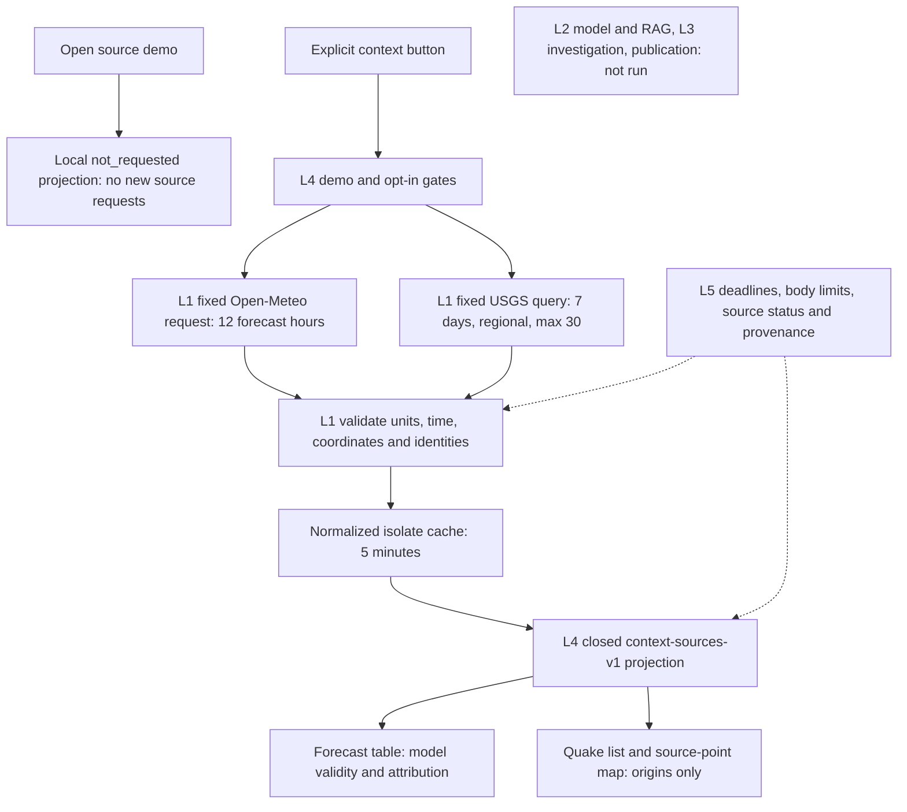

# INT-02: bounded weather and regional earthquake context

Status: accepted locally, 10 October 2026. The educational preview now includes four independently attributed providers: OSM, PetaBencana, Open-Meteo and USGS. No published Event, incident verification, L2 model/RAG, L3 investigation, persistence or deployment activation. Source count does not mean corroboration of one incident.

## Sources and terms

Open-Meteo's [terms](https://open-meteo.com/en/terms) permit non-commercial educational Free API use without a key, with CC BY 4.0 attribution and limits below 10,000/day, 5,000/hour and 600/minute. API access terms differ from the data licence's broader sharing terms. Use only a fixed Jakarta sample (106.82,-6.2) and 12 hourly forecast slots, transient normalized metadata with attribution/licence/change notice. Its [documentation](https://open-meteo.com/en/docs) describes model-derived weather, grid selection, Unix timestamps and unit definitions. Forecast validity is not observation or issuer publication time. Precipitation millimetres accumulate over the preceding hour; probability is a separate model percentage. No rain threshold becomes a flood warning, official BMKG alert or observed incident. Never plot the model grid as a danger point. Model issue time is unavailable; generationtime_ms is CPU time, not an instant.

USGS [copyright policy](https://www.usgs.gov/information-policies-and-instructions/copyrights-and-credits) identifies USGS-produced data as US public domain with credit requested; third-party media can remain protected. Retain only factual catalog metadata, no imagery, logos, ShakeMap products, linked articles or extended third-party text. The [FDSN catalog API](https://earthquake.usgs.gov/fdsnws/event/1/) and [GeoJSON format](https://earthquake.usgs.gov/earthquakes/feed/v1.0/geojson.php) support bounded regional queries. Use a rolling seven-day window, magnitude filter >=2.5, query rectangle CRS84 104,-9.5,110,-4, order time, limit30. This application window covers regional context near western Java/Sunda, not an official boundary or Jakarta impact footprint. Epicentres, source origin/revision times, magnitude/type and depth remain separate. Provider reviewed/automatic is not Waspada verification. Empty results never establish safety; magnitude is not automatically Richter scale, and no tsunami/impact interpretation is derived. Prefer a bounded catalog query here over a global feed to avoid downloading unrelated global events.

BMKG, commercial media/news, personal crime reports and Satu Data dataset ingestion are not activated by these terms. Their source-specific gates remain. Further news/crime expansion needs a concrete permitted metadata/redistribution path; source count is not independent corroboration. Existing source-preview-v1 and published v1/schema2.0 stay unchanged.

## Boundary and flow

New isolated contract: `context-sources-v1` in `apps/worker/src/contracts/context-sources.ts`, exposed by `GET /api/v1/demo/context-sources`. Exact demo mode and the existing explicit preview flag are required. Default request returns both sources `not_requested`, making zero upstream requests. Exact `?mode=fetch` requests the fixed weather URL and bounded USGS query; no other parameters or methods are accepted. The additional **Ambil konteks cuaca & gempa** button is separate from existing OSM/PetaBencana acquisition. Opening the demo does not fetch new providers automatically. Each explicit context refresh makes at most two requests; fetching both preview groups may make four overall. There is no schedule, retry, fallback or source-owner contact.

L1 acquires, validates time/space/units/identity, normalizes and deduplicates. L4 validates the closed projection and returns context only; L5 enforces request/body/cache/privacy limits. L2 and L3 are not run. Each provider can fail independently. Request deadlines25s include body reads; streamed bodies <=1MiB, depth32, provider record cap500, no redirects followed (`manual` plus reject non-2xx), fixed identifying User-Agent, safe HTTPS URLs and sanitized errors. One normalized isolate cache with a five-minute reuse TTL and in-flight coalescing; no durable storage. Expired references are removed on access/isolate disposal, not guaranteed deletion at exactly five minutes.

Weather fixed URL: `https://api.open-meteo.com/v1/forecast?latitude=-6.2&longitude=106.82&hourly=temperature_2m,precipitation_probability,precipitation,weather_code,wind_speed_10m&forecast_hours=12&timezone=GMT&timeformat=unixtime&wind_speed_unit=kmh&temperature_unit=celsius&precipitation_unit=mm`. Validate GMT/UTC offset0 and exact documented units. All arrays same length1..12; hourly epochs safe/strictly increasing by3600; first slot equals current trusted request hour (allow previous hour if request crosses an hour), slots remain within request horizon. Null model values remain unknown; numeric values obey contract bounds (temperature -80..60C, precipitation0..1000mm, probability0..100, wind0..500km/h, closed WMO codes). Reject malformed units/shapes rather than coercing strings/nulls. The provider may choose a different nearby grid point inside the declared half-degree validation window; show both requested sample and model grid in detail.

USGS query uses trusted request clock to derive start/end, fixed region/magnitude/limit. Require FeatureCollection, successful metadata status, valid source-generated instant not later than acquisition, <=500 incoming features. metadata.count may be absent (observed on a valid empty response); if present it must be integer/consistent. Points must contain three finite coordinates, depth -20..800km, region and seven-day time window, origin<=updated<=fetch. Keep only `type=earthquake`, safe provider ID and exact matching source event URL; magnitude null or finite2.5..10, magnitude type null or bounded plain text, status null/automatic/reviewed. Duplicate identical identities collapse; contradictory duplicate versions are rejected together, never chosen by input order. Source-provided place is bounded plain text, not HTML or model instructions. Cap output30 and mark limited honestly when query cap reached.

## UI direction and packages

Keep the existing calm civic palette, typography and map. Add a compact **Konteks cuaca & gempa** section in the demo, explicit acquisition/retry/reset controls and independent source outcomes. Weather is a horizontally scrollable forecast table with unknown cells, valid hour/fetch time and attribution, never a marker. Earthquake context has a useful list, selected metadata and a collapsible/list-first regional point map. A new G symbol and distinct shape label epicentres; map notice explicitly says there is no demonstrated Jakarta impact area. No invented live records or empty-to-safe copy. All fixtures used in tests are labelled synthetic; the default UI does not fabricate weather/quakes.

- `INT-02-CONTEXT-SOURCES-CORE`: new L1 adapters/runtime/L4 gate and focused tests. Root owns route registration/config/package test wiring.
- `UI-02-CONTEXT-SOURCES-DEMO`: bounded strict client, context view/CSS, mocked tests, no direct map dependency (render callback).
- `UI-02-REGIONAL-QUAKE-MAP`: extend map input via separate union without changing source-preview-v1; source-aware labels, regional view option and quake-only legend; retain all existing map behavior.

Root reviews all three branch diffs, validates Worker/client parity, runs WSL checks, probes actual providers once through local Worker, inspects stubbed-tile headless desktop/mobile screenshots, documents real limits and pushes accepted commits. No paid API/dependency, external configuration or hosted activation.

## Initial bounded probes

10 October 2026, native WSL Node: fixed Open-Meteo query returned HTTP200,12 model hours, expected units, grid106.856186,-6.221441. Fixed USGS regional query03–10October08:00UTC returned HTTP200 with a valid empty FeatureCollection and absent metadata.count. No report or raw response file was retained; these are access observations, not production or nonempty-record proof.

Actual local workerd composition, 10 October 2026 at `08:30:14.023Z`: `/api/v1/demo/context-sources?mode=fetch` returned HTTP200 and `context-sources-v1`, uncached. Open-Meteo was available with 12 hours, first validity `08:00:00Z`, selected grid106.856186,-6.221441 and acquisition `08:30:14.022Z`; model issue time remained null. USGS returned a valid empty catalog, source generation `08:30:13Z`, acquired `08:30:13.664Z`, query window `2026-10-03T08:30:12.646Z` to `2026-10-10T08:30:12.646Z`. Both rejection counts were0 and neither was limited. Default route first returned both not_requested. This proves local Worker format/transport compatibility, not nonempty USGS coverage, model accuracy, completeness or hosted deployment. No raw report or contemporary earthquake fixture was retained.

## Root acceptance

Reviewed and integrated two Luna/max agent branches and a separately committed root map branch. Agent-thread capacity prevented the third assignment/reuse; the core agent independently reviewed the root map and reran its 9 tests and web typecheck before acceptance. USGS-only callback typing preserves the regional-mode input constraint. Root added route/App/CSS/test registration and two authored source-to-API-to-client composition tests without new dependencies.

Final WSL Ubuntu-26.04 checks: web **105/105**, Worker **494/494**, cross-layer composition **2/2** (included in web), local smoke, all-workspace/evaluation typecheck, Vite build and Wrangler dry-run **passed**. DB/evaluation runtime suites were not rerun for this web/Worker-only change; their source and migrations are unchanged. Two headless browser suites passed six scenario groups each, no page errors, at desktop1440x1000 and mobile390x844. All automated tiles and explicit fixture refreshes were stubbed; nonempty QA quake records are labelled synthetic. The actual local workerd probe above is separate from those mocks.

Visual review confirmed compact provider sections, list-first mobile behavior, scrollable model table and optional regional map. Root changed the condition heading to plain Bahasa, exposed magnitude/count filters even on empty results, and removed a duplicate impact warning when the map supplies its own notice. Browser checks cover loading, null values, query reset, independent failure, empty result, unsafe URL rejection, explicit retry, map selection/pan/zoom/reset, multiple map IDs, and no horizontal page overflow. Screenshots are ignored local QA artifacts, not evidence of a real USGS quake or geographic basemap.

Commits and exact checks are in [the delivery log](DELIVERY_LOG.md). BMKG/news rights, source-quality evaluation, human adjudication (Perry/Jesaya), publication authorization and hosted deployment remain separate unfinished work. No API key, new migration, model provider, cloud binding, source account, Cron or durable database integration was added.
