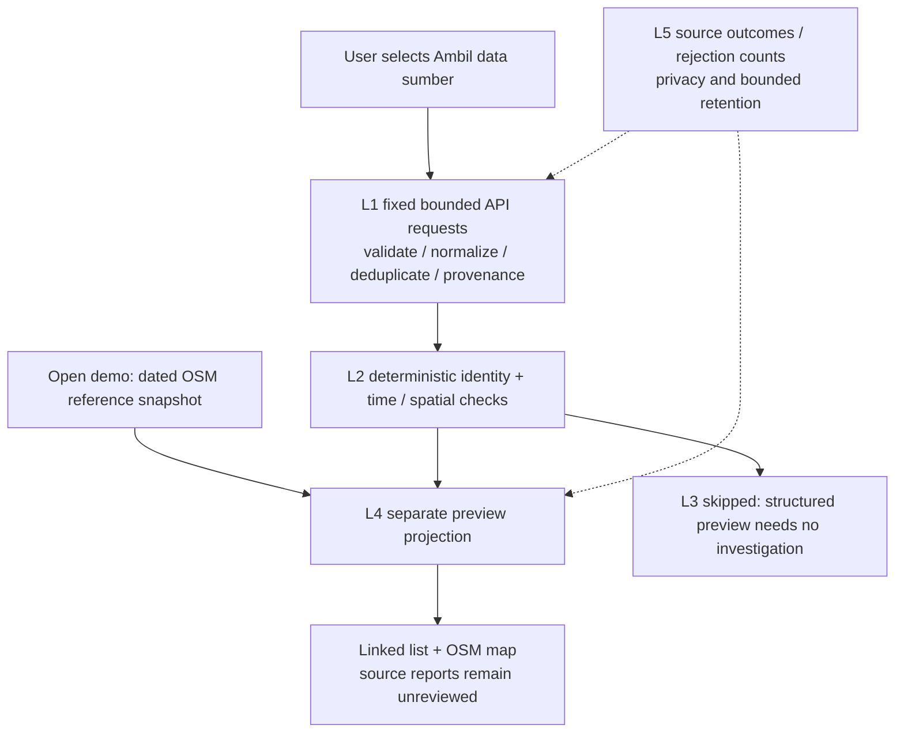

# INT-01: source integration and map demo

Status: implementation assigned, 10 October 2026. This slice is an educational source preview; it is not live incident publication or completion of INT-01.

## Scope and source rights

Use an OpenStreetMap basemap with visible contributor attribution, normal browser caching, viewport-only requests and no offline download/prefetch. Browser automation must stub tile requests. OSM facility records are reference locations, never hazard zones or promises of assistance. The bounded central-Jakarta query envelope (CRS84 106.78,-6.24,106.88,-6.14) is an application coverage window, not an official administrative boundary. Query hospitals, police and fire stations; cap at 100 records. Ways/relations use an explicitly labelled Overpass extent centre, not an incident point or building entrance. Node coordinates are source points. OSM data is ODbL; a narrow normalized public snapshot may be distributed with attribution under that licence. The source database timestamp is not an observation or individual facility edit time.

PetaBencana report preview uses the more restrictive current CC BY-NC 4.0 terms for this non-commercial university demonstration. This is a bounded exception to the earlier broad production-ingestion gate: source report ID, provided point, disaster type, created_at and provider status only, with attribution and a source link. No citizen text, identity, photo, social-media URL, model transfer, permanent raw retention, training or publication into the incident dataset. Omit non-flood, invalid or out-of-window data. Unclear broader production/commercial rights remain unresolved. Current-source display does not establish independent corroboration. Source withdrawal/termination requires disabling preview and deleting transient copies. BMKG/news integrations remain disabled.

## Actual flow

This demo does not call an LLM, run semantic RAG, persist to Neon, invoke the L3 coordinator or authorize incident publication. Existing incident/demo APIs stay unchanged and synthetic records are never overlaid as real reports. The five-layer design is preserved by separate L1 adapters and L4 source projection; L2 is deterministic here and L3 is explicitly skipped. Future model investigation must enter the existing evidence/proposal/publication gates.

## Demo contract and operating budget

`GET /api/v1/demo/source-preview` returns the dated normalized OSM snapshot and PetaBencana `not_requested`. `?mode=fetch` requests the fixed sources, only when server dataset is exact `demo` and `SOURCE_PREVIEW_ENABLED` is exact `true`. Other queries/methods are rejected. The DTO is `source-preview-v1` in `apps/worker/src/contracts/source-preview.ts`, distinct from public Event/GeoJSON contracts. No arbitrary URL, location, query or source parameter is accepted.

At most two upstream requests per cache refresh; no automatic polling, Cron, retry or endpoint failover. Coalesce concurrent refreshes in an isolate; keep only one normalized response for five minutes, never raw provider bodies. No stale success masquerades as a current fetch. Each request has a 25-second deadline, 1 MiB streamed response limit, depth/record/text bounds, redirects rejected, fixed identifying User-Agent, strict JSON/content validation and sanitized error codes. Provider remarks/errors cannot be reported as empty success. The OSM query uses a 20-second timeout and 64 MiB Overpass execution cap; these are provider execution limits, separate from our 1 MiB network body limit. The initial probe with smaller execution limits returned a runtime-error remark, which must fail closed. The successful 10 October probe returned 100 records (possibly truncated) and PetaBencana returned a valid empty FeatureCollection for the preceding 24 hours. Empty reports do not establish safety.

Free-tier compatibility: no new dependency, secret, hosted service, database, model API or deployment required. OSM tiles and Overpass have best-effort availability; PetaBencana may also be empty or unavailable. Initial snapshot mode works without source access; the basemap still requires internet. Hosted Cloudflare deployment/public traffic needs a later quota and terms review; this task enables the explicit local demo only.

## UI

Add `#demo-sumber`, linked as **Demo sumber** when the server confirms demo mode. Keep the civic palette (tinta kota, kali teal, hujan pagi, beton, kuning perhatian, merah tanda) and existing typography. Desktop: compact heading/controls and pipeline strip, source status above linked list/map columns, selected-record details with timestamps/attribution. Mobile: list first and a map switch. Facility icons H/P/D and flood symbol B plus text labels distinguish categories. Show snapshot date, fetch time, provider observation time and missing time explicitly. State **Pratinjau sumber — belum melalui publikasi Waspada**. Source-report marker is a point only; no danger radius or safety classification. Facility/reference and citizen-report layers remain visually and textually distinct. Loading, source error, empty, tile failure, disabled/live-mode and offline-snapshot states remain legible without a map.

## Delivery packages

- `INT-01-SOURCE-PREVIEW-CORE`: independent L1 adapters, normalized snapshot, bounded fetch service and L4 handler. Root wires index/config/exports and tests integration.
- `UI-01-OSM-MAP-DEMO`: independent reusable slippy map component, source-supported point markers, keyboard controls, tests and scoped CSS.
- `UI-01-SOURCE-PREVIEW-DEMO`: strict client, demo view, linked list, flow/status/timestamp display, responsive CSS and tests. Root wires App navigation.

Root reviews all branch diffs, runs integrated WSL checks, inspects desktop/mobile browser screenshots with tile/source mocks, and records actual limitations before acceptance. No agent may change existing public contracts or install dependencies.
