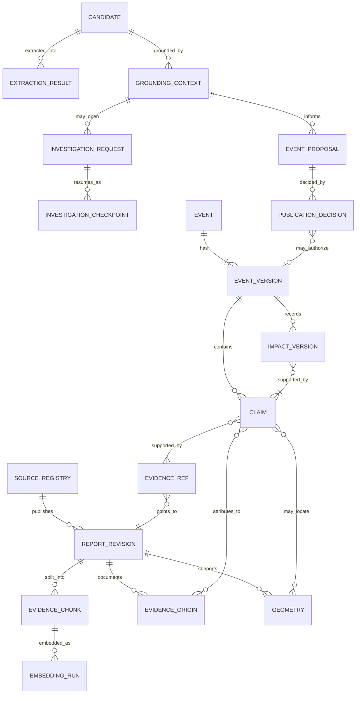

# Waspada Jakarta domain model and state rules

- **Specification:** SPEC-02, schema 2.0
- **Status:** Design baseline accepted on 24 September 2026. DATA-01 supplies the local PostgreSQL schema, migration runner, core persistence ports and database constraints. L2-CONTEXT-PERSIST-CORE and L2-CONTEXT-BRIDGE-CORE locally validate and persist canonical refs-only grounding contexts; Worker-to-database runtime wiring, provider-backed persistence and full service-level semantic validation remain future work.
- **Scope:** FR-03, FR-06, FR-08 and FR-13. The machine-readable boundary contracts are in [contracts.schema.json](contracts.schema.json), with synthetic examples in [contracts.examples.json](contracts.examples.json).

Schema 2.0 is a breaking design change from the original 1.0 proposal. No running clients or production application records exist, so migration means updating fixtures and future runtime integrations before they start. Root checked the Draft 2020-12 schema and all 14 synthetic record examples on WSL. DATA-01 implements the local relational/spatial/vector foundation and tests its database-enforceable invariants; semantic support, authorization, source reuse, lifecycle transitions and other application-level checks remain in later services.

## Five-layer ownership

L1 stores the source registry and acquires only from enabled, approved sources; L4/moderator policy owns source approval. L1 also creates immutable report revisions, evidence origins, source-backed geometry, extraction results, chunks and embedding metadata. L1 runs independently of L3. L2 retrieves persisted evidence and returns grounding contexts and evidence-linked proposals. L3 opens an investigation only for a gap after L2 retrieval; a checkpoint preserves the same case identity, event match pair and budget ledger across pause/resume. L4 alone stores event and impact versions and publication decisions. L5 observes all layers and reports provenance, freshness, cost, quality and correction propagation. Source text and model output are data, never instructions that can change a layer boundary.

The diagram shows logical relations, not a mandated table layout. `CANDIDATE`, `EVENT_VERSION`, `CLAIM`, `EVIDENCE_REF`, and `IMPACT_VERSION` are represented within or referenced by boundary records in the JSON contracts. `Event` and `Impact` records are immutable version snapshots. A public projection joins only the relevant event version, its published claims and referenced impact versions. Do not infer a relationship between records from semantic similarity alone.

## Records and relation rules

| Record | Owner and purpose | Required links or invariants |
| --- | --- | --- |
| `SourceRegistry` | L1; approved identity, remit, permitted acquisition and reuse, connector status and health | Every report revision resolves to a source. Approval, acquisition state and connector health are separate fields. |
| `ReportRevision` | L1; immutable permitted source text and its source metadata | Stores original-content hash and normalized permitted-text hash; time offsets address the exact normalized text. A correction creates a new revision and points back with `supersedes_id`. |
| `EvidenceOrigin` | L1; underlying statement, observation, document or unknown origin | Connects source revisions and evidence spans to a described origin. Dependency links record known copying/quotation; `unknown` never counts as independent corroboration. |
| `Geometry` | L1; a source-supported geographic representation | GeoJSON in WGS 84 longitude/latitude, role, precision and evidence references. It has no inferred radius or implied hazard area. |
| `ExtractionResult` | L1 pipeline using a fixed L2 adapter; candidate fields and unknowns | Evidence spans address the report revision. It cannot create an event, authorize publication or invoke L3. |
| `EvidenceChunk` / `EmbeddingRun` | L1; stable text chunk and separate embedding/index metadata | Chunk offsets and text hash refer to the immutable normalized revision. Embedding capability, model version, vector dimension and index version are not parser/extraction/reasoning `ModelRun` values. |
| `GroundingContext` | L2; a retrieval snapshot with evidence, status, event candidates and gaps | Evidence/revision states come from storage and are rechecked by L4. `sufficient` only routes the flow; it is not a publication decision. |
| `InvestigationRequest` / `InvestigationCheckpoint` | L3; gap-specific work and durable stop/resume state | A case opens only from insufficient retrieved context. The request retains the initial context; checkpoints may reference a later context for the same dataset/candidate. Resume retains investigation ID, event pair, budget policy/limits, and all consumed/reserved counters. A new unmatched candidate has both event ID and event version null; a matched case has both populated. |
| `EventProposal` | L2 or L3; proposed claims and unresolved fields | Both routes use the same L4 gate. New candidate pair is `(event_id=null, base_event_version=null)`; existing event proposal supplies both values. No model status authorizes publishing. |
| `Event` | L4; immutable event version and its published claim set | Version is positive, previous version is explicit when one exists, and publication state is independent of incident lifecycle and freshness. Public list/detail selects only the latest eligible published version. |
| `Impact` | L4; versioned service, facility, road, hazard or audience effect | Has its own lifecycle, freshness, event time, validity and scope. It is attached to an event version and points to supported claims; one effect's update does not resolve the parent incident. |
| `PublicationDecision` | L4; per-claim rule outcome, reviewer and policy version | Only L4 produces it. A correction or moderator action enters the same gate. Evidence support and authorization still require service checks. |

All event/evidence pipeline records carry `dataset_kind`: `live`, `historical`, or `synthetic`. Historical and synthetic demonstrations use a separate demo namespace/database and remain visibly labelled. Cross-dataset evidence, event matching and updates are rejected by service policy. The deployment selects the dataset namespace; clients cannot override it in public requests. A source registry is a shared schema concept, but source approvals, credentials and enabled-source configuration are environment-scoped.

## Taxonomy and tags

Each event has exactly one primary `category`. Additional tags are namespaced facets; tags do not replace the category and do not encode event lifecycle, evidence status, freshness or publication status. Tag values are lower-case controlled slugs governed by the vocabulary version used by the application. The schema checks namespaces and slug form; L4 checks that audience, service and hazard tags have evidence.

| Schema value | Product label |
| --- | --- |
| `crime_personal_security` | Crime and personal security |
| `demonstrations_public_gatherings` | Demonstrations and public gatherings |
| `crowds_major_events` | Crowds and major events |
| `violence_immediate_threats` | Violence and immediate threats |
| `disasters_weather` | Disasters and weather |
| `fires_infrastructure_hazards` | Fires and infrastructure hazards |
| `transport_road_incidents` | Transport and road incidents |
| `utilities_essential_services` | Utilities and essential services |
| `health_environmental_advisories` | Health and environmental advisories |
| `group_specific_critical_notices` | Group-specific critical notices |

Tags have `namespace` (`topic`, `service`, `audience`, `hazard`, `transport_mode`, or `place_type`) and a `value` slug. Preserve a demonstration as its own event and link distinct incidents/effects only when evidence supports the relationship. Category or tag membership never creates a risk score or warning boundary.

## Independent status dimensions

Status must be stored at the level it describes. A source registry's approval does not make every source revision eligible; a source revision's eligibility does not publish its claims; an event lifecycle does not determine evidence support; and freshness does not resolve a physical condition.

| Dimension | Values | Meaning and owner |
| --- | --- | --- |
| Source registry approval | `pending`, `approved`, `suspended`, `revoked` | L4/moderator-controlled source permission. Only an approved source may use a non-`never` automatic-publication policy, still limited by its remit. |
| Registry lifecycle | `active`, `paused`, `retired` | Whether the source entry is in service. It is separate from connector health. |
| Connector health | `unknown`, `healthy`, `degraded`, `unavailable` | L1 polling/access result with last-check and last-success times. A failure is not evidence that an event ended. |
| Report revision | `unreviewed`, `eligible`, `quarantined`, `superseded`, `retracted` | Evidence-source review state. `eligible` means usable under source policy, not that every claim is true. |
| Claim assessment (proposal) | `supported`, `uncertain`, `disputed` | L2/L3 assessment for the specific claim. L4 can require human review. |
| Public evidence label | `issuer_notice`, `attributed_report`, `independent_corroboration`, `crowdsourced_observation` | L4-approved display label for a published claim. An origin count is claim-specific; copied coverage is one origin. |
| Incident/impact lifecycle | `planned`, `ongoing`, `resolved`, `cancelled`, `unknown` | Evidence-backed state of the incident or one impact. A later arrest or service reopening changes only the supported record. |
| Freshness | `current`, `needs_update`, `expired` | L4 time and evidence review state. Expiry never means `resolved`, `safe`, or `cancelled`. |
| Event publication state | `published`, `withdrawn` | L4 publication/version state. A held proposal is not an Event record. A withdrawal creates a tombstone version. |
| Dataset | `live`, `historical`, `synthetic` | Provenance/namespace dimension, not a condition or trust label. |

### Transition rules

These are allowed transitions, not automatic inferences. Every transition is written as a new version or a separate audit/decision record.

| State dimension | Allowed transition | Required basis / restriction |
| --- | --- | --- |
| Incident lifecycle | `unknown` → any supported state; `planned` → `ongoing` or `cancelled`; `ongoing` → `resolved`; `resolved` → `ongoing` only on new evidence | L4 assesses claim-specific evidence and scope. A planned end time alone does not establish cancellation or resolution. A correction may change a previously wrong state only through a new reviewed version. |
| Impact lifecycle | Same lifecycle values, evaluated independently of the parent event | Reopening a road or service does not resolve the event that caused its restriction. |
| Freshness | `current` → `needs_update` or `expired`; `needs_update` → `current` or `expired`; `expired` → `current` only after new source evidence and a new L4 check | Refetch/304/feed-build time does not renew an observation. Existing rules use explicit issuer validity first, 60-minute review for fast-changing observations, and 24-hour review for an advisory without an end date. |
| Claim assessment | Proposal `supported` / `uncertain` / `disputed`; published support may later be challenged or withdrawn | Material contradiction or ineligible/retracted support triggers reassessment and, when needed, moderator review or withdrawal. Model confidence cannot clear it. |
| Publication | Proposal → per-claim `publish`, `review`, `reject`, or `retract`; a later correction passes the same gate | A schema-valid proposal cannot write an Event version. L4 checks authorization, source remit, references, current evidence state, time, geometry and base event version. |
| Event version | `vN` → immutable `vN+1`; current published version may be followed by a `withdrawn` tombstone | Version history is append-only. A public withdrawal tombstone contains no claims, impacts or withdrawn source content. Previously published versions may appear in an explicitly historical change log; withdrawn content does not re-enter current public views. |

## Time, IDs and versions

- All timestamp fields are RFC 3339 date-times with an explicit UTC offset. Date-precision event times use `YYYY-MM-DD`; the schema uses `TimeScope` to distinguish date, exact, range and unknown without fabricating a time-of-day.
- Keep source publication time, optional source-observed time, ingestion retrieval time, event/impact time, explicit source validity and application freshness-review time separate. Refetch time never substitutes for observation time. An update may describe the earlier event time.
- A known event/impact interval must have `start <= end`; a validity interval must have `valid_from < valid_until`. Service validation enforces ordering, source meaning, timezone interpretation and compatible time precision. Do not treat null as “now”.
- IDs are stable opaque strings within their entity namespace. JSON Schema enforces non-empty bounded IDs; database uniqueness and foreign-key existence are service/storage checks. Never reuse an ID for a different source, claim, event, revision or geometry.
- Every stored event and impact version is an integer >= 1. Event version 1 has no predecessor; version N identifies predecessor N-1. The application checks the current version again at commit. A stale proposal is re-grounded, not applied over a newer version.
- Pair nullable target ID/version fields. `event_id=null` requires its associated event version to be null; a non-null ID requires a positive version. For proposals the version field is `base_event_version`; for investigations and decisions it is `event_version`. A resume carries the exact pair saved at case creation; matching a previously unmatched candidate is a reviewed event-match action, not a resume side effect.
- A new investigation ledger starts only from a persisted insufficient `GroundingContext` and configured `limits`; `consumed` counts failed and successful actions, and `reserved` records preflight work not yet reconciled. Checkpoints preserve all three budget objects and policy version. The request retains the initial context, while a checkpoint may refer to refreshed context for the same dataset/candidate. Remaining allowance is derived. Service validation prevents `consumed + reserved` exceeding a limit, duplicate/in-flight reservation, limit edits, event-target changes, or resetting counters on resume. See [ADR-014](decisions/ADR-014-l3-investigation-ledger.md).
- Investigation hard bounds are 5 tool attempts, 4 reasoning turns, 60 active seconds and 12,000 model input/output tokens. The contract catches a limit above those maxima and a counter above the absolute maxima. The live service also checks each count against its case's configured limit and releases/reconciles reservations on crash or cancellation.
- Evidence offsets are zero-based, end-exclusive Unicode code-point offsets into the exact immutable `permitted_text` stored on the referenced report revision, after the recorded normalization version. SHA-256 `permitted_text_hash` ties a span to that text. The schema bounds offsets and checks hash shape; the service verifies hash equality, `span_end > span_start`, text bounds, revision status and actual claim support. No cross-record source span or support is invented from a model claim.

## Geometry and evidence origins

Geometry uses RFC 7946 GeoJSON geometry with WGS 84 longitude/latitude (CRS84 order). Supported forms are Point, LineString, Polygon, MultiPoint, MultiLineString and MultiPolygon. Geometry has an explicit role, `precision_m` when known, a precision basis and one or more source evidence references. Source-defined warning polygons may be used with their stated meaning and validity. A named-place geocode is a location estimate, not proof of an event. Never buffer a point into a warning area or substitute an administrative boundary for unsupported hazard extent.

An origin is the underlying authority statement, operator notice, newsroom observation, public record, original document or crowdsourced observation. Reports may document the same origin, multiple origins, or an unknown origin. `depends_on_origin_ids` records known quotation/copy/reused-media relationships. Similarity alone never proves dependence; missing lineage is `unknown`, not independent. A claim's `origin_ids` and evidence spans are checked against stored origin records. Each origin only supports the claims and details its cited material actually addresses.

Embedding metadata is a separate `EmbeddingRun`, with capability fixed to embedding, provider/model version, vector dimensions, distance metric, index version, input chunk hash and status. It is not represented as an extraction/reasoning model run. Re-indexing creates a new run/version. A withdrawn, superseded or privacy-deleted report invalidates derived chunks/vectors/caches, and retrieval rechecks revision status even if a vector index is stale.

## Schema checks and service checks

| Enforceable by JSON Schema | Requires database, application policy or human assessment |
| --- | --- |
| Contract version and record type; required/closed object shapes; enum values; ID/hash/URL syntax; category/tag syntax; GeoJSON shape and coordinate numeric bounds; positive versions; paired-null target fields; hard budget caps and counter non-negativity; timestamp syntax; evidence reference structure; proposal/public claim label vocabularies. | ID/reference existence and uniqueness; same dataset across relations; exact time ordering and offset/hash equality; source authorization/remit/redirect and reuse conditions; current event version at commit; checkpoint resume continuity and `consumed + reserved <= limit`; geometry-to-source fidelity and location precision; actual textual support; origin dependence/independence; whether a contradiction is material; transition eligibility; evidence freshness and event semantics; moderator identity/authorization; public/live data filtering and tombstone safety. |

Schema validity is necessary but never sufficient for publication. L4 must reject or hold records with failed semantic or authorization checks; L5 records the reason and propagation outcome without silently changing policy. API-PROJECT-CORE implements a runtime-validated public whitelist for consumed schema 2.0 Event/Impact fields. It resolves names, explicitly public-approved source attributions and exact impact versions before constructing `EventView`; the database read and live HTTP route remain unconnected. API-GEOMETRY-CORE extends the pure L4 projection to `EventDetail` and GeoJSON, requiring exact event/claim geometry references and a matching published-claim support span, validating CRS84 structure and bounded coordinates, and omitting storage-only geometry data. Its synthetic tests establish structural projection and field filtering only; they do not verify factual support, source rights, the future database read, or route behavior. API-DETAIL-HISTORY-ROUTES-CORE serves demo detail/history responses only from explicitly synthetic fixtures; it neither promotes those fixtures through the live projector nor implements a database reader. GEO-STORE-CORE adds a local L1 writer that validates a supplied schema 2.0 Geometry and resolves its exact persisted supporting spans before storing the shape and links atomically. Synthetic PGlite checks establish storage invariants only; they do not verify source rights or that a support relation proves the geometry's meaning.
